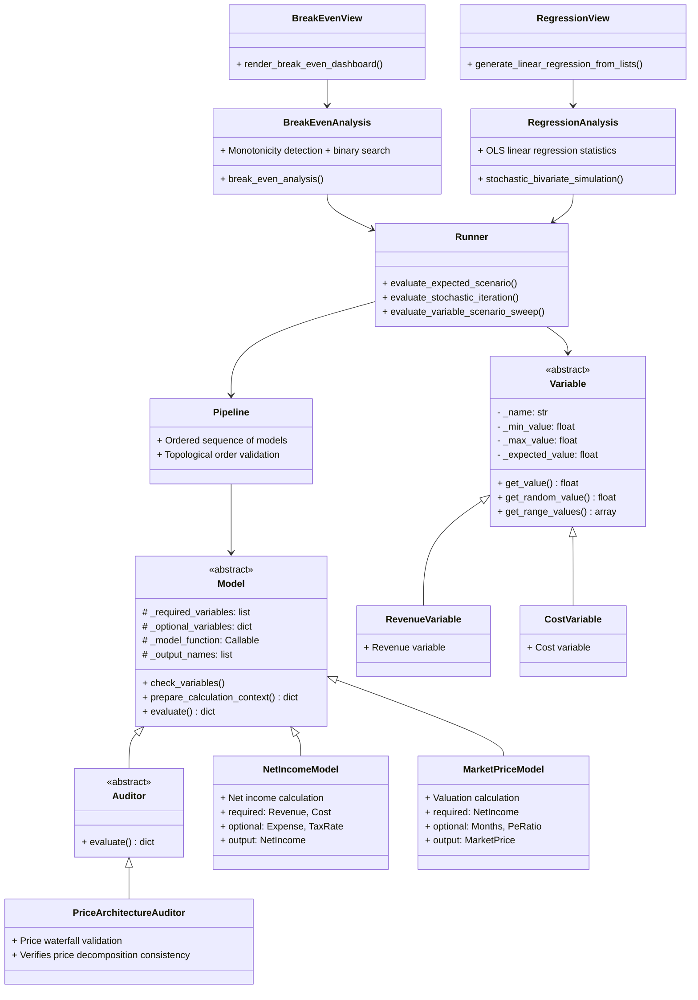

# LedgerScope 设计文档

[TOC]

---


## 第一部分：概览与入门

## 第 1 章 项目介绍

### 1. 项目介绍

#### 1.1 项目定位

**LedgerScope** 是一个**通用财务建模框架**，而非针对特定商品或行业的固定模型。

框架提供核心抽象（Variable、Model、Pipeline、Analysis、Auditor、Visualization），用户可通过组合这些组件快速构建适用于不同业务场景的财务模型，包括但不限于：

- 外贸 B2B 出口业务
- 电商运营分析
- SaaS 订阅经济
- 制造业成本核算
- 初创公司财务预测
- 广告效能与投入核算

##### 核心价值

| 维度 | 说明 |
|:---|:---|
| **可复用** | 一次构建模型，多场景复用 |
| **可扩展** | 支持自定义 Variable、Model、Analysis、Visualization |
| **可审计** | Auditor 机制验证跨模型数据一致性 |
| **可视化** | 内置 6 种分析模式 + 7 种视图，开箱即用 |

#### 1.2 设计原则

| 原则 | 说明 |
|:---|:---|
| **框架与业务解耦** | 核心抽象可复用于任意商品/行业，业务逻辑通过 Variable 和 Model 注入 |
| **单一商品模型** | 当前版本专注于单商品分析，简化数据流和依赖关系；多商品为未来规划 |
| **外贸场景优先** | 组件设计优先满足外贸 B2B 需求（运费、关税、汇率、FOB 定价等） |
| **广告效能核心** | 内置 Google Search 广告漏斗模型，支持 CPC、CVR、Close Rate 等关键指标 |
| **可扩展性** | 预留升级包、多商品、复购 LTV 等未来功能的接口 |
| **确定性优先** | 管道拓扑顺序验证确保每次执行结果可复现 |

#### 1.3 模型边界与局限性

| 项目 | 说明 |
|:---|:---|
| **模型假设** | 所有假设透明列出，并说明其对结果的影响方向 |
| **单一商品** | 当前仅支持单商品分析 |
| **广告归因** | 假设所有订单来自付费广告（无 SEO 自然流量） |
| **转化率** | 假设恒定，不随时间变化 |
| **折旧与资本支出** | 占位实现，返回 0 |
| **交付时间** | 忽略订单交付时间滞后 |
| **汇率** | 当前使用固定汇率，未做动态模拟 |
| **融资成本** | 未纳入利息费用 |

##### 1.x 版本不包含的内容

| 项目 | 目标版本 | 说明 |
|:---|:---|:---|
| 升级包模块 | V2.x | 支持 upgrade_cost、upgrade_price、upgrade_rate |
| 复购与 LTV | V2.x | 客户生命周期价值建模 |
| 多渠道归因 | V2.x | 区分不同广告渠道对订单的贡献 |
| 批量折扣 | V2.x | COGS 非线性关系 |
| 多商品支持 | V2.x | 引入 product_id 维度 |
| 交付周期 | V3.x | 收入确认时间滞后 |
| SEO/自然搜索流量 | V3.x | 扩展到非付费渠道 |
| 季节性因素 | V3.x | 节假日高峰等周期性影响 |
| 汇率波动模拟 | V4.x | 动态汇率敏感性分析 |
| 融资成本（利息） | V4.x | 扩展 FCF 模型 |

#### 1.4 版本约束与规划

##### 当前版本（1.x）

| 约束 | 说明 |
|:---|:---|
| 商品数量 | 仅支持单一商品模型 |
| 订单来源 | 假设所有订单来自广告渠道（无复购、无分销） |
| 转化率 | 假设恒定，不随时间变化 |
| 折旧与资本支出 | 占位实现，返回 0 |
| 交付时间 | 忽略订单交付时间滞后 |
| 汇率 | 固定汇率（可做敏感性分析） |

##### 版本号规则

采用语义化版本（Semantic Versioning）：

- **MAJOR**：架构重大变更（如模块职责重定义）
- **MINOR**：新增功能（如新增 Model、Analysis）
- **PATCH**：修正（如修复文档错误、补充说明）

##### 版本迭代策略

| 版本 | 定位 | 变更类型 |
|:---|:---|:---|
| 1.x | 稳定版本 | 仅 PATCH 级别的修复，不进行大的 features 修改 |
| 2.x | 功能扩展 | MINOR 级别新增功能（升级包、复购、多渠道等） |
| 3.x | 时间维度 | MINOR 级别新增功能（交付周期、季节性） |
| 4.x | 高级模拟 | MINOR 级别新增功能（动态汇率、融资成本） |

#### 1.5 推荐的下一步行动

| 优先级 | 行动 | 负责方 | 目标版本 | 时间线 |
|:---|:---|:---|:---|:---|
| 立即 | 在基准或乐观情景参数下启动业务 | 业务团队 | 1.x | 第 1 个月 |
| 短期 | 积累前 3 个月实际数据，校准模型参数 | 数据分析 | 1.x | 第 3 个月末 |
| 短期 | 验证 CPC、CVR、Close Rate 与行业基准的偏差 | 营销团队 | 1.x | 第 3 个月末 |
| 中期 | 升级包模块开发 | 开发团队 | 2.x | 第 6 个月 |
| 中期 | 复购和客户生命周期价值建模 | 开发团队 | 2.x | 第 6 个月 |
| 中期 | 多渠道归因与批量折扣 | 开发团队 | 2.x | 第 9 个月 |
| 中期 | 多商品支持 | 开发团队 | 2.x | 第 12 个月 |
| 长期 | 交付周期和季节性因素 | 开发团队 | 3.x | 第 18 个月 |
| 长期 | 动态汇率与融资成本 | 开发团队 | 4.x | 第 24 个月 |

#### 1.6 未来规划（Roadmap）

##### 版本 1.x（当前稳定版本）

1.x 版本定位为**稳定版本**，仅进行 PATCH 级别的错误修复和文档完善，不进行大的 features 修改。

| 项目 | 说明 | 状态 |
|:---|:---|:---|
| 框架稳定性保障 | 确保核心 API 稳定，无破坏性变更 | ✅ 已稳定 |
| 文档完善 | 补充示例、修复文档错误 | 持续进行 |
| Bug 修复 | 修复已识别的边缘情况问题 | 按需进行 |

##### 版本 2.x（功能扩展）

| 项目 | 说明 |
|:---|:---|
| 升级包模块 | 支持 upgrade_cost、upgrade_price、upgrade_rate |
| 多渠道归因 | 区分不同广告渠道对订单的贡献 |
| 批量折扣 | COGS 非线性关系 |
| 多商品支持 | 引入 product_id 维度 |
| 复购与 LTV | 客户生命周期价值建模 |

##### 版本 3.x（时间维度）

| 项目 | 说明 |
|:---|:---|
| 订单交付延迟 | 收入确认时间滞后 |
| 季节性因素 | 节假日高峰等周期性影响 |
| SEO/自然搜索流量 | 扩展到非付费渠道 |

##### 版本 4.x（高级模拟）

| 项目 | 说明 |
|:---|:---|
| 汇率波动模拟 | 动态汇率敏感性分析 |
| 融资成本（利息） | 扩展 FCF 模型 |
| 概率分布扩展 | 支持正态分布、三角分布等 |
| 负利润税务处理 | Tax shield 计算 |
| 实时仪表板 | Web 界面 + 动态刷新 |

#### 1.7 不补充的内容（超出模型能力）

| 项目 | 原因 | 替代方案 |
|:---|:---|:---|
| AI 需求预测 | 模型不支持 | 使用外部市场调研报告 |
| 竞品分析 | 不在模型范围 | 独立竞品调研 |
| 客户画像分析 | 不在模型范围 | CRM 数据分析 |
| 产品设计优化 | 不在模型范围 | 产品团队独立决策 |
| 供应链优化 | 不在模型范围 | 供应链专项分析 |
| 品牌建设效果 | 难以量化，超出模型范围 | 品牌健康度调研 |

---

## 第 2 章 快速开始

### 2. 快速开始

#### 2.1 开发环境与安装

##### 环境要求

- **Python 3.8+**：LedgerScope 基于 Python 3 开发，作为财务建模的分析引擎/计算平台
- **推荐环境**：Jupyter Notebook / JupyterLab（用于数据展示和交互式分析）

##### 安装步骤

1. **安装 Python 3.8 或更高版本**
2. **安装 Jupyter**：`pip install jupyter`
3. **下载 LedgerScope 项目**：`git clone https://github.com/hanyuwcn/LedgerScope/`
4. **安装项目依赖**：`pip install -r requirements.txt`

> 📝 外部依赖清单请参见**附录 B.6**。

##### 推荐使用方式

| 环境 | 用途 | 推荐程度 |
|:---|:---|:---|
| **Jupyter Notebook** | 交互式数据分析、可视化展示 | ⭐⭐⭐ 强烈推荐 |
| **JupyterLab** | 多窗口工作流、复杂项目组织 | ⭐⭐⭐ 强烈推荐 |
| **Python 脚本 (.py)** | 自动化批量计算 | ⭐⭐ 可选 |
| **PyCharm/VS Code** | 代码开发、调试 | ⭐⭐ 辅助开发 |

> 💡 **提示**：Jupyter Notebook 能够完美展示 LedgerScope 生成的图表和格式化表格，是体验框架分析能力的最佳环境。

#### 2.2 5 分钟示例：分析收入对估值的影响

##### 步骤 1：定义变量

```python
variables = {
    "Revenue": Variable(min=80000, exp=100000, max=120000),
    "Cost": Variable(min=30000, exp=40000, max=50000),
    "PeRatio": Variable(min=5, exp=8, max=10)
}
```

| 变量 | 最小值 | 期望值 | 最大值 | 说明 |
|:---|:---|:---|:---|:---|
| Revenue | 80,000 | 100,000 | 120,000 | 营业收入 |
| Cost | 30,000 | 40,000 | 50,000 | 营业成本 |
| PeRatio | 5 | 8 | 10 | 市盈率倍数 |

##### 步骤 2：构建模型管道

```python
pipeline = [NetIncomeModel(), MarketPriceModel()]
```

##### 步骤 3：执行回归分析

```python
x, y, stats = stochastic_bivariate_simulation(
    variables=variables,
    independent_target_x="Revenue",
    dependent_target_y="MarketPrice",
    shuffled_variables=["Revenue", "Cost"],
    model_pipeline=pipeline,
    sample_size=100
)
```

##### 步骤 4：可视化

```python
fig = generate_linear_regression_from_lists(
    x, y, "Revenue", "MarketPrice",
    x_benchmark=100000,
    y_benchmark=5000000
)
```

##### 输出解读

- **R² 值**：衡量收入对估值的解释力度（越接近 1 越强）
- **斜率**：每增加 1 元收入，估值增加多少元
- **基准线**：红色虚线标记目标收入（10 万）和目标估值（500 万）

#### 2.3 6 个分析案例速览

| 案例 | 分析模块 | 可视化 | 核心问题 |
|:---|:---|:---|:---|
| 1 | `break_even_analysis` | 表格 | 需要多少收入才能达到目标估值？ |
| 2 | `comparative_statics` | 表格 + 弹性 | 收入变化 1% 时，估值变化多少？ |
| 3 | `stochastic_contribution_analysis` | 饼图 | 收入和成本的平均占比是多少？ |
| 4 | `run_monte_carlo` | 直方图 | 估值的概率分布和达标概率是多少？ |
| 5 | `stochastic_bivariate_simulation` | 散点图 + 回归线 | 收入与估值之间存在线性关系吗？ |
| 6 | `run_two_way_sensitivity_analysis` | 热力图 | 收入和成本如何共同影响估值？ |

详细代码示例请参见**附录 C：完整示例**。

---

## 第 3 章 核心概念

### 3. 核心概念

#### 3.1 Variable（变量）

Variable 是框架中最基础的构建块，用于定义**自变量**的取值范围和取值策略。

##### 核心职责

- 管理变量的最小值（min）、期望值（exp）、最大值（max）
- 提供多种取值方式：期望值、最小值、最大值、随机值
- 生成用于敏感性分析的线性空间数组

##### 构造规则

| 输入组合 | 处理逻辑 |
|:---|:---|
| min, exp, max 全提供 | 直接使用 |
| 仅 exp | min = max = exp |
| 仅 min + max | exp = (min + max) / 2 |
| 仅 max | min = 0, exp = max / 2 |
| 全空 | 全部为 None（占位变量） |
| 仅 min | 语义不清晰，不允许 |

##### 取值方法

| 方法 | 返回值 | 用途 |
|:---|:---|:---|
| `get_value(ValueType.EXPECTED)` | 期望值 | 基准场景 |
| `get_value(ValueType.MIN)` | 最小值 | 悲观场景 |
| `get_value(ValueType.MAX)` | 最大值 | 乐观场景 |
| `get_value(ValueType.RANDOM)` | 随机值 | 蒙特卡洛模拟 |
| `get_range_values(num)` | 线性空间数组 | 敏感性分析 |

##### 示例

```python
# 定义广告预算：范围 1500-3000，期望值 2250
ads_budget = Variable(min=1500, max=3000)

# 定义固定汇率（无范围）
exchange_rate = Variable(exp=6.8)

# 随机采样
random_budget = ads_budget.get_value(ValueType.RANDOM)

# 生成 50 个等间距值用于扫描
scan_values = ads_budget.get_range_values(num=50)
```

##### 设计决策

**为什么不提供默认业务边界？** 财务模型的边界条件高度依赖具体业务场景。硬编码默认值会造成隐性假设。显式传入参数强制用户思考业务逻辑。

**为什么 Variable 实例不可变？** 保持分析的可复现性。如果需要不同范围的变量，应创建新实例而非修改现有实例。

---

#### 3.2 Model（模型）

Model 是框架中的计算单元，用于**因变量**的计算。

##### 核心职责

- 接收 `{variable_name: value}` 格式的输入字典
- 验证必需变量存在，为可选变量提供默认值
- 执行核心计算逻辑
- 将计算结果合并到输入字典并返回

##### 输入与输出

| 方向 | 格式 | 示例 |
|:---|:---|:---|
| 输入 | `{var_name: value}` | `{"Revenue": 100000, "Cost": 40000}` |
| 输出 | `{var_name: value}`（原字典 + 新字段） | `{"Revenue": 100000, "Cost": 40000, "Profit": 60000}` |

##### 关键属性

| 属性 | 类型 | 说明 |
|:---|:---|:---|
| `_required_variables` | `list[str]` | 必需变量名（缺失时抛出 KeyError） |
| `_optional_variables` | `dict[str, float]` | 可选变量名及其默认值（缺失时使用默认值） |
| `_model_function` | `callable` | 核心计算函数 |
| `_output_names` | `list[str]` | 输出变量名列表 |

##### 执行流程

```
输入字典 → check_variables() → prepare_calculation_context() → _model_function() → 合并结果 → 返回字典
```

##### 示例：自定义 Model

```python
def calculate_profit(variables: dict) -> dict:
    """Calculates the net operational profit generated within the execution context."""
    revenue = variables["Revenue"]
    cost = variables["Cost"]
    return {"Profit": revenue - cost}

class ProfitModel(Model):
    def __init__(self, input_variables: dict = None):
        super().__init__(input_variables)
        self._model_function = calculate_profit
        self._output_names = ["Profit"]
        self._required_variables = ["Revenue", "Cost"]
```

##### 设计决策

**为什么 Model 不依赖 Variable 类？** Model 只接收具体的数值字典，不关心数值来源。这使得 Model 可以独立测试。

**为什么使用就地更新策略？** 避免在深层 pipeline 中创建大量中间字典，上游模型的输出自动成为下游模型的输入。

> ⚠️ **注意**：就地更新会修改输入字典。如需保留原始状态，请在调用前使用 `copy.deepcopy()`。

---

#### 3.3 Auditor（审计器）

Auditor 是 Model 的特化形式，用于**验证跨模型数据的一致性**。

##### 与 Model 的区别

| 维度 | Model | Auditor |
|:---|:---|:---|
| 核心职责 | 计算新变量 | 验证已有变量 |
| 输出 | 新增字段 | 无新字段（返回原字典） |
| 失败处理 | 计算结果可能异常 | 抛出 ValueError，中断 pipeline |
| 使用场景 | 任何计算节点 | 关键数据一致性检查点 |

##### 执行流程

```
输入字典 → check_variables() → prepare_calculation_context() → 验证函数 → 返回原字典（通过）或抛出异常（失败）
```

##### 示例：价格架构审计器

```python
def check_price_architecture(variables: dict) -> None:
    """Validates the Price Waterfall for a single product context."""
    cogs_per_unit = variables["CogsPerUnit"]
    profit_per_unit = variables["ProfitPerUnit"]
    unit_fob = variables["UnitFob"]
    
    if not math.isclose(cogs_per_unit + profit_per_unit, unit_fob):
        raise ValueError("Reconciliation error: COGS + Profit != FOB")

class PriceArchitectureAuditor(Auditor):
    def __init__(self, input_variables: dict = None):
        super().__init__(input_variables)
        self._model_function = check_price_architecture
        self._required_variables = ["CogsPerUnit", "ProfitPerUnit", "UnitFob"]
```

##### 设计决策

**为什么 Auditor 是 Model 的特化？** 统一接口使得 Auditor 可以无缝嵌入 Model pipeline，无需特殊处理。

---

#### 3.4 Pipeline（管道）

Pipeline 是 Model 的有序序列，负责将上游模型的输出传递给下游模型。

##### 构建 Pipeline 的两种方式

| 方式 | 示例 | 适用场景 |
|:---|:---|:---|
| **直接使用模型类** | `[ModelA(), ModelB()]` | 快速原型，代码直观 |
| **通过名称列表** | `PipelineComposer.build_pipeline_by_keys(["a", "b"])` | 动态配置，场景化管理 |

```python
# 方式一：直接使用模型类列表
pipeline = [AdvertisingEfficiencyGoogleSearchModel(), OrderModel()]

# 方式二：通过模型名称列表构建
pipeline = PipelineComposer.build_pipeline_by_keys([
    "advertising_efficiency_google_search", "order_model"
])
```

##### 拓扑顺序验证

**黄金法则**：一个变量一旦被作为输入消费，就不能在后续模型中重新计算。

> 📝 详细说明请参见**第 8 章：Pipeline 参考**。

---

#### 3.5 Engine（执行引擎）

Engine 负责将 Variable 对象的具体值喂给 Pipeline，并执行计算。

##### 核心函数

| 函数 | 用途 | 特点 |
|:---|:---|:---|
| `evaluate_expected_scenario` | 基准场景 | 所有变量取期望值 |
| `evaluate_stochastic_iteration` | 单次随机采样 | 指定变量随机，其余期望 |
| `evaluate_variable_scenario_sweep` | 单变量扫描 | 固定其他变量，遍历目标值 |
| `evaluate_chained_models` | 通用执行 | 接收字典，执行 pipeline |

##### 示例

```python
result = evaluate_expected_scenario(variables, pipeline)
print(result["MarketPrice"])
```

##### 设计决策

**为什么使用 deepcopy 隔离状态？** 每次执行都在深拷贝的字典上进行，避免多次运行之间的状态污染。

---

#### 3.6 Analysis（分析框架）

Analysis 模块提供 6 种开箱即用的分析模式，封装了常见的财务分析场景。

##### 分析模式一览

| 模式 | 函数 | 输入特点 | 输出 |
|:---|:---|:---|:---|
| 盈亏平衡 | `break_even_analysis` | 需要 goal 目标值 | 阈值、安全边际 |
| 比较静态 | `comparative_statics` | 三点扫描（min/exp/max） | 弹性系数 |
| 贡献度 | `stochastic_contribution_analysis` | 随机采样 | 平均值（饼图数据） |
| 蒙特卡洛 | `run_monte_carlo` | 随机采样 | 完整分布数组 |
| 回归 | `stochastic_bivariate_simulation` | 随机采样 | OLS 统计 + 散点数据 |
| 双变量敏感性 | `run_two_way_sensitivity_analysis` | 双变量网格扫描 | DataFrame（热力图） |

##### 设计决策

**为什么 Analysis 与 Pipeline 解耦？** Analysis 只接收可执行的 pipeline 函数，不关心 pipeline 内部结构。这使得同一种分析模式可以复用于任何 pipeline。

---

#### 3.7 Visualization（可视化）

Visualization 模块将 Analysis 的输出渲染为图表或表格。

##### 视图与分析的对应关系

| 分析模式 | 视图函数 | 输出类型 |
|:---|:---|:---|
| 盈亏平衡 | `render_break_even_dashboard` | Pandas Styler 表格 |
| 比较静态 | `render_comparative_statics_dashboard` | Pandas Styler 表格 |
| 贡献度 | `generate_contribution_pie_chart` | Matplotlib 饼图 |
| 蒙特卡洛 | `generate_histogram_from_array` | Matplotlib 直方图 |
| 回归 | `generate_linear_regression_from_lists` | Matplotlib 散点图 + 回归线 |
| 双变量敏感性 | `generate_heatmap_from_df` | Seaborn 热力图 |

##### 通用格式化工具

```python
formatter = get_formatter("Revenue")
print(formatter(100000))  # 输出: ¥100,000
```

##### 设计决策

**样式与视图分离**：样式配置存放在 `styles/` 目录，视图逻辑存放在 `views/` 目录，便于主题定制。

---

## 第 4 章 使用流程

### 4. 使用流程

#### 4.1 标准工作流

使用 LedgerScope 进行财务分析的标准流程包含 4 个步骤：

```
定义变量 → 构建管道 → 执行分析 → 可视化结果
```

##### 步骤 1：定义变量

```python
variables = {
    "Revenue": Variable(min=80000, exp=100000, max=120000),
    "Cost": Variable(min=30000, exp=40000, max=50000),
    "PeRatio": Variable(min=5, exp=8, max=10)
}
```

##### 步骤 2：构建管道

```python
# 方式一：直接实例化模型列表
pipeline = [NetIncomeModel(), MarketPriceModel()]

# 方式二：使用 PipelineComposer 通过场景名称构建
pipeline = PipelineComposer.build_named_scenario("marketing_roi_analysis")
```

##### 步骤 3：执行分析

```python
report = comparative_statics(
    variables=variables,
    selected_variables=["Revenue", "Cost", "PeRatio"],
    model_pipeline=pipeline,
    output_name="MarketPrice"
)
```

##### 步骤 4：可视化结果

```python
render_comparative_statics_dashboard(report, "MarketPrice")
```

#### 4.2 数据流向图

```
┌─────────────────────────────────────────────────────────────────────────────┐
│                              数据流向                                        │
├─────────────────────────────────────────────────────────────────────────────┤
│                                                                              │
│  ┌──────────────┐                                                           │
│  │  Variable    │  min=80000, exp=100000, max=120000                        │
│  │  对象定义     │                                                           │
│  └──────┬───────┘                                                           │
│         │                                                                   │
│         ▼                                                                   │
│  ┌──────────────┐                                                           │
│  │   Engine     │  get_value(ValueType.EXPECTED) → 100000                   │
│  │   取值       │                                                           │
│  └──────┬───────┘                                                           │
│         │                                                                   │
│         ▼                                                                   │
│  ┌──────────────┐                                                           │
│  │  {var: value}│  {"Revenue": 100000, "Cost": 40000, "PeRatio": 8}         │
│  └──────┬───────┘                                                           │
│         │                                                                   │
│         ▼                                                                   │
│  ┌──────────────┐                                                           │
│  │  Pipeline    │  NetIncomeModel → MarketPriceModel                        │
│  │   执行       │                                                           │
│  └──────┬───────┘                                                           │
│         │                                                                   │
│         ▼                                                                   │
│  ┌──────────────┐                                                           │
│  │  Final Dict  │  {"Revenue": 100000, "Cost": 40000, "NetIncome": 60000,   │
│  │              │   "MarketPrice": 480000}                                  │
│  └──────┬───────┘                                                           │
│         │                                                                   │
│         ▼                                                                   │
│  ┌──────────────┐     ┌──────────────┐                                     │
│  │  Analysis    │ ──► │ Visualization│                                     │
│  │  分析执行     │     │   渲染输出   │                                     │
│  └──────────────┘     └──────────────┘                                     │
│                                                                              │
└─────────────────────────────────────────────────────────────────────────────┘
```

#### 4.3 与 Jupyter Notebook 集成

##### 在 Notebook 中显示图表

```python
report = run_monte_carlo(variables, shuffled_inputs, pipeline, iterations=500)
fig = generate_histogram_from_array(report, "MarketPrice", goal=5000000)
```

##### 在 Notebook 中显示表格

```python
render_break_even_dashboard(break_even_report, "MarketPrice")
```

##### 多图表并排显示

```python
fig, axes = plt.subplots(1, 2, figsize=(12, 5))
axes[0] = generate_histogram_from_array(report, "MarketPrice", goal=5000000)
axes[1] = generate_linear_regression_from_lists(x, y, "Revenue", "MarketPrice")
plt.tight_layout()
```

##### 保存图表到文件

```python
fig = generate_contribution_pie_chart(average_contributions)
fig.savefig("contribution_pie.png", dpi=150, bbox_inches="tight")
```

##### 在 Notebook 中调试

```python
log.setLevel(logging.INFO)  # 开启详细日志
report = break_even_analysis(variables, selected_variables, pipeline, "MarketPrice", goal=5000000)
```

---

## 第二部分：组件参考手册

## 第 5 章 Variable 参考

### 5. Variable 参考

#### 5.1 概述

Variable 是框架中最基础的构建块，用于定义**自变量**的取值范围和取值策略。所有自变量都应定义为 Variable 的子类，并在 `variables/` 目录下集中管理。

##### 变量分类

| 分类 | 说明 | 示例 |
|:---|:---|:---|
| 广告类 | 广告预算、CPC、转化率、渠道分配 | `AdvertisingBudget`, `GoogleSearchCostPerClick` |
| 成本类 | 采购成本、运费、启动成本 | `Cost`, `ShippingCost`, `SetupCost` |
| 交易类 | 订单量、成交率、价格、扣率 | `Orders`, `CloseRate`, `UnitRetail`, `DeductionRate` |
| 费用类 | 租金、差旅、技术费用 | `RentExpense`, `TravelExpense`, `RenderExpense` |
| 财务类 | 税率、汇率、关税、市盈率 | `TaxRate`, `USDToRMB`, `TariffRate`, `PriceToEarningsRatio` |

##### 核心属性

| 属性 | 类型 | 说明 |
|:---|:---|:---|
| `_name` | `str` | 变量唯一标识名，与 `variable_names` 常量对应 |
| `_min_value` | `float` | 最小值 |
| `_max_value` | `float` | 最大值 |
| `_expected_value` | `float` | 期望值（基准值） |

##### 核心方法

| 方法 | 返回值 | 用途 |
|:---|:---|:---|
| `get_value(value_type)` | `float` | 根据策略返回对应值 |
| `get_random_value()` | `float` | 返回 [min, max] 范围内的随机值 |
| `get_range_values(num)` | `np.ndarray` | 返回等间距线性空间数组 |
| `set_value(value)` | `None` | 将变量固定为常量（不推荐） |

#### 5.2 变量清单（代表性示例）

以下仅列出各分类的代表性变量。完整清单请查阅 `variables/` 目录下的源文件。

##### 广告类（advertising.py）

| 类名 | 常量名 | 说明 |
|:---|:---|:---|
| `AdvertisingBudget` | `ADVERTISING_COST` | 总广告预算 |
| `GoogleSearchConversionRate` | `CONVERSION_RATE_GOOGLE_SEARCH` | Google Search 点击-线索转化率 |
| `GoogleSearchCostPerClick` | `CPC_GOOGLE_SEARCH` | Google Search 单次点击成本 |

##### 成本类（costs.py）

| 类名 | 常量名 | 说明 |
|:---|:---|:---|
| `SetupCost` | `SETUP_COST` | 一次性启动成本（投资项） |
| `ShippingCost` | `SHIPPING_COST` | 物流运费 |

##### 交易类（deals.py）

| 类名 | 常量名 | 说明 |
|:---|:---|:---|
| `CloseRate` | `CLOSE_RATE` | 线索-订单转化率 |
| `UnitExw` | `UNIT_EXW` | Ex Works 出厂价（人民币） |
| `UnitRetail` | `UNIT_RETAIL` | 终端市场零售价（美元） |
| `UnitsPerOrder` | `UNITS_PER_ORDER` | 每订单平均商品数量 |

##### 费用类（expenses.py）

| 类名 | 常量名 | 说明 |
|:---|:---|:---|
| `MonthlyExpense` | `MONTHLY_EXPENSE` | 月度运营费用 |
| `RentExpense` | `RENT_EXPENSE` | 月租金 |

##### 财务类（finance.py）

| 类名 | 常量名 | 说明 |
|:---|:---|:---|
| `TaxRate` | `TAX_RATE` | 公司税率 |
| `USDToRMB` | `USD_TO_RMB` | 美元兑人民币汇率 |
| `PriceToEarningsRatio` | `PE_RATIO` | 市盈率倍数 |

#### 5.3 设计决策

##### 决策 1：Variable 仅覆盖自变量，不覆盖因变量

LedgerScope 中的变量分为两类：

| 类型 | 说明 | 示例 | 是否有 Variable 子类 |
|:---|:---|:---|:---|
| **自变量** | 模型的输入参数，在分析时需要设定取值范围 | `AdvertisingBudget`, `CloseRate` | ✅ 是 |
| **因变量** | 模型的输出结果，由自变量推导而来 | `Revenue`, `NetIncome` | ❌ 否 |

一个变量（如 `Orders`）在标准模型中作为因变量，但在简化分析中也可以作为自变量。`variables/` 目录下定义的 Variable 子类仅表示该变量可以作为自变量使用。

##### 决策 2：Variable 不提供默认业务边界

财务模型的边界条件高度依赖具体业务场景。显式传入参数强制用户思考业务逻辑。

```python
# 正确：用户明确业务边界
ads_budget = AdvertisingBudget(min=1500, exp=2250, max=3000)

# 错误：不应依赖内部默认值
ads_budget = AdvertisingBudget()  # 无默认值，会抛异常
```

##### 决策 3：Variable 实例不可变

保持分析的可复现性。如需不同范围的变量，应创建新实例。

```python
# 推荐：创建新实例
high_budget = AdvertisingBudget(min=2000, exp=3000, max=4000)

# 不推荐：修改已有实例
budget.set_value(3000)  # 会丢失原始范围信息
```

##### 决策 4：变量名与代码解耦

使用 `variable_names` 常量避免拼写错误，支持 IDE 自动补全。

```python
# 推荐
from src.config import variable_names as vn
variables = {vn.REVENUE: Variable(...)}

# 不推荐
variables = {"Revenue": Variable(...)}
```

---

## 第 6 章 Model 参考

### 6. Model 参考

#### 6.1 概述

Model 是框架中的计算单元，用于**因变量**的计算。每个 Model 接收输入字典，执行计算逻辑，并将结果合并到原字典中返回。

##### 模型分类

| 分类 | 说明 |
|:---|:---|
| 广告漏斗模型 | 广告预算 → 线索 → 订单 |
| 成本模型 | COGS、运费、总成本 |
| 交易模型 | 扣率、FOB、单位贡献 |
| 费用模型 | 月度费用、期间费用 |
| 收入与利润模型 | 收入、利润、净利润、现金流 |
| 财务指标模型 | CAC、ROAS、ROI、估值、价格分解 |
| 占位模型 | 折旧、资本支出（当前返回 0） |

##### 统一接口

| 属性/方法 | 类型 | 说明 |
|:---|:---|:---|
| `_required_variables` | `list[str]` | 必需变量名（缺失时抛出 KeyError） |
| `_optional_variables` | `dict[str, float]` | 可选变量名及其默认值 |
| `_model_function` | `callable` | 核心计算函数，签名为 `(variables: dict) -> dict` |
| `_output_names` | `list[str]` | 输出变量名列表 |
| `evaluate()` | `method` | 执行验证和计算，返回更新后的字典 |

#### 6.2 模型清单（代表性示例）

以下仅列出各分类的代表性模型。完整清单请查阅 `models/` 目录下的源文件。

##### 广告漏斗模型（advertising/）

| 模型 | 输入（必需） | 输入（可选） | 输出 | 公式 |
|:---|:---|:---|:---|:---|
| `AdvertisingEfficiencyGoogleSearchModel` | `ADVERTISING_COST`, `CPC_GOOGLE_SEARCH`, `CONVERSION_RATE_GOOGLE_SEARCH` | `USD_TO_RMB`, `ALLOCATION_GOOGLE_SEARCH` | `LEADS` | `Leads = (Budget × Allocation) / (CPC × USDToRMB) × CVR` |
| `CostPerLeadGoogleSearchModel` | `CPC_GOOGLE_SEARCH`, `CONVERSION_RATE_GOOGLE_SEARCH` | `ALLOCATION_GOOGLE_SEARCH` | `CPL_GOOGLE_SEARCH` | `CPL = CPC / (CVR × Allocation)` |

##### 成本模型（cost/）

| 模型 | 输入（必需） | 输入（可选） | 输出 | 公式 |
|:---|:---|:---|:---|:---|
| `CostOfGoodsSoldModel` | `UNIT_EXW`, `ORDERS`, `UNITS_PER_ORDER` | — | `COGS` | `COGS = UnitExw × Orders × UnitsPerOrder` |
| `TotalCostModel` | `COGS` | `ADVERTISING_COST`, `SHIPPING_COST` | `COST` | `TotalCost = COGS + AdvertisingCost + ShippingCost` |

##### 交易模型（deal/）

| 模型 | 输入（必需） | 输入（可选） | 输出 | 公式 |
|:---|:---|:---|:---|:---|
| `OrderModel` | `LEADS`, `CLOSE_RATE` | — | `ORDERS` | `Orders = Leads × CloseRate` |
| `UnitFobModel` | `UNIT_RETAIL` | `DEDUCTION_RATE` | `UNIT_FOB` | `UnitFob = UnitRetail × (1 - DeductionRate)` |

##### 收入与利润模型（income/）

| 模型 | 输入（必需） | 输入（可选） | 输出 | 公式 |
|:---|:---|:---|:---|:---|
| `RevenueModel` | `UNIT_FOB`, `ORDERS`, `UNITS_PER_ORDER` | `USD_TO_RMB` | `REVENUE` | `Revenue = UnitFob × Orders × UnitsPerOrder × USDToRMB` |
| `NetIncomeModel` | `REVENUE`, `COST` | `EXPENSE`, `DEPRECIATION`, `TAX_RATE` | `NET_INCOME` | `NetIncome = (Revenue - Cost - Expense - Depreciation) × (1 - TaxRate)` |

##### 财务指标模型（metrics/）

| 模型 | 输入（必需） | 输入（可选） | 输出 | 公式 |
|:---|:---|:---|:---|:---|
| `MarketPriceModel` | `NET_INCOME` | `MONTHS`, `PE_RATIO` | `MARKET_PRICE` | `MarketPrice = (NetIncome × 12 × PE) / Months` |
| `PriceArchitectureModel` | `UNITS_PER_ORDER`, `ORDERS`, `COGS`, `UNIT_RETAIL`, `PROFIT` | `SHIPPING_RATE`, `TARIFF_RATE`, `CHANNEL_MARKUP_RATE`, `USD_TO_RMB` | 5 个输出变量 | 分解零售价为各组成部分 |

#### 6.3 模型依赖关系

下图展示了模型之间的数据依赖关系（文字流向图）：

```
自变量输入
    │
    ├── AdvertisingEfficiencyGoogleSearchModel → LEADS
    ├── CostPerLeadGoogleSearchModel → CPL_GOOGLE_SEARCH
    │
    ▼
LEADS ──► OrderModel ──► ORDERS
    │
    ├──► CostOfGoodsSoldModel ──► COGS ──► TotalCostModel ──► COST
    ├──► ShippingCostModel ──► SHIPPING_COST ──► TotalCostModel
    │
    ├──► DeductionRateModel ──► DEDUCTION_RATE ──► UnitFobModel ──► UNIT_FOB
    │
    ├──► RevenueModel ──► REVENUE
    │
    ▼
COGS + SHIPPING_COST + ADVERTISING_COST ──► TotalCostModel ──► COST
    │
    ▼
REVENUE + COST ──► ProfitModel ──► PROFIT
    │
    ▼
REVENUE + COST + EXPENSE + DEPRECIATION + TAX_RATE ──► NetIncomeModel ──► NET_INCOME
    │
    ├──► MarketPriceModel ──► MARKET_PRICE
    ├──► FreeCashFlowModel ──► FREE_CASH_FLOW
    ├──► RoiModel ──► ROI
    │
    ▼
PriceArchitectureModel ──► 单位层面分解（COGS_PER_UNIT, PROFIT_PER_UNIT, ...）
```

**核心数据流**：

| 阶段 | 输入 | 模型 | 输出 |
|:---|:---|:---|:---|
| 1 | 广告预算、CPC、转化率 | `AdvertisingEfficiencyGoogleSearchModel` | `LEADS` |
| 2 | `LEADS`、成交率 | `OrderModel` | `ORDERS` |
| 3 | 单位成本、`ORDERS` | `CostOfGoodsSoldModel` | `COGS` |
| 4 | 零售价、`ORDERS` | `ShippingCostModel` | `SHIPPING_COST` |
| 5 | `COGS`、广告费、运费 | `TotalCostModel` | `COST` |
| 6 | FOB 价、`ORDERS` | `RevenueModel` | `REVENUE` |
| 7 | `REVENUE`、`COST` | `ProfitModel` | `PROFIT` |
| 8 | `REVENUE`、`COST`、费用、税率 | `NetIncomeModel` | `NET_INCOME` |
| 9 | `NET_INCOME`、PE 倍数 | `MarketPriceModel` | `MARKET_PRICE` |

#### 6.4 设计决策

##### 决策 1：Model 不依赖 Variable 类

**问题**：为什么 Model 只接收 `{name: value}` 字典，而不直接接收 Variable 对象？

**理由**：
- Model 可独立测试，不依赖 Variable 的随机/范围逻辑
- 同一 Model 可用于确定性分析（期望值）和随机模拟（采样值）
- 输入来源不限于 Variable，也可来自其他 Model 的输出或硬编码值

##### 决策 2：使用就地更新策略

**问题**：为什么 Model 直接修改输入字典而非返回新字典？

**理由**：
- **内存优化**：避免在深层 pipeline 中创建大量中间字典
- **链式执行**：上游模型的输出自动成为下游模型的输入
- **性能**：减少垃圾回收开销

**风险与缓解**：
- 就地更新会修改原始字典，可能影响后续分析
- 调用方如需保留原始状态，应在调用前使用 `copy.deepcopy()`

---

## 第 7 章 Auditor 参考

### 7. Auditor 参考

#### 7.1 概述

Auditor 是 Model 的特化形式，用于**验证跨模型数据的一致性**。与 Model 不同，Auditor 不产生新变量，仅验证已有变量之间的关系，验证失败时抛出异常并中断 pipeline 执行。

##### 核心特性

| 特性 | 说明 |
|:---|:---|
| **继承自 Model** | 复用 Model 的验证和执行框架 |
| **无输出变量** | `output_names` 返回空列表 |
| **验证失败抛异常** | 通过 `ValueError` 中断 pipeline |
| **无缝嵌入 Pipeline** | 与 Model 使用相同的执行接口 |

##### 与 Model 的对比

| 维度 | Model | Auditor |
|:---|:---|:---|
| 核心职责 | 计算新变量 | 验证已有变量 |
| 输出 | 新增字段 | 无新字段（返回原字典） |
| 失败处理 | 计算结果可能异常 | 抛出 ValueError，中断 pipeline |
| `output_names` | 输出变量名列表 | 空列表 `[]` |
| 使用场景 | 任何计算节点 | 关键数据一致性检查点 |

#### 7.2 审计器清单（代表性示例）

随着框架发展，审计器数量将持续增长。以下列出代表性审计器作为参考。完整清单请查阅 `auditors/` 目录下的源文件。

##### PriceArchitectureAuditor

**位置**：`auditors/price_architecture_auditor.py`

**职责**：验证价格架构分解的一致性，确保零售价等于各组成部分之和。

**验证规则**：

| 规则 | 公式 | 说明 |
|:---|:---|:---|
| 规则 1 | `COGS_per_unit + Profit_per_unit == UnitFob` | FOB 价 = 单位 COGS + 单位利润 |
| 规则 2 | `UnitFob + Shipping_per_unit + Tariff_per_unit + RetailMargin_per_unit == UnitRetail` | 零售价 = FOB + 运费 + 关税 + 渠道毛利 |

**输入变量**：

| 变量名 | 必需/可选 | 说明 |
|:---|:---|:---|
| `COGS_PER_UNIT` | 必需 | 单位 COGS |
| `PROFIT_PER_UNIT` | 必需 | 单位利润 |
| `UNIT_FOB` | 必需 | FOB 单价 |
| `UNIT_RETAIL` | 必需 | 零售单价 |
| `SHIPPING_COST_PER_UNIT` | 可选（默认 0.0） | 单位运费 |
| `TARIFF_PER_UNIT` | 可选（默认 0.0） | 单位关税 |
| `RETAIL_MARGIN_PER_UNIT` | 可选（默认 0.0） | 单位渠道毛利 |

**容差设置**：

审计器使用 `settings.py` 中定义的容差进行浮点数比较：

```python
AUDIT_REL_TOL = 1e-3  # 相对容差（0.1%）
AUDIT_ABS_TOL = 1e-2  # 绝对容差（0.01）
```

**错误示例**：

当价格分解不一致时，抛出 `ValueError`：

```python
# 假设 COGS_per_unit=30, Profit_per_unit=20, UnitFob=60
# 30 + 20 = 50 ≠ 60 → 抛出异常

ValueError: Reconciliation error: cog_per_unit(30) + profit_per_unit(20) != unit_fob(60)
```

**在 Pipeline 中的位置**：

`PriceArchitectureAuditor` 应放置在 `PriceArchitectureModel` 之后，以便验证其计算结果：

```python
pipeline = [
    # ... 上游模型 ...
    PriceArchitectureModel(),      # 计算价格分解
    PriceArchitectureAuditor(),    # 验证分解一致性
    # ... 下游模型 ...
]
```

#### 7.3 设计决策

##### 决策 1：Auditor 作为 Model 的特化

**问题**：为什么 Auditor 不设计为独立的接口？

**理由**：
- 复用 Model 的验证框架（`check_variables`、`prepare_calculation_context`、`evaluate` 等）
- 可无缝嵌入 Pipeline，无需特殊处理
- Pipeline 执行器不区分 Model 和 Auditor

**实现方式**：
```python
class Auditor(Model):
    @property
    def output_names(self) -> list:
        return []  # 不产生新变量
    
    def evaluate(self):
        self.check_variables()
        context = self.prepare_calculation_context()  # 统一变量解析
        self._model_function(context)  # 验证逻辑，失败时抛异常
        return self._input_variables  # 返回原字典
```

##### 决策 2：验证失败中断 Pipeline

**问题**：为什么验证失败时抛出异常而不是记录警告并继续？

**理由**：
- 数据不一致会影响下游所有计算结果
- 继续执行可能产生误导性结论
- "快速失败"原则有助于及早发现问题

##### 决策 3：使用容差进行浮点比较

**问题**：为什么不直接使用 `==` 进行相等性判断？

**理由**：
- 财务计算涉及大量浮点运算，精度误差不可避免
- 容差设置（相对 0.1%，绝对 0.01）在财务分析中是可接受的精度

---

## 第 8 章 Pipeline 参考

### 8. Pipeline 参考

#### 8.1 概述

Pipeline 是 Model 的有序序列，负责将上游模型的输出传递给下游模型。LedgerScope 通过 `PipelineComposer` 提供场景化的管道构建能力，并内置拓扑顺序验证机制。

##### 核心组件

| 组件 | 位置 | 职责 |
|:---|:---|:---|
| `PIPELINE_REGISTRY` | `model_registry.py` | 模型名称到模型类的映射表 |
| `DYNAMIC_PIPELINE_CONFIGS` | `pipelines.py` | 预定义场景配置 |
| `PipelineComposer` | `model_composer.py` | 场景化管道构建器 |
| `check_model_pipeline_topology_order` | `validation.py` | 拓扑顺序验证 |

##### 工作流程

```
场景名称 → PIPELINE_CONFIGS → 模型名称列表 → PIPELINE_REGISTRY → 模型实例列表 → 拓扑验证 → 可执行 Pipeline
```

#### 8.2 预定义场景（代表性示例）

`DYNAMIC_PIPELINE_CONFIGS` 中定义了多个预置场景。以下列出代表性场景作为参考：

| 场景名称 | 模型序列 | 用途 |
|:---|:---|:---|
| `marketing_roi_analysis` | 广告效率 → 订单 → COGS → 总成本 → 收入 → 利润 | 营销 ROI 分析 |
| `complete_macro_metrics` | 广告效率 → COGS → 收入 → 总成本 → 费用 → 折旧 → 资本支出 → 净利润 → 利润 → 现金流 → ROI | 完整宏观指标 |

**场景配置示例**：

```python
DYNAMIC_PIPELINE_CONFIGS = {
    "marketing_roi_analysis": [
        "advertising_efficiency_google_search",
        "order_model",
        "cogs",
        "total_cost",
        "revenue",
        "profit"
    ]
}
```

> 📝 **注意**：预定义场景配置仍在持续完善中。完整清单请查阅 `config/pipelines.py`。

#### 8.3 自定义管道

##### 方式一：直接使用模型类列表

```python
pipeline = [
    AdvertisingEfficiencyGoogleSearchModel(),
    OrderModel(),
    CostOfGoodsSoldModel(),
    TotalCostModel(),
    RevenueModel(),
    ProfitModel()
]
```

##### 方式二：使用 PipelineComposer 通过模型名称列表构建

```python
model_keys = [
    "advertising_efficiency_google_search",
    "order_model",
    "cogs",
    "total_cost",
    "revenue",
    "profit"
]

pipeline = PipelineComposer.build_pipeline_by_keys(model_keys)
```

##### 方式三：基于预定义场景并追加模型

```python
pipeline = PipelineComposer.build_named_scenario(
    "marketing_roi_analysis",
    "roas",      # 追加 ROAS 模型
    "cac"        # 追加 CAC 模型
)
```

##### 方式四：合并多个场景

```python
pipeline = PipelineComposer.build_merged_scenarios([
    "costs",
    "marketing_roi_analysis"
])  # 自动去重
```

#### 8.4 拓扑顺序验证（DAG 性质）

##### 核心规则

**黄金法则**：一个变量一旦被作为输入消费，就不能在后续模型中重新计算。

```
✅ 正确：Leads → Orders → Revenue → Profit
❌ 错误：Leads → Orders → (重新计算 Orders)
```

##### 验证示例

```python
# ✅ 正确：数据单向流动
pipeline = [
    ModelA(),  # 输入 [Leads] → 输出 [Orders]
    ModelB(),  # 输入 [Orders] → 输出 [Revenue]
    ModelC()   # 输入 [Revenue] → 输出 [Profit]
]
check_model_pipeline_topology_order(pipeline)  # 通过

# ❌ 错误：Orders 已被消费，不能重新计算
pipeline = [
    ModelA(),  # 输入 [Leads] → 输出 [Orders]
    ModelB(),  # 输入 [Orders] → 输出 [Revenue]
    ModelC()   # 输入 [Leads] → 输出 [Orders]  ← 违反规则
]
check_model_pipeline_topology_order(pipeline)  # 抛出 KeyError
```

##### 设计原理

| 设计目标 | 说明 |
|:---|:---|
| **确定性** | 每个变量只有一个来源，结果可复现 |
| **防冲突** | 避免两个模型对同一变量产生不同值 |
| **DAG 保证** | Pipeline 始终是有向无环图，无循环依赖 |

---

## 第 9 章 Analysis 参考

### 9. Analysis 参考

#### 9.1 概述

Analysis 模块提供 6 种开箱即用的财务分析模式，覆盖常见的业务分析场景。所有分析函数均遵循统一的接口设计：接收变量定义和模型管道，返回结构化的分析结果。

##### 分析模式一览

| 模式 | 函数 | 输入特点 | 输出 | 适用场景 |
|:---|:---|:---|:---|:---|
| 盈亏平衡 | `break_even_analysis` | 需要 goal 目标值 | 阈值、安全边际、状态码 | "需要多少才能达标" |
| 比较静态 | `comparative_statics` | 三点扫描（min/exp/max） | 弹性系数、结果范围 | "敏感度有多高" |
| 贡献度 | `stochastic_contribution_analysis` | 随机采样 | 平均值（饼图数据） | "各部分的平均占比" |
| 蒙特卡洛 | `run_monte_carlo` | 随机采样 | 完整分布数组 | "结果的概率分布" |
| 回归 | `stochastic_bivariate_simulation` | 随机采样 | OLS 统计 + 散点数据 | "线性关系强度" |
| 双变量敏感性 | `run_two_way_sensitivity_analysis` | 双变量网格扫描 | DataFrame（热力图） | "X 和 Y 如何共同影响" |

##### 设计决策

**Analysis 与 Pipeline 解耦**：所有分析函数只接收可执行的 pipeline 函数，不关心 pipeline 内部结构。这使得同一种分析模式可以复用于任何业务模型。

#### 9.2 盈亏平衡分析

**函数**：`break_even_analysis`

**用途**：找到使目标指标达到指定阈值所需的变量值。例如："需要多少收入才能实现 500 万估值？"

##### 函数签名

```python
def break_even_analysis(
    variables: dict,           # 变量字典
    selected_variables: list,  # 要分析的变量列表
    model_pipeline: list,      # 模型管道
    output_name: str,          # 目标指标名称
    goal: float = 0.0          # 目标阈值
) -> list[dict]:
```

##### 输出说明

每个被分析变量返回：阈值（达到目标所需的最小值）、安全边际（期望值与阈值的偏差百分比）、状态码。

**状态码（FeasibilityStatus）**：

| 状态码 | 含义 |
|:---|:---|
| `CROSSOVER_FOUND` | 存在盈亏平衡点 |
| `ALWAYS_FEASIBLE` | 所有场景均达到目标 |
| `UNREACHABLE` | 无法达到目标 |

##### 使用示例

```python
report = break_even_analysis(
    variables=variables,
    selected_variables=[vn.REVENUE, vn.COST],
    model_pipeline=pipeline,
    output_name=vn.MARKET_PRICE,
    goal=5000000
)

for item in report:
    print(f"{item['Variable']}: Threshold = {item['Threshold']:.0f}, "
          f"Safety Margin = {item['SafetyMargin']:.1%}")
```

##### 算法说明

1. 生成变量的线性空间范围（`NUMS_IN_RANGE` 步）
2. 遍历所有取值，计算对应结果
3. 判断单调性（非单调则抛出异常）
4. 二分查找精确阈值
5. 计算安全边际：`(expected - threshold) / expected`

#### 9.3 比较静态分析

**函数**：`comparative_statics`

**用途**：计算变量在最小值、期望值、最大值三点变化时对目标指标的影响，并计算弹性系数。例如："收入增加 1% 时，估值变化百分之几？"

##### 函数签名

```python
def comparative_statics(
    variables: dict,           # 变量字典
    selected_variables: list,  # 要分析的变量列表
    model_pipeline: list,      # 模型管道
    output_name: str           # 目标指标名称
) -> list[dict]:
```

##### 输出说明

每个被分析变量返回：min/exp/max 对应的变量值和结果值，以及弹性系数。

##### 弹性计算公式

```
弹性 = (ΔY / Y_expected) / (ΔX / X_expected) = (ΔY/ΔX) × (X_expected / Y_expected)
```

**弹性的含义**：衡量目标指标对变量变化的敏感程度。

| 弹性值 | 含义 |
|:---|:---|
| \|ε\| > 1 | 高敏感性（弹性） |
| \|ε\| = 1 | 单位弹性 |
| \|ε\| < 1 | 低敏感性（缺乏弹性） |
| ε > 0 | 正相关 |
| ε < 0 | 负相关 |

**弹性与线性斜率的区别**：

| 概念 | 公式 | 特点 |
|:---|:---|:---|
| 斜率 | `ΔY / ΔX` | 依赖单位，不同单位不可比 |
| 弹性 | `(ΔY/Y) / (ΔX/X)` | 无量纲，可跨变量比较 |

##### 使用示例

```python
report = comparative_statics(
    variables=variables,
    selected_variables=[vn.REVENUE, vn.COST, vn.PE_RATIO],
    model_pipeline=pipeline,
    output_name=vn.MARKET_PRICE
)

for item in report:
    print(f"{item['Variable']}: Elasticity = {item['Elasticity']:.2f}")
```

#### 9.4 贡献度分析

**函数**：`stochastic_contribution_analysis`

**用途**：通过蒙特卡洛模拟计算各指标的平均贡献值，用于生成饼图。例如："收入和成本的平均占比是多少？"

##### 函数签名

```python
def stochastic_contribution_analysis(
    variables: dict,           # 变量字典
    breakdown_metrics: list,   # 要分析的指标列表
    model_pipeline: list,      # 模型管道
    shuffled_inputs: list,     # 随机采样的变量列表
    sample_size: int = settings.SAMPLE_SIZE  # 采样次数
) -> dict[str, float]:
```

##### 输出说明

返回字典，键为指标名称，值为该指标的平均值。饼图需要调用方自行计算百分比。

##### 使用示例

```python
averages = stochastic_contribution_analysis(
    variables=variables,
    breakdown_metrics=[vn.REVENUE, vn.COST],
    model_pipeline=pipeline,
    shuffled_inputs=[vn.REVENUE, vn.COST],
    sample_size=5000
)

# 输出：{"Revenue": 100000, "Cost": 40000}
```

##### 注意事项

- 采样次数建议使用 5000 以上以获得稳定结果
- 返回的是绝对平均值，百分比需另行计算

#### 9.5 蒙特卡洛模拟

**函数**：`run_monte_carlo`

**用途**：执行蒙特卡洛模拟，生成目标指标的概率分布。例如："估值的分布形态和达标概率是多少？"

##### 函数签名

```python
def run_monte_carlo(
    variables: dict,           # 变量字典
    shuffled_inputs: list,     # 随机采样的变量列表
    model_pipeline: list,      # 模型管道
    tracked_outputs: list = None,  # 要追踪的输出指标（可选）
    iterations: int = 100      # 迭代次数
) -> list[dict]:
```

##### 输出说明

返回模拟结果列表，每个元素包含所有 `tracked_outputs` 指定的指标和 `simulation_run_id`（迭代序号）。

##### 使用示例

```python
results = run_monte_carlo(
    variables=variables,
    shuffled_inputs=[vn.REVENUE, vn.COST, vn.PE_RATIO],
    model_pipeline=pipeline,
    tracked_outputs=[vn.MARKET_PRICE],
    iterations=5000
)

market_prices = [r[vn.MARKET_PRICE] for r in results]
```

##### 性能建议

| 场景 | 推荐迭代次数 |
|:---|:---|
| 快速原型 | 100-500 |
| 生产分析 | 5,000-10,000 |
| 高精度要求 | 50,000+ |

#### 9.6 回归分析

**函数**：`stochastic_bivariate_simulation`

**用途**：执行双变量蒙特卡洛模拟，计算 OLS 线性回归统计。例如："收入与估值之间存在线性关系吗？"

##### 函数签名

```python
def stochastic_bivariate_simulation(
    variables: dict,           # 变量字典
    independent_target_x: str, # X 轴变量
    dependent_target_y: str,   # Y 轴变量
    shuffled_variables: list,  # 随机采样的变量列表
    model_pipeline: list,      # 模型管道
    sample_size: int = settings.SAMPLE_SIZE
) -> tuple[list[float], list[float], dict]:
```

##### 输出说明

| 返回值 | 类型 | 说明 |
|:---|:---|:---|
| `simulated_x` | `list[float]` | X 变量模拟值列表 |
| `simulated_y` | `list[float]` | Y 变量模拟值列表 |
| `stats` | `dict` | OLS 回归统计 |

**回归统计字典**：

| 字段 | 说明 | 意义 |
|:---|:---|:---|
| `slope` | 回归斜率 | X 每变化 1 单位，Y 变化多少 |
| `intercept` | 截距 | X=0 时 Y 的预测值 |
| `r_squared` | 决定系数（R²） | X 对 Y 的解释力度（0~1，越接近 1 越好） |
| `p_value` | p 值 | 统计显著性（<0.05 表示关系显著） |
| `standard_error` | 标准误 | 斜率估计的不确定性（越小越精确） |

##### 使用示例

```python
x, y, stats = stochastic_bivariate_simulation(
    variables=variables,
    independent_target_x=vn.REVENUE,
    dependent_target_y=vn.MARKET_PRICE,
    shuffled_variables=[vn.REVENUE, vn.COST],
    model_pipeline=pipeline,
    sample_size=5000
)

print(f"R² = {stats['r_squared']:.3f}")  # 解释力度
print(f"p-value = {stats['p_value']:.4f}")  # 显著性
print(f"MarketPrice = {stats['slope']:.2f} × Revenue + {stats['intercept']:.0f}")
```

#### 9.7 双变量敏感性分析

**函数**：`run_two_way_sensitivity_analysis`

**用途**：分析两个变量对目标指标的联合影响，生成热力图数据。例如："收入和成本如何共同影响估值？"

##### 函数签名

```python
def run_two_way_sensitivity_analysis(
    variables: dict,           # 变量字典
    param_x_name: str,         # X 轴变量名
    param_y_name: str,         # Y 轴变量名
    model_pipeline: list,      # 模型管道
    target_output_name: str,   # 目标指标名称
    x_steps: int = settings.NUMS_IN_RANGE,   # X 轴步数
    y_steps: int = settings.NUMS_IN_RANGE,   # Y 轴步数
    reverse_x: bool = False,   # 是否反转 X 轴
    reverse_y: bool = True     # 是否反转 Y 轴
) -> pd.DataFrame:
```

##### 输出说明

返回 `pandas.DataFrame`：索引为 Y 变量值，列为 X 变量值，值为目标指标计算结果。该 DataFrame 可直接用于 `generate_heatmap_from_df()` 生成热力图。

##### 使用示例

```python
df = run_two_way_sensitivity_analysis(
    variables=variables,
    param_x_name=vn.REVENUE,
    param_y_name=vn.COST,
    model_pipeline=pipeline,
    target_output_name=vn.MARKET_PRICE,
    x_steps=20,
    y_steps=20
)
```

##### 参数说明

| 参数 | 默认值 | 说明 |
|:---|:---|:---|
| `x_steps` | 50 | X 轴等间距步数 |
| `y_steps` | 50 | Y 轴等间距步数 |
| `reverse_x` | False | X 轴从小到大 |
| `reverse_y` | True | Y 轴从大到小（热力图左下角为低值） |

---
## 第 10 章 Visualization 参考

### 10. Visualization 参考

#### 10.1 概述

Visualization 模块将 Analysis 模块的输出渲染为图表或表格。所有视图均与 Jupyter Notebook 原生兼容，支持交互式显示和保存。

##### 架构设计

```
views/                    # 视图逻辑（可扩展）
├── common_view.py        # 共享格式化工具
├── break_even_view.py    # 盈亏平衡表格
├── comparative_statics_view.py  # 敏感性分析表格
├── contribution_pie_view.py     # 贡献度饼图
├── histogram_distribution_view.py  # 蒙特卡洛直方图
├── linear_regression_view.py    # 回归散点图
└── ...                   # 未来新增视图

styles/                   # 样式配置（颜色、字体、布局）
├── break_even_styles.py
├── comparative_statics_styles.py
├── contribution_pie_styles.py
├── ...                   # 未来新增样式
```

> 📝 **扩展性说明**：架构预留了扩展空间，可随时新增视图和样式配置，无需修改现有代码。

##### 设计决策

**样式与视图分离**：样式配置存放在 `styles/` 目录，视图逻辑存放在 `views/` 目录，便于主题定制和样式统一。不同用户可根据偏好自定义视觉效果。

#### 10.2 通用格式化工具

`common_view.py` 提供共享的格式化功能，确保各视图在数值格式、表格样式、颜色主题等方面保持一致。

##### 数值格式化

根据变量类型自动应用格式化规则（货币符号、小数位数、百分比等）：

```python
formatter = get_formatter("Revenue")
print(formatter(100000))   # 输出: ¥100,000

formatter = get_formatter("TaxRate")
print(formatter(0.25))     # 输出: 25%
```

##### 表格样式

`apply_custom_variable_formatting` 用于对 DataFrame 行应用变量格式化：

```python
formatted_row = apply_custom_variable_formatting(
    row,
    variable_col="Variable",
    target_cols=["Base", "Threshold"]
)
```

##### 通用样式要素

视图模块包含以下可配置的样式要素（具体值可根据主题调整）：

| 样式要素 | 说明 |
|:---|:---|
| 数值格式 | 货币符号、小数位数、千位分隔符、百分比 |
| 表格样式 | 对齐方式、字体、背景色、边框、高亮规则 |
| 图表颜色 | 主色、辅助色、渐变色、警示色 |
| 字体配置 | 标题字体、正文字体、大小、粗细 |

> 📝 **注意**：以上样式要素均可在 `styles/` 目录下按需定制。完整配置请查阅 `styles/` 目录及 `config/formatting.py`。

#### 10.3 盈亏平衡表格

**视图函数**：`render_break_even_dashboard`

**输入**：`break_even_analysis` 的输出

**输出**：Pandas Styler 表格

##### 使用示例

```python
report = break_even_analysis(...)
styler = render_break_even_dashboard(report, "MarketPrice")
styler  # 在 Jupyter Notebook 中自动显示
```

##### 输出示例

| Variable | Base | Threshold | Safety Margin |
|:---|:---|:---|:---|
| MarketPrice | 480,000 | 500,000 | — |
| Revenue | 100,000 | 104,167 | +4.17% |

#### 10.4 敏感性分析表格

**视图函数**：`render_comparative_statics_dashboard`

**输入**：`comparative_statics` 的输出

**输出**：Pandas Styler 表格

##### 使用示例

```python
report = comparative_statics(...)
styler = render_comparative_statics_dashboard(report, "MarketPrice")
styler
```

##### 输出示例

| Variable | Min | Base | Max | Elasticity |
|:---|:---|:---|:---|:---|
| MarketPrice | 240,000 | 480,000 | 720,000 | — |
| Revenue | 80,000 | 100,000 | 120,000 | +2.00 |

#### 10.5 贡献度饼图

**视图函数**：`generate_contribution_pie_chart`

**输入**：`stochastic_contribution_analysis` 的输出（平均值字典）

**输出**：Matplotlib Figure

##### 使用示例

```python
averages = stochastic_contribution_analysis(...)
fig = generate_contribution_pie_chart(averages)
```

##### 输出示例

饼图显示各指标的平均贡献占比，图例显示变量名和格式化后的绝对值。例如：
- 收入：100,000 (60%)
- 成本：40,000 (40%)

#### 10.6 蒙特卡洛直方图

**视图函数**：`generate_histogram_from_array`

**输入**：`run_monte_carlo` 的输出 + 目标指标名称 + 可选目标值

**输出**：Matplotlib Figure

##### 使用示例

```python
results = run_monte_carlo(...)
fig = generate_histogram_from_array(
    results,
    output_name="MarketPrice",
    goal=5000000
)
```

##### 输出示例

直方图显示概率分布，包含以下要素：
- 分布概率（直方图高度）
- 均值线（蓝色虚线）及均值数值
- 目标线（红色虚线，如提供 goal）
- 低于/高于目标的百分比标注

```
示例标注：
Mean: 4,800,000
Below Goal: 65% | Above Goal: 35%
```

#### 10.7 回归散点图

**视图函数**：`generate_linear_regression_from_lists`

**输入**：`stochastic_bivariate_simulation` 的 X/Y 数据 + 标签 + 可选基准线

**输出**：Matplotlib Figure

##### 使用示例

```python
x, y, stats = stochastic_bivariate_simulation(...)
fig = generate_linear_regression_from_lists(
    x, y,
    x_label="Revenue",
    y_label="MarketPrice",
    x_benchmark=100000,
    y_benchmark=5000000
)
```

##### 输出示例

散点图包含回归线，图例显示回归方程和 R² 值：

```
Eq: MarketPrice = 48.00 × Revenue - 2,000,000 | R² = 0.95
```

#### 10.8 热力图

**视图函数**：`generate_heatmap_from_df`

**输入**：`run_two_way_sensitivity_analysis` 返回的 DataFrame

**输出**：Seaborn 热力图（Matplotlib Figure）

##### 使用示例

```python
df = run_two_way_sensitivity_analysis(...)
fig = generate_heatmap_from_df(df, output_name="MarketPrice")
```

##### 图表效果

热力图展示双变量联合影响，颜色深浅代表数值高低（深色 = 高值，浅色 = 低值），颜色条（legend）标注具体数值范围。

---

## 第 11 章 Config 参考

### 11. Config 参考

#### 11.1 概述

Config 模块集中管理系统的配置信息，包括系统参数、变量名常量、日志消息、格式化映射和预定义管道场景。

##### 模块结构

| 文件 | 职责 |
|:---|:---|
| `settings.py` | 系统和模型配置参数 |
| `variable_names.py` | 变量名字典 key 常量 |
| `messages.py` | 日志和错误信息模板 |
| `formatting.py` | 变量格式化规则 |
| `pipelines.py` | 预定义管道场景配置 |

#### 11.2 settings.py（系统参数）

定义框架运行时的系统和模型配置参数。以下为部分参数示例：

| 参数 | 默认值 | 说明 |
|:---|:---|:---|
| `NUMS_IN_RANGE` | 50 | 变量扫描和热力图的步数 |
| `SAMPLE_SIZE` | 100 | 蒙特卡洛默认迭代次数 |
| `AUDIT_REL_TOL` | 1e-3 | 审计相对容差 |
| `AUDIT_ABS_TOL` | 1e-2 | 审计绝对容差 |

> 📝 完整参数列表请查阅 `config/settings.py`，随版本迭代可能新增。

#### 11.3 variable_names.py（变量名常量）

定义所有变量名的字符串常量，避免硬编码拼写错误。

```python
REVENUE = "Revenue"
COST = "Cost"
ADVERTISING_COST = "AdvertisingCost"
```

**使用方式**：

```python
from src.config import variable_names as vn
variables = {vn.REVENUE: Variable(...)}
```

#### 11.4 messages.py（消息模板）

集中管理日志信息、错误提示和状态消息。

```python
# 错误消息示例
ERROR_VARIABLE_NOT_SETUP = "{var} not setup"
ERROR_PIPELINE_MODEL_NOT_REGISTERED = "Key '{model}' is not registered in MODEL_REGISTRY."
```

#### 11.5 formatting.py（格式化映射）

定义各变量在可视化时的格式化规则（货币符号、小数位数、百分比等）。

```python
VARIABLE_FORMATTING_MAP = {
    "Revenue": lambda v: fmt(v, d=0, s='¥'),           # ¥100,000
    "CPC_GoogleSearch": lambda v: fmt(v, d=1, s='$'),  # $2.5
    "TaxRate": lambda v: fmt(v, d=2, p=True),          # 25.00%
    "ALLOCATION_GOOGLE_SEARCH": lambda v: fmt(v, d=0, p=True),  # 50%
}
```

**使用方式**：

```python
formatter = VARIABLE_FORMATTING_MAP.get("Revenue")
print(formatter(100000))   # ¥100,000
```

#### 11.6 pipelines.py（预定义管道场景）

定义预置的管道场景配置，配合 `PipelineComposer` 使用。

```python
DYNAMIC_PIPELINE_CONFIGS = {
    "costs": [
        "advertising_efficiency_google_search",
        "order_model",
        "cogs",
        "total_cost"
    ],

    "marketing_roi_analysis": [
        "advertising_efficiency_google_search",
        "order_model",
        "cogs",
        "total_cost",
        "revenue",
        "profit"
    ],
}
```

**使用方式**：

```python
from src.pipelines import PipelineComposer

pipeline = PipelineComposer.build_named_scenario("marketing_roi_analysis")
```

---

## 第 12 章 Utils 参考

### 12. Utils 参考

#### 12.1 概述

Utils 模块提供通用的辅助函数，包括变量验证、数值格式化和日志管理。这些工具函数主要服务于框架内部的运行机制，随着框架发展会持续扩展。

##### 模块结构

| 文件 | 职责 |
|:---|:---|
| `validation.py` | 变量完整性验证、管道拓扑验证 |
| `formatting.py` | 数值格式化核心函数 |
| `logger.py` | 控制台日志与文件输出 |

#### 12.2 validation.py（验证工具）

提供变量缺失检测和管道拓扑验证功能，确保数据可靠性和模型稳定性。

**核心函数**：

| 函数 | 用途 |
|:---|:---|
| `get_missing_elements` | 检测必需变量列表中缺失的变量 |
| `check_variables_for_function` | 验证变量存在性，缺失时抛出 KeyError |
| `check_model_pipeline_topology_order` | 验证管道拓扑顺序，防止变量覆盖冲突 |

> 📝 验证工具集随框架发展将持续扩展。详细用法请查阅 `src/utils/validation.py`。

#### 12.3 formatting.py（数值格式化）

提供数值格式化的核心函数，用于货币符号、小数位数和百分比转换。

**核心函数**：

| 函数 | 用途 |
|:---|:---|
| `fmt` | 核心格式化函数，支持货币、小数、百分比 |
| `list_to_element_string` | 将列表转换为逗号分隔字符串，用于错误信息 |

> 📝 格式化规则和实际使用示例请参见 **11.5 formatting.py** 和 **10.2 通用格式化工具**。

#### 12.4 logger.py（日志配置）

提供彩色控制台日志输出和可选的文件日志记录。

**配置开关**：

| 参数 | 默认值 | 说明 |
|:---|:---|:---|
| `PRINT_TO_CONSOLE` | True | 是否输出到控制台 |
| `WRITE_TO_FILE` | False | 是否写入文件 |
| `LOG_LEVEL` | ERROR | 日志级别（DEBUG/INFO/WARNING/ERROR） |

**使用示例**：

```python
from src.utils import log

log.error("Variable not found: Revenue")
log.info("Monte Carlo simulation completed")
```

> 📝 调试时可将 `LOG_LEVEL` 调低为 `INFO` 或 `DEBUG` 以获取更详细的执行信息。

---

## 第 13 章 模块关系与依赖

### 13. 模块关系与依赖

> 💡 **提示**：本章节概述各组件的层次依赖和数据流向。详细的类图和模型数据流图请参见**附录 A：模型依赖图**。

#### 13.1 层次依赖与架构模式

LedgerScope 遵循类 MVC 架构模式：

| 角色 | 层次 | 组件 | 职责 |
|:---|:---|:---|:---|
| **Model** | 第 1 层（基类层） | `Variable`, `Model`, `Auditor` | 定义核心抽象 |
| **Model** | 第 2 层（实现层） | `RevenueVariable`, `NetIncomeModel`, `PriceArchitectureAuditor` | 业务组件实现 |
| **Model** | 第 3 层（引擎层） | `Pipeline`, `Runner` | 执行与编排 |
| **Model** | 第 4 层（分析层） | `BreakEvenAnalysis`, `RegressionAnalysis` | 集成 1-3 层，生成分析结果 |
| **View** | 第 5 层（可视化层） | `BreakEvenView`, `RegressionView`, `CommonView` | 渲染图表与表格 |
| **Controller** | 外部 | Jupyter Notebook / 用户脚本 | 调用分析层，触发可视化 |

**依赖方向**：上层依赖下层，下层不依赖上层。

**核心关系总结**：

| 关系 | 说明 |
|:---|:---|
| `Variable → Analysis` | Analysis 依赖 Variable 定义 |
| `Analysis → Pipeline` | Analysis 调用 Pipeline 执行业务计算 |
| `Pipeline → Model` | Pipeline 编排 Model 的执行顺序 |
| `Pipeline → Auditor` | Pipeline 编排 Auditor 的验证顺序 |
| `Analysis → Visualization` | Analysis 产出结果供 Visualization 渲染 |

#### 13.2 核心数据流

```
┌─────────────────────────────────────────────────────────────────────────────┐
│                              核心数据流                                      │
├─────────────────────────────────────────────────────────────────────────────┤
│                                                                              │
│  ┌────────────────────────────────────────────────────────────────────┐     │
│  │                        Analysis 层                                  │     │
│  │                                                                      │     │
│  │  ┌──────────────┐    ┌──────────────┐    ┌──────────────┐          │     │
│  │  │  Variable    │───►│   Runner     │───►│  Pipeline    │          │     │
│  │  │  定义        │    │   取值       │    │   执行       │          │     │
│  │  └──────────────┘    └──────────────┘    └──────────────┘          │     │
│  │                                                                      │     │
│  └────────────────────────────────────────────────────────────────────┘     │
│         │                                                                   │
│         │ 分析结果                                                          │
│         ▼                                                                   │
│  ┌──────────────┐                                                           │
│  │Visualization │                                                           │
│  │   渲染       │                                                           │
│  └──────────────┘                                                           │
│                                                                              │
└─────────────────────────────────────────────────────────────────────────────┘
```

**数据流说明**：

| 阶段 | 输入 | 输出 | 关键组件 |
|:---|:---|:---|:---|
| 定义 | 业务参数（min/exp/max） | Variable 对象 | `Variable` |
| 取值 | Variable 对象 | `{name: value}` 字典 | `Runner` |
| 执行 | 输入字典 + Model/Auditor 列表 | 完整状态字典 | `Pipeline`, `Model`, `Auditor` |
| 分析 | 状态字典 + 分析参数 | 分析报告 | `BreakEvenAnalysis`, `RegressionAnalysis` |
| 渲染 | 分析报告 | 图表 / 表格 | `BreakEvenView`, `RegressionView` |

#### 13.3 执行时序图

```
用户脚本 / Jupyter Notebook          Analysis              Pipeline          Model/Auditor
        │                              │                      │                    │
        │  1. 定义 Variable            │                      │                    │
        │─────────────────────────────►│                      │                    │
        │                              │                      │                    │
        │  2. 调用分析函数              │                      │                    │
        │─────────────────────────────►│                      │                    │
        │                              │                      │                    │
        │                              │  3. 执行 Pipeline    │                    │
        │                              │─────────────────────►│                    │
        │                              │                      │                    │
        │                              │                      │  4. 调用 Model     │
        │                              │                      │───────────────────►│
        │                              │                      │                    │
        │                              │                      │  5. 返回计算结果   │
        │                              │                      │◄───────────────────│
        │                              │                      │                    │
        │                              │                      │  6. 调用 Auditor    │
        │                              │                      │───────────────────►│
        │                              │                      │                    │
        │                              │                      │  7. 验证通过       │
        │                              │                      │◄───────────────────│
        │                              │                      │                    │
        │                              │  8. 返回完整状态字典  │                    │
        │                              │◄─────────────────────│                    │
        │                              │                      │                    │
        │  9. 返回分析结果              │                      │                    │
        │◄─────────────────────────────│                      │                    │
        │                              │                      │                    │
        │  10. 调用 Visualization      │                      │                    │
        │─────────────────────────────────────────────────────────────────────►│
        │                                                                       │
        │  11. 渲染图表/表格                                                    │
        │◄─────────────────────────────────────────────────────────────────────│
        │                                                                       │
```

**时序说明**：

| 步骤 | 调用方 | 被调用方 | 动作 |
|:---|:---|:---|:---|
| 1 | 用户脚本 | Analysis | 定义 Variable 对象 |
| 2 | 用户脚本 | Analysis | 调用分析函数（如 `break_even_analysis`） |
| 3 | Analysis | Pipeline | 执行 Pipeline |
| 4 | Pipeline | Model | 调用 Model 计算 |
| 5 | Model | Pipeline | 返回计算结果 |
| 6 | Pipeline | Auditor | 调用 Auditor 验证 |
| 7 | Auditor | Pipeline | 验证通过 |
| 8 | Pipeline | Analysis | 返回完整状态字典 |
| 9 | Analysis | 用户脚本 | 返回分析报告 |
| 10 | 用户脚本 | Visualization | 调用视图函数 |
| 11 | Visualization | 用户脚本 | 渲染图表/表格 |

---

## 第三部分：扩展开发指南

## 第 14 章 添加新 Variable

### 14. 添加新 Variable

#### 14.1 步骤

添加新 Variable 需要完成以下步骤：

| 步骤 | 操作 | 位置 |
|:---|:---|:---|
| 1 | 在 `variable_names.py` 中添加常量 | `config/variable_names.py` |
| 2 | 在 `formatting.py` 中添加格式化规则 | `config/formatting.py` |
| 3 | 创建 Variable 子类 | `variables/` 对应分类文件 |
| 4 | 设置变量名称 | `__init__` 中调用 `super()` 并设置 `_name` |

#### 14.2 命名规范

| 规范 | 示例 |
|:---|:---|
| 类名：驼峰命名 | `NewRevenueStream` |
| 常量名：SCREAMING_SNAKE_CASE | `NEW_REVENUE_STREAM` |
| 字典 key：首字母大写驼峰 | `"NewRevenueStream"` |

> 📝 完整变量清单请查阅 `variables/` 目录下的源文件，随业务发展会持续新增。

#### 14.3 格式化配置说明

在 `config/formatting.py` 中，每个变量需要配置其显示格式：

| 参数 | 说明 | 示例 |
|:---|:---|:---|
| `d` | 小数位数 | `d=2` 保留两位小数 |
| `s` | 货币符号 | `s='¥'` 人民币，`s='$'` 美元 |
| `p` | 是否为百分比 | `p=True` 显示为百分比 |

**格式化示例**：

```python
VARIABLE_FORMATTING_MAP = {
    # 货币类：带货币符号
    "Revenue": lambda v: fmt(v, s='¥'),           # ¥100,000
    "Cost": lambda v: fmt(v, s='¥'),              # ¥40,000
    "CPC_GoogleSearch": lambda v: fmt(v, d=1, s='$'),  # $2.5
    
    # 百分比类
    "TaxRate": lambda v: fmt(v, d=2, p=True),     # 25.00%
    "CloseRate": lambda v: fmt(v, d=2, p=True),   # 12.00%
    
    # 普通数值类
    "Orders": lambda v: fmt(v, d=1),              # 64.5
    "USDToRMB": lambda v: fmt(v, d=2),            # 6.80
}
```

#### 14.4 示例：添加新变量

**步骤 1**：在 `config/variable_names.py` 中添加常量

```python
# 在对应分类中添加
NEW_REVENUE_STREAM = "NewRevenueStream"
```

**步骤 2**：在 `config/formatting.py` 中添加格式化规则

```python
VARIABLE_FORMATTING_MAP = {
    # ... 已有配置 ...
    variable_names.NEW_REVENUE_STREAM: lambda v: fmt(v, s='¥'),  # 人民币计价
}
```

**步骤 3**：在 `variables/` 对应文件中创建子类

```python
from src.config import variable_names
from src.core import Variable


class NewRevenueStream(Variable):
    """新收入来源变量"""

    def __init__(self, min=None, exp=None, max=None):
        super().__init__(min, exp, max)
        self._name = variable_names.NEW_REVENUE_STREAM
```

**使用示例**：

```python
from src.variables import NewRevenueStream
from src.config import variable_names as vn

variables = {
    vn.NEW_REVENUE_STREAM: NewRevenueStream(min=0, exp=50000, max=100000)
}

# 在 visualization 中会自动应用格式化
# 显示为: ¥50,000
```

#### 14.5 格式化配置参考

| 变量类型 | 小数位数 | 货币符号 | 百分比 | 示例输出 |
|:---|:---|:---|:---|:---|
| 收入、利润、成本 | 0 | ¥ | 否 | `¥100,000` |
| 广告单价（CPC, CPL） | 1 | $ | 否 | `$2.5` |
| FOB 价 | 0 | $ | 否 | `$150` |
| 订单量、销量 | 1 | 无 | 否 | `64.5` |
| 汇率 | 2 | 无 | 否 | `6.80` |
| 税率、转化率 | 2 | 无 | 是 | `25.00%` |
| ROAS, ROI | 1-2 | 无 | 是 | `450.0%` |
| 弹性系数 | 2 | 无 | 否（带符号） | `+2.00` |

---

## 第 15 章 添加新 Model

### 15. 添加新 Model

#### 15.1 步骤

添加新 Model 需要完成以下步骤：

| 步骤 | 操作 | 位置 |
|:---|:---|:---|
| 1 | 在 `variable_names.py` 中添加输出变量常量 | `config/variable_names.py` |
| 2 | 在 `formatting.py` 中添加格式化规则（如需可视化） | `config/formatting.py` |
| 3 | 实现计算函数 | 模型文件（如 `models/metrics/`） |
| 4 | 创建 Model 子类 | 同上 |
| 5 | 注册到 `PIPELINE_REGISTRY` | `pipelines/model_registry.py` |
| 6 | （可选）添加到预定义场景 | `config/pipelines.py` |

#### 15.2 Model 实现规范

每个 Model 必须实现以下属性：

| 属性 | 类型 | 说明 |
|:---|:---|:---|
| `_model_function` | `callable` | 核心计算函数，签名为 `(variables: dict) -> dict` |
| `_output_names` | `list[str]` | 输出变量名列表 |
| `_required_variables` | `list[str]` | 必需变量名列表（缺失时抛出 KeyError） |
| `_optional_variables` | `dict[str, float]` | 可选变量名及其默认值 |

#### 15.3 计算函数规范

| 规范 | 说明 |
|:---|:---|
| 函数签名 | `def func(variables: dict) -> dict` |
| 输入读取 | 直接从 `variables` 字典读取，框架已自动解析 required/optional |
| 除零保护 | 对可能为零的分母进行检查 |
| 返回值 | 必须返回 `dict`，键为输出变量名 |

#### 15.4 示例：添加毛利率模型

**步骤 1**：在 `config/variable_names.py` 中添加常量

```python
# 在 Metrics 分类中添加
GROSS_MARGIN = "GrossMargin"
```

**步骤 2**：在 `config/formatting.py` 中添加格式化规则

```python
VARIABLE_FORMATTING_MAP = {
    # ... 已有配置 ...
    variable_names.GROSS_MARGIN: lambda v: fmt(v, d=2, p=True),  # 显示为百分比
}
```

**步骤 3**：实现计算函数和 Model

```python
from src.config import variable_names
from src.core import Model


def calculate_gross_margin(variables: dict) -> dict:
    """
    计算毛利率

    公式: GrossMargin = (Revenue - COGS) / Revenue
    """
    revenue = variables[variable_names.REVENUE]
    cogs = variables[variable_names.COGS]

    # 除零保护
    if revenue == 0:
        return {variable_names.GROSS_MARGIN: 0.0}

    gross_margin = (revenue - cogs) / revenue
    return {variable_names.GROSS_MARGIN: gross_margin}


class GrossMarginModel(Model):
    """毛利率计算模型"""

    def __init__(self, input_variables: dict = None):
        super().__init__(input_variables)

        self._model_function = calculate_gross_margin
        self._output_names = [variable_names.GROSS_MARGIN]

        self._required_variables = [
            variable_names.REVENUE,
            variable_names.COGS
        ]

        self._optional_variables = {}
```

**步骤 4**：注册到 `PIPELINE_REGISTRY`

```python
from src.models.metrics.gross_margin_model import GrossMarginModel

PIPELINE_REGISTRY = {
    # ... 已有注册 ...
    "gross_margin": GrossMarginModel,
}
```

**步骤 5**：（可选）添加到预定义场景

```python
DYNAMIC_PIPELINE_CONFIGS = {
    # ... 已有场景 ...
    "gross_margin_analysis": [
        "advertising_efficiency_google_search",
        "order_model",
        "cogs",
        "revenue",
        "gross_margin"
    ],
}
```

#### 15.5 使用新模型

```python
# 方式一：手动构建
pipeline = [
    RevenueModel(),
    CostOfGoodsSoldModel(),
    GrossMarginModel()  # 必须放在 Revenue 和 COGS 之后
]

# 方式二：使用场景名称
pipeline = PipelineComposer.build_named_scenario("gross_margin_analysis")
```

#### 15.6 常见错误与解决

| 问题 | 原因 | 解决方案 |
|:---|:---|:---|
| `KeyError: 'VariableName'` | 必需变量缺失 | 检查 pipeline 中上游模型是否产出该变量 |
| 除零错误 | 未处理分母为零的情况 | 添加除零保护 |
| 拓扑顺序错误 | 模型顺序违反 DAG 规则 | 将产出所需变量的模型提前 |
| 输出未更新到状态字典 | 计算函数未返回 dict | 确保返回 `{output_name: value}` |

---

## 第 16 章 添加新 Auditor

### 16. 添加新 Auditor

#### 16.1 步骤

添加新 Auditor 需要完成以下步骤：

| 步骤 | 操作 | 位置 |
|:---|:---|:---|
| 1 | 在 `variable_names.py` 中添加审计涉及的变量常量（如需） | `config/variable_names.py` |
| 2 | 创建 Auditor 子类 | `auditors/` 目录 |
| 3 | 实现验证函数 | 同上 |
| 4 | 设置验证失败时抛出 `ValueError` | 同上 |
| 5 | 注册到 `PIPELINE_REGISTRY` | `pipelines/model_registry.py` |

#### 16.2 Auditor 实现规范

| 规范 | 说明 |
|:---|:---|
| 继承 `Auditor` 基类 | `class NewAuditor(Auditor)` |
| `output_names` 返回空列表 | 继承自 `Auditor`，自动返回 `[]` |
| 验证失败抛异常 | 使用 `raise ValueError("错误信息")` |
| 验证通过无返回值 | 函数正常返回即可 |

#### 16.3 验证函数规范

| 规范 | 说明 |
|:---|:---|
| 函数签名 | `def check_xxx(variables: dict) -> None` |
| 输入读取 | 直接从 `variables` 字典读取，框架已自动解析 required/optional |
| 容差比较 | 使用 `math.isclose()` 和 `settings.AUDIT_REL_TOL`、`AUDIT_ABS_TOL` |
| 失败处理 | 抛出 `ValueError`，包含清晰的错误信息 |

#### 16.4 示例：添加扣率合理性审计器

**场景需求**：验证 DeductionRate 在合理范围内（0 ≤ DeductionRate < 1）。

**步骤 1**：创建审计器文件

```python
from src.config import variable_names
from src.core import Auditor


def check_deduction_rate(variables: dict) -> None:
    """
    验证扣率在合理范围内

    规则:
        - DeductionRate >= 0（不能为负数）
        - DeductionRate < 1（不能达到或超过 100%）
    """
    deduction_rate = variables[variable_names.DEDUCTION_RATE]

    if deduction_rate < 0:
        raise ValueError(
            f"DeductionRate({deduction_rate:.2%}) 不能为负数。"
            f"请检查 ShippingRate、TariffRate、ChannelMarkupRate 的设置。"
        )

    if deduction_rate >= 1:
        raise ValueError(
            f"DeductionRate({deduction_rate:.2%}) 不能达到或超过 100%。"
            f"请检查 ShippingRate、TariffRate、ChannelMarkupRate 的和是否超过 1。"
        )


class DeductionRateAuditor(Auditor):
    """扣率合理性审计器"""

    def __init__(self, input_variables: dict = None):
        super().__init__(input_variables)

        self._model_function = check_deduction_rate
        self._required_variables = [variable_names.DEDUCTION_RATE]
        self._optional_variables = {}
```

**步骤 2**：注册审计器

```python
from src.auditors.deduction_rate_auditor import DeductionRateAuditor

PIPELINE_REGISTRY = {
    # ... 已有注册 ...
    "deduction_rate_auditor": DeductionRateAuditor,
}
```

**步骤 3**：在 Pipeline 中使用

```python
pipeline = PipelineComposer.build_pipeline_by_keys([
    "deduction_rate",        # 计算扣率
    "deduction_rate_auditor" # 验证扣率合理性
])
```

#### 16.5 示例：价格架构审计器（参考实现）

```python
import math
from src.config import variable_names, settings
from src.core import Auditor


def check_price_architecture(variables: dict) -> None:
    """
    验证价格分解的一致性

    规则:
        - COGS_per_unit + Profit_per_unit == UnitFob
        - UnitFob + Shipping_per_unit + Tariff_per_unit + RetailMargin_per_unit == UnitRetail
    """
    cogs_per_unit = variables[variable_names.COGS_PER_UNIT]
    profit_per_unit = variables[variable_names.PROFIT_PER_UNIT]
    unit_fob = variables[variable_names.UNIT_FOB]
    unit_retail = variables[variable_names.UNIT_RETAIL]
    shipping_per_unit = variables[variable_names.SHIPPING_COST_PER_UNIT]
    tariff_per_unit = variables[variable_names.TARIFF_PER_UNIT]
    retail_margin_per_unit = variables[variable_names.RETAIL_MARGIN_PER_UNIT]

    # 审计 1: COGS + Profit == FOB
    if not math.isclose(
        cogs_per_unit + profit_per_unit, unit_fob,
        rel_tol=settings.AUDIT_REL_TOL, abs_tol=settings.AUDIT_ABS_TOL
    ):
        raise ValueError(
            f"价格分解不一致: COGS_per_unit({cogs_per_unit}) + "
            f"Profit_per_unit({profit_per_unit}) != UnitFob({unit_fob})"
        )

    # 审计 2: FOB + 各项扣费 == Retail
    if not math.isclose(
        unit_fob + shipping_per_unit + tariff_per_unit + retail_margin_per_unit,
        unit_retail,
        rel_tol=settings.AUDIT_REL_TOL, abs_tol=settings.AUDIT_ABS_TOL
    ):
        raise ValueError(
            f"价格分解不一致: UnitFob({unit_fob}) + Shipping({shipping_per_unit}) + "
            f"Tariff({tariff_per_unit}) + RetailMargin({retail_margin_per_unit}) "
            f"!= UnitRetail({unit_retail})"
        )


class PriceArchitectureAuditor(Auditor):
    """价格架构审计器"""

    def __init__(self, input_variables: dict = None):
        super().__init__(input_variables)

        self._model_function = check_price_architecture
        self._required_variables = [
            variable_names.COGS_PER_UNIT,
            variable_names.PROFIT_PER_UNIT,
            variable_names.UNIT_FOB,
            variable_names.UNIT_RETAIL,
        ]
        self._optional_variables = {
            variable_names.SHIPPING_COST_PER_UNIT: 0.0,
            variable_names.TARIFF_PER_UNIT: 0.0,
            variable_names.RETAIL_MARGIN_PER_UNIT: 0.0,
        }
```

#### 16.6 审计器在 Pipeline 中的位置

审计器应放置在产生待验证变量的模型**之后**：

```python
# ✅ 正确顺序
pipeline = [
    PriceArchitectureModel(),      # 产生价格分解变量
    PriceArchitectureAuditor(),    # 验证分解一致性
    # ... 下游模型 ...
]

# ❌ 错误顺序
pipeline = [
    PriceArchitectureAuditor(),    # 此时变量还未产生 → KeyError
    PriceArchitectureModel(),
]
```

#### 16.7 审计器设计原则

| 原则 | 说明 |
|:---|:---|
| **单一职责** | 每个审计器只验证一类业务规则 |
| **明确错误信息** | 错误信息应说明失败原因和可能的解决方案 |
| **使用容差** | 财务计算涉及浮点精度，使用 `math.isclose` 和容差设置 |
| **可选变量支持** | 对可能缺失的变量提供默认值（通过 `_optional_variables` 配置） |

#### 16.8 常见错误与解决

| 问题 | 原因 | 解决方案 |
|:---|:---|:---|
| `KeyError: 'VariableName'` | 待验证变量未产生 | 检查审计器是否放置在产生变量的模型之后 |
| 审计器未执行 | 审计器未注册或未加入 pipeline | 检查 `PIPELINE_REGISTRY` 注册 |
| 容差过严格导致误报 | 财务计算精度不足 | 调整 `settings.AUDIT_REL_TOL` 和 `AUDIT_ABS_TOL` |

---

## 第 17 章 添加新 Pipeline

### 17. 添加新 Pipeline

#### 17.1 步骤

添加新 Pipeline 需要完成以下步骤：

| 步骤 | 操作 | 位置 |
|:---|:---|:---|
| 1 | 定义场景配置（模型名称列表） | `config/pipelines.py` |
| 2 | （推荐）验证拓扑顺序 | 调用 `check_model_pipeline_topology_order()` |
| 3 | （可选）添加到文档 | 设计文档或代码注释 |

#### 17.2 场景配置规范

| 规范 | 说明 |
|:---|:---|
| 名称 | 使用小写字母 + 下划线，如 `"marketing_roi_analysis"` |
| 顺序 | 上游模型在前，下游模型在后 |
| 依赖 | 确保下游模型所需的变量由上游模型产生 |

#### 17.3 添加新场景示例

**场景需求**：毛利率分析（收入、COGS、毛利率）

**步骤 1**：在 `config/pipelines.py` 中添加配置

```python
DYNAMIC_PIPELINE_CONFIGS = {
    # ... 已有场景 ...
    
    # 毛利率分析场景
    "gross_margin_analysis": [
        "advertising_efficiency_google_search",  # 广告效率 → LEADS
        "order_model",                           # LEADS → ORDERS
        "cogs",                                  # COGS 计算
        "revenue",                               # 收入计算
        "gross_margin"                           # 毛利率计算
    ],
}
```

**步骤 2**：验证拓扑顺序（可选但推荐）

```python
pipeline = PipelineComposer.build_named_scenario("gross_margin_analysis")
check_model_pipeline_topology_order(pipeline)  # 无异常则顺序正确
```

**步骤 3**：使用新场景

```python
pipeline = PipelineComposer.build_named_scenario("gross_margin_analysis")

report = break_even_analysis(
    variables=variables,
    selected_variables=["Revenue", "COGS"],
    model_pipeline=pipeline,
    output_name="GrossMargin",
    goal=0.3  # 目标毛利率 30%
)
```

#### 17.4 动态构建管道

| 方法 | 说明 | 示例 |
|:---|:---|:---|
| `build_named_scenario` | 基于预定义场景，可追加模型 | `build_named_scenario("costs", "roas")` |
| `build_merged_scenarios` | 合并多个场景，自动去重 | `build_merged_scenarios(["costs", "margin"])` |
| `build_pipeline_by_keys` | 通过模型名称列表构建 | `build_pipeline_by_keys(["model_a", "model_b"])` |

#### 17.5 常见错误与解决

| 问题 | 原因 | 解决方案 |
|:---|:---|:---|
| `KeyError: 'model_name not registered'` | 模型名称未在注册表中 | 检查 `PIPELINE_REGISTRY` 中的注册 |
| 拓扑顺序错误 | 模型顺序违反 DAG 规则 | 确保产出变量的模型在消费模型之前 |
| 场景名称不存在 | 场景未在配置中定义 | 添加场景配置或使用 `build_pipeline_by_keys()` |

---

## 第 18 章 添加新 Analysis

### 18. 添加新 Analysis

#### 18.1 步骤

添加新 Analysis 需要完成以下步骤：

| 步骤 | 操作 | 位置 |
|:---|:---|:---|
| 1 | 创建分析函数文件 | `analysis/` 目录 |
| 2 | 实现分析逻辑 | 同上 |
| 3 | 调用 Runner 执行 pipeline | 使用 `evaluate_*` 函数 |
| 4 | 调用 Validation 工具验证输入 | 使用 `check_variables_for_function`、`check_model_pipeline_topology_order` |
| 5 | 返回结构化结果 | 同上 |
| 6 | （可选）创建对应 Visualization | `visualization/views/` |

#### 18.2 分析函数模板

```python
def new_analysis(
    variables: dict,
    model_pipeline: list,
    target_output: str,
    **params
) -> dict:
    """
    新分析函数

    Args:
        variables: 变量字典
        model_pipeline: 模型管道
        target_output: 目标输出变量名
        **params: 分析特定参数

    Returns:
        结构化分析结果
    """
    # 1. 验证管道拓扑顺序
    check_model_pipeline_topology_order(model_pipeline)

    # 2. 验证必需参数存在
    check_variables_for_function(variables, required_vars)

    # 3. 执行基准场景（可选）
    baseline = evaluate_expected_scenario(variables, model_pipeline)

    # 4. 执行分析逻辑
    # ... 具体分析代码 ...

    # 5. 返回结构化结果
    return {
        "baseline": baseline[target_output],
        # ... 其他结果 ...
    }
```

#### 18.3 示例：添加敏感度分级分析

**场景需求**：将变量按弹性系数大小分为高敏感、中敏感、低敏感三个等级。

**步骤 1**：创建分析函数

```python
from src.analysis import comparative_statics
from src.utils import check_model_pipeline_topology_order
from src.config import variable_names as vn


def sensitivity_ranking_analysis(
    variables: dict,
    selected_variables: list,
    model_pipeline: list,
    output_name: str,
    high_threshold: float = 1.0,
    low_threshold: float = 0.5
) -> dict:
    """
    敏感度分级分析

    根据弹性系数将变量分为三个等级：
    - 高敏感：|弹性| >= high_threshold
    - 中敏感：low_threshold <= |弹性| < high_threshold
    - 低敏感：|弹性| < low_threshold
    """
    # 1. 验证管道拓扑顺序
    check_model_pipeline_topology_order(model_pipeline)

    # 2. 执行比较静态分析获取弹性系数
    comparative_report = comparative_statics(
        variables=variables,
        selected_variables=selected_variables,
        model_pipeline=model_pipeline,
        output_name=output_name
    )

    # 3. 分级处理
    high_sensitivity = []
    medium_sensitivity = []
    low_sensitivity = []

    for item in comparative_report:
        var_name = item[vn.COMPARATIVE_STATICS_VARIABLE_NAME]
        elasticity = item[vn.COMPARATIVE_STATICS_ELASTICITY]

        if elasticity >= high_threshold:
            high_sensitivity.append({"variable": var_name, "elasticity": elasticity})
        elif elasticity >= low_threshold:
            medium_sensitivity.append({"variable": var_name, "elasticity": elasticity})
        else:
            low_sensitivity.append({"variable": var_name, "elasticity": elasticity})

    # 4. 返回结果
    return {
        "high_sensitivity": high_sensitivity,
        "medium_sensitivity": medium_sensitivity,
        "low_sensitivity": low_sensitivity,
        "high_threshold": high_threshold,
        "low_threshold": low_threshold
    }
```

**步骤 2**：使用新分析函数

```python
ranking = sensitivity_ranking_analysis(
    variables=variables,
    selected_variables=[vn.REVENUE, vn.COST, vn.PE_RATIO],
    model_pipeline=pipeline,
    output_name=vn.MARKET_PRICE,
    high_threshold=1.5,
    low_threshold=0.8
)

print(f"高敏感变量: {ranking['high_sensitivity']}")
print(f"中敏感变量: {ranking['medium_sensitivity']}")
print(f"低敏感变量: {ranking['low_sensitivity']}")
```

#### 18.4 分析函数设计原则

| 原则 | 说明 |
|:---|:---|
| **输入验证** | 使用 `check_model_pipeline_topology_order` 验证管道 |
| **参数明确** | 分析特定参数应作为显式参数，而非隐藏配置 |
| **结果结构化** | 返回字典应包含清晰的字段名和说明 |
| **复用现有分析** | 新分析可组合现有分析函数（如示例中复用了 `comparative_statics`） |
| **文档完整** | 包含 docstring 说明用途、参数和返回值 |

#### 18.5 常用 Runner 函数

| 函数 | 用途 | 适用场景 |
|:---|:---|:---|
| `evaluate_expected_scenario` | 基准场景（所有变量取期望值） | 获取基准结果 |
| `evaluate_stochastic_iteration` | 单次随机采样 | 蒙特卡洛模拟的迭代 |
| `evaluate_variable_scenario_sweep` | 单变量扫描 | 敏感性分析、盈亏平衡 |

#### 18.6 常见错误与解决

| 问题 | 原因 | 解决方案 |
|:---|:---|:---|
| 拓扑顺序错误 | 管道顺序违反 DAG 规则 | 调用 `check_model_pipeline_topology_order` 提前验证 |
| 变量缺失 KeyError | 分析中使用了不存在的变量 | 使用 `check_variables_for_function` 验证 |
| 分析结果不收敛 | 变量对目标指标影响非单调 | 确保分析变量与目标指标存在单调关系 |

---

## 第 19 章 添加新 Visualization

### 19. 添加新 Visualization

#### 19.1 步骤

| 步骤 | 操作 | 位置 |
|:---|:---|:---|
| 1 | 创建视图函数文件 | `visualization/views/` |
| 2 | 实现渲染逻辑 | 同上 |
| 3 | 使用 `get_formatter()` 格式化数值 | 视图函数内 |
| 4 | （可选）导出到 `__init__.py` | `visualization/__init__.py` |

> 💡 **提示**：样式配置、颜色、字体等细节可根据需要自行调整，本章不展开。

#### 19.2 视图函数模板

```python
def render_new_chart(analysis_result, output_name: str):
    """新图表渲染函数"""
    formatter = get_formatter(output_name)

    fig, ax = plt.subplots(figsize=(10, 6))

    # 绘图逻辑（根据 analysis_result 绘制图表）
    # ...

    plt.tight_layout()
    return fig
```

#### 19.3 示例：敏感度分级条形图

```python
def generate_sensitivity_ranking_chart(ranking_result: dict, output_name: str):
    """生成敏感度分级水平条形图"""
    # 收集数据
    all_vars = []
    all_elasticities = []

    for item in ranking_result["high_sensitivity"]:
        all_vars.append(item["variable"])
        all_elasticities.append(item["elasticity"])
    for item in ranking_result["medium_sensitivity"]:
        all_vars.append(item["variable"])
        all_elasticities.append(item["elasticity"])
    for item in ranking_result["low_sensitivity"]:
        all_vars.append(item["variable"])
        all_elasticities.append(item["elasticity"])

    # 创建图表
    fig, ax = plt.subplots(figsize=(10, 6))
    y_pos = np.arange(len(all_vars))
    bars = ax.barh(y_pos, all_elasticities, height=0.6)

    # 添加阈值参考线
    ax.axvline(x=ranking_result["high_threshold"], color='gray', linestyle='--')
    ax.axvline(x=ranking_result["low_threshold"], color='gray', linestyle='--')

    ax.set_yticks(y_pos)
    ax.set_yticklabels(all_vars)
    ax.set_xlabel("Elasticity")
    ax.set_title(f"Sensitivity Ranking - {output_name}")

    plt.tight_layout()
    return fig
```

#### 19.4 使用示例

```python
ranking = sensitivity_ranking_analysis(variables, selected_vars, pipeline, output_name)
fig = generate_sensitivity_ranking_chart(ranking, output_name)
```

#### 19.5 核心原则

| 原则 | 说明 |
|:---|:---|
| **输入明确** | 视图函数应接收分析模块的输出，而非原始数据 |
| **格式化复用** | 使用 `get_formatter()` 统一数值格式 |
| **样式分离** | 样式配置（颜色、字体、尺寸）放在 `styles/` 目录 |
| **输出独立** | 返回 `plt.Figure`，不直接调用 `plt.show()` |
| **空数据处理** | 无数据时返回占位图，而非抛出异常 |

---

## 第四部分：附录

### 附录 A：模型依赖图

下图展示了 LedgerScope 各核心组件之间的继承和依赖关系。

#### A.1 核心组件类图



---

### 附录 B：配置说明

#### B.1 系统参数推荐值

以下参数位于 `src/config/settings.py`，可根据分析需求调整：

| 参数 | 默认值 | 推荐值 | 说明 |
|:---|:---|:---|:---|
| `NUMS_IN_RANGE` | 50 | 20-100 | 变量扫描和热力图的步数。值越大精度越高，但计算时间增加 |
| `DECIMAL_ROUNDING` | 4 | 2-6 | 浮点数计算精度。财务分析建议 2-4 位 |
| `SAMPLE_SIZE` | 100 | 5000 | 蒙特卡洛模拟默认迭代次数。生产环境建议 5000-20000 |

#### B.2 审计容差设置

以下参数用于浮点数比较的容差控制：

| 参数 | 默认值 | 说明 |
|:---|:---|:---|
| `AUDIT_REL_TOL` | 1e-3 (0.1%) | 相对容差，用于验证价格分解等财务等式 |
| `AUDIT_ABS_TOL` | 1e-2 (0.01) | 绝对容差，用于小数值的比较 |

**使用示例**：

```python
import math
from src.config import settings

# 在审计器中使用容差
if not math.isclose(value1, value2, 
                    rel_tol=settings.AUDIT_REL_TOL, 
                    abs_tol=settings.AUDIT_ABS_TOL):
    raise ValueError("数值不一致")
```

#### B.3 场景配置模板

预定义场景位于 `src/config/pipelines.py`：

```python
DYNAMIC_PIPELINE_CONFIGS = {
    "scenario_name": [
        "model_key_1",
        "model_key_2",
        "model_key_3",
    ],
}
```

**添加新场景**：

```python
DYNAMIC_PIPELINE_CONFIGS = {
    # ... 已有场景 ...
    
    "my_custom_scenario": [
        "advertising_efficiency_google_search",
        "order_model",
        "cogs",
        "revenue",
        "profit",
        "roas",
    ],
}
```

#### B.4 格式化映射配置

变量格式化规则位于 `src/config/formatting.py`：

```python
VARIABLE_FORMATTING_MAP = {
    "Revenue": lambda v: fmt(v, s='¥'),           # 人民币
    "CPC_GoogleSearch": lambda v: fmt(v, d=1, s='$'),  # 美元，1位小数
    "TaxRate": lambda v: fmt(v, d=2, p=True),     # 百分比，2位小数
}
```

**添加新变量格式化**：

```python
VARIABLE_FORMATTING_MAP = {
    # ... 已有配置 ...
    "MyNewVariable": lambda v: fmt(v, d=0, s='¥'),
}
```

#### B.5 日志配置

日志配置位于 `src/utils/logger.py`：

| 参数 | 默认值 | 说明 |
|:---|:---|:---|
| `WRITE_TO_FILE` | `False` | 是否写入日志文件 |
| `PRINT_TO_CONSOLE` | `True` | 是否输出到控制台 |
| `LOG_LEVEL` | `logging.ERROR` | 日志级别（DEBUG/INFO/WARNING/ERROR） |

**调试时调整日志级别**：

```python
import logging
from src.utils.logger import log

log.setLevel(logging.INFO)  # 显示 INFO 及以上级别
```

#### B.6 外部依赖

LedgerScope 基于以下 Python 库构建，示例代码中的 `import` 语句为简化展示已省略。实际使用时需安装相关依赖：

| 依赖库 | 版本要求 | 用途 |
|:---|:---|:---|
| `numpy` | >=1.20.0 | 数组运算、线性空间生成 |
| `pandas` | >=1.3.0 | 数据分析、DataFrame 操作 |
| `matplotlib` | >=3.4.0 | 图表绘制（直方图、散点图、饼图） |
| `seaborn` | >=0.11.0 | 热力图生成 |
| `statsmodels` | >=0.13.0 | OLS 线性回归统计 |
| ... | ... | *后续扩展* |

> 💡 **提示**：随着框架发展，可能引入更多依赖（如 plotly 交互式图表、scipy 高级统计）。完整依赖列表请查阅项目根目录的 `requirements.txt`。

**安装命令**：

```bash
pip install numpy pandas matplotlib seaborn statsmodels
```

---

### 附录 C：完整示例

以下示例展示了 LedgerScope 的 6 种分析模式的完整代码。

#### C.1 盈亏平衡分析

**场景**：分析收入和成本对市值的影响，找到达到目标市值（500 万）所需的阈值。

```python
variables = {
    vn.REVENUE: Variable(min=80000, exp=100000, max=120000),
    vn.COST: Cost(min=30000, exp=40000, max=50000),
    vn.PE_RATIO: PriceToEarningsRatio(min=5, exp=8, max=10)
}

pipeline = [NetIncomeModel(), MarketPriceModel()]

report = break_even_analysis(
    variables=variables,
    selected_variables=[vn.REVENUE, vn.COST],
    model_pipeline=pipeline,
    output_name=vn.MARKET_PRICE,
    goal=5000000
)

render_break_even_dashboard(report, vn.MARKET_PRICE)
```

**输出解读**：
- 每个变量显示期望值、阈值、安全边际
- 安全边际为正表示当前值高于阈值（安全），为负表示低于阈值（风险）

#### C.2 比较静态分析

**场景**：计算各变量对市值的敏感性，输出弹性系数。

```python
variables = {
    vn.REVENUE: Variable(min=80000, exp=100000, max=120000),
    vn.COST: Cost(min=30000, exp=40000, max=50000),
    vn.PE_RATIO: PriceToEarningsRatio(min=5, exp=8, max=10)
}

pipeline = [NetIncomeModel(), MarketPriceModel()]

report = comparative_statics(
    variables=variables,
    selected_variables=[vn.REVENUE, vn.COST, vn.PE_RATIO],
    model_pipeline=pipeline,
    output_name=vn.MARKET_PRICE
)

render_comparative_statics_dashboard(report, vn.MARKET_PRICE)
```

**输出解读**：
- 弹性 > 1：高敏感（弹性）
- 弹性 = 1：单位弹性
- 弹性 < 1：低敏感（缺乏弹性）
- 正弹性：正相关，负弹性：负相关

#### C.3 贡献度分析

**场景**：通过蒙特卡洛模拟，计算收入和成本的平均贡献（用于饼图）。

```python
variables = {
    vn.REVENUE: Variable(min=80000, exp=100000, max=120000),
    vn.COST: Cost(min=30000, exp=40000, max=50000),
    vn.PE_RATIO: PriceToEarningsRatio(min=5, exp=8, max=10)
}

pipeline = [NetIncomeModel(), MarketPriceModel()]

report = stochastic_contribution_analysis(
    variables=variables,
    breakdown_metrics=[vn.REVENUE, vn.COST],
    model_pipeline=pipeline,
    shuffled_inputs=[vn.REVENUE, vn.COST],
    sample_size=5000
)

fig = generate_contribution_pie_chart(report)
```

**输出解读**：
- 饼图显示各指标的平均绝对贡献
- 图例显示格式化后的绝对值
- 扇区标签显示百分比

#### C.4 蒙特卡洛模拟

**场景**：模拟市值的概率分布，计算达标概率。

```python
variables = {
    vn.REVENUE: Variable(min=80000, exp=100000, max=120000),
    vn.COST: Cost(min=30000, exp=40000, max=50000),
    vn.PE_RATIO: PriceToEarningsRatio(min=5, exp=8, max=10)
}

pipeline = [NetIncomeModel(), MarketPriceModel()]

results = run_monte_carlo(
    variables=variables,
    shuffled_inputs=[vn.REVENUE, vn.COST, vn.PE_RATIO],
    model_pipeline=pipeline,
    tracked_outputs=[vn.MARKET_PRICE],
    iterations=5000
)

fig = generate_histogram_from_array(results, vn.MARKET_PRICE, goal=5000000)
```

**输出解读**：
- 直方图显示市值分布
- 红色虚线：目标线（500 万）
- 绩效括号：低于/高于目标的比例

#### C.5 回归分析

**场景**：分析收入与市值之间的线性关系，计算 R² 和回归方程。

```python
variables = {
    vn.REVENUE: Variable(min=80000, exp=100000, max=120000),
    vn.COST: Cost(min=30000, exp=40000, max=50000),
    vn.PE_RATIO: PriceToEarningsRatio(min=5, exp=8, max=10)
}

pipeline = [NetIncomeModel(), MarketPriceModel()]

x, y, stats = stochastic_bivariate_simulation(
    variables=variables,
    independent_target_x=vn.REVENUE,
    dependent_target_y=vn.MARKET_PRICE,
    shuffled_variables=[vn.REVENUE, vn.COST],
    model_pipeline=pipeline,
    sample_size=5000
)

fig = generate_linear_regression_from_lists(
    x, y,
    x_label=vn.REVENUE,
    y_label=vn.MARKET_PRICE,
    x_benchmark=100000,
    y_benchmark=5000000
)

print(f"R² = {stats['r_squared']:.3f}")
print(f"斜率 = {stats['slope']:.2f}")
print(f"截距 = {stats['intercept']:.0f}")
print(f"p值 = {stats['p_value']:.4f}")
```

**输出解读**：
- R²：收入对市值的解释力度（越接近 1 越强）
- 斜率：每增加 1 元收入，市值增加多少元
- 散点图：颜色渐变，点大小随市值缩放

#### C.6 双变量敏感性分析

**场景**：分析收入和成本对市值的联合影响，生成热力图。

```python
variables = {
    vn.REVENUE: Variable(min=80000, exp=100000, max=120000),
    vn.COST: Cost(min=30000, exp=40000, max=50000),
    vn.PE_RATIO: PriceToEarningsRatio(min=5, exp=8, max=10)
}

pipeline = [NetIncomeModel(), MarketPriceModel()]

df = run_two_way_sensitivity_analysis(
    variables=variables,
    param_x_name=vn.REVENUE,
    param_y_name=vn.COST,
    model_pipeline=pipeline,
    target_output_name=vn.MARKET_PRICE,
    x_steps=20,
    y_steps=20,
    reverse_y=False
)

fig = generate_heatmap_from_df(df, vn.MARKET_PRICE)
```

**输出解读**：
- X 轴：收入（从小到大）
- Y 轴：成本（从小到大）
- 颜色：市值（深色 = 高市值，浅色 = 低市值）
- 颜色条：自动应用货币格式化

---

### 附录 D：已知局限与未来规划

#### D.1 当前版本约束

以下为 LedgerScope 1.x 版本的已知约束：

| 约束 | 说明 | 影响 |
|:---|:---|:---|
| **单一商品模型** | 仅支持单商品分析，不支持多商品组合 | 无法分析产品组合的交叉影响 |
| **订单单一来源** | 假设所有订单来自广告渠道（Google Search） | 无法分析复购、分销、自然流量等渠道 |
| **转化率恒定** | 广告转化率（CVR）和成交率（CloseRate）不随时间变化 | 无法分析季节性波动或长期趋势 |
| **折旧与资本支出** | 占位实现，当前返回 0 | 无法分析资产折旧对利润和现金流的影响 |
| **订单交付延迟** | 忽略收入确认的时间滞后 | 现金流分析可能过于乐观 |
| **汇率固定** | 当前使用固定汇率，未做动态模拟 | 无法分析汇率波动风险 |
| **融资成本** | 未纳入利息费用 | 自由现金流（FCF）未考虑债务成本 |

#### D.2 模型假设

以下为当前模型的关键假设及其影响方向：

| 假设 | 说明 | 影响方向 |
|:---|:---|:---|
| 广告预算 100% 分配 | 假设所有广告预算都分配给 Google Search | 可能高估渠道效果 |
| 无批量折扣 | COGS 与订单量呈线性关系 | 可能高估大规模订单的成本 |
| 线性定价瀑布 | DeductionRate 为加法聚合 | 忽略乘法效应的复合影响 |
| 无税收抵免 | 亏损时不考虑 tax shield | 可能高估亏损时的税负 |
| 无营运资金变动 | FCF 忽略应收账款、存货等变动 | 现金流分析可能不准确 |

#### D.3 未来规划（Roadmap）

##### 版本 1.x（当前稳定版本）

1.x 版本定位为**稳定版本**，仅进行 PATCH 级别的错误修复和文档完善。

| 项目 | 说明 | 状态 |
|:---|:---|:---|
| 框架稳定性保障 | 确保核心 API 稳定，无破坏性变更 | ✅ 已稳定 |
| 文档完善 | 补充示例、修复文档错误 | 持续进行 |
| Bug 修复 | 修复已识别的边缘情况问题 | 按需进行 |

##### 版本 2.x（功能扩展）

| 项目 | 说明 |
|:---|:---|
| 升级包模块 | 支持 upgrade_cost、upgrade_price、upgrade_rate |
| 多渠道归因 | 区分不同广告渠道对订单的贡献 |
| 批量折扣 | COGS 非线性关系（阶梯折扣） |
| 多商品支持 | 引入 product_id 维度，支持产品组合分析 |
| 复购与 LTV | 客户生命周期价值建模 |

##### 版本 3.x（时间维度）

| 项目 | 说明 |
|:---|:---|
| 订单交付延迟 | 收入确认时间滞后，改善现金流分析 |
| 季节性因素 | 节假日高峰等周期性影响 |
| SEO/自然搜索流量 | 扩展到非付费渠道 |

##### 版本 4.x（高级模拟）

| 项目 | 说明 |
|:---|:---|
| 汇率波动模拟 | 动态汇率敏感性分析 |
| 融资成本（利息） | 扩展 FCF 模型，纳入利息费用 |
| 概率分布扩展 | 支持正态分布、三角分布等 |
| 负利润税务处理 | Tax shield 计算 |
| 实时仪表板 | Web 界面 + 动态刷新 |

#### D.4 不补充的内容（超出模型能力）

| 项目 | 原因 | 替代方案 |
|:---|:---|:---|
| AI 需求预测 | 模型不支持时间序列预测 | 使用外部市场调研报告 |
| 竞品分析 | 不在模型范围 | 独立竞品调研 |
| 客户画像分析 | 不在模型范围 | CRM 数据分析 |
| 产品设计优化 | 不在模型范围 | 产品团队独立决策 |
| 供应链优化 | 不在模型范围 | 供应链专项分析 |
| 品牌建设效果 | 难以量化，超出模型范围 | 品牌健康度调研 |

---

### 附录 E：常见问题

#### E.1 调试技巧

| 问题 | 解决方案 |
|:---|:---|
| 如何查看中间变量？ | 分步执行 `evaluate_chained_models`，或插入透传模型 |
| 如何开启详细日志？ | `log.setLevel(logging.INFO)` |
| 如何验证变量范围？ | 打印 `var.min_value`、`var.expected_value`、`var.max_value` |

#### E.2 性能优化

| 问题 | 解决方案 |
|:---|:---|
| 蒙特卡洛模拟太慢 | 减少 `iterations`（原型 500 次）或减少随机变量 |
| 双变量敏感性分析太慢 | 减少 `x_steps`、`y_steps`（如 20×20） |

#### E.3 常见错误与解决

| 错误 | 原因 | 解决方案 |
|:---|:---|:---|
| `KeyError: 'VariableName'` | 必需变量缺失 | 检查 pipeline 顺序或变量名拼写 |
| `ValueError: Pipeline Order Violation` | 变量被重复产出 | 调整顺序或移除重复模型 |
| `ValueError: non-monotonic` | 盈亏平衡要求单调关系 | 使用其他分析模式（如蒙特卡洛） |
| `ZeroDivisionError` | 分母为零 | 添加除零保护 |
| 图表中文显示方框 | matplotlib 字体不支持 | `plt.rcParams['font.sans-serif'] = ['SimHei']` |

#### E.4 模型设计建议

| 问题 | 建议 |
|:---|:---|
| 必需还是可选？ | 核心变量用必需，有合理默认值（如 0、1）用可选 |
| 何时创建 Auditor？ | 多模型产出同一变量、存在业务规则约束、防止数据污染下游 |
| 如何选择分析模式？ | 见第 9 章 9.1 节"分析模式一览"表格 |

---

### 附录 F：版本历史

本附录链接到项目根目录的 `CHANGELOG.md` 文件，记录 LedgerScope 各版本的主要变更。

#### F.1 版本概览

| 版本 | 发布日期 | 主要变更 |
|:---|:---|:---|
| 1.0 | 2026-06-12 | 初始版本 |
| ... | ... | 待发布 |

#### F.2 文档结构

```
LedgerScope/
├── CHANGELOG.md          # 版本历史记录
├── README.md             # 项目说明
└── docs/
    └── design.md         # 设计文档（本文档）
```

#### F.3 版本号规则

LedgerScope 遵循语义化版本（Semantic Versioning）：

| 版本号变化 | 含义 | 示例 |
|:---|:---|:---|
| **MAJOR** | 架构重大变更，不兼容的 API 修改 | 1.0.0 → 2.0.0 |
| **MINOR** | 新增功能，向下兼容 | 1.0.0 → 1.1.0 |
| **PATCH** | 问题修复，向下兼容 | 1.0.0 → 1.0.1 |

完整的版本历史请参阅项目根目录的 `CHANGELOG.md`。

---

### 附录 G：作者信息

#### 项目维护者

| 角色 | 姓名 | 联系方式 |
|:---|:---|:---|
| 作者与维护者 | @hanyuwcn | hanyuw.edu@gmail.com |

#### 许可证

本项目采用 **Apache License, Version 2.0, January 2004** 进行开源。

```
Copyright 2026 @hanyuwcn

Licensed under the Apache License, Version 2.0 (the "License");
you may not use this file except in compliance with the License.
You may obtain a copy of the License at

    http://www.apache.org/licenses/LICENSE-2.0

Unless required by applicable law or agreed to in writing, software
distributed under the License is distributed on an "AS IS" BASIS,
WITHOUT WARRANTIES OR CONDITIONS OF ANY KIND, either express or implied.
See the License for the specific language governing permissions and
limitations under the License.
```

#### 引用说明

如在本项目基础上进行研究、开发或撰写报告，请注明来源：

> LedgerScope 财务建模框架 (https://github.com/hanyuwcn/LedgerScope)
> 作者：@hanyuwcn
> 许可证：Apache License 2.0

#### 贡献指南

欢迎通过以下方式参与项目：

1. **报告问题**：提交 Issue 描述问题或改进建议
2. **贡献代码**：Fork 项目并提交 Pull Request
3. **完善文档**：修正错误或补充示例

#### 致谢

感谢所有为 LedgerScope 提供反馈和建议的用户与贡献者。

---

**文档版本**：1.0
**最后更新**：2026-01-15
**维护者**：@hanyuwcn
