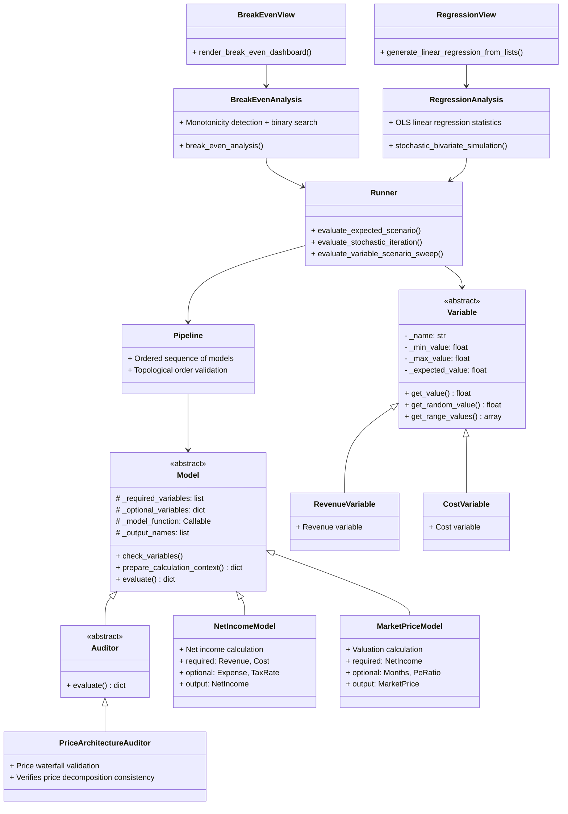

# LedgerScope Design Document

[TOC]

---

## Part 1: Overview & Getting Started

### 1. Project Introduction

#### 1.1 Project Positioning

**LedgerScope** is a **general-purpose financial modeling framework**, rather than a fixed model for specific products or industries.

The framework provides core abstractions (Variable, Model, Pipeline, Analysis, Auditor, Visualization). Users can quickly build financial models for different business scenarios by combining these components, including but not limited to:

- Cross-border B2B export business
- E-commerce operations analysis
- SaaS subscription economy
- Manufacturing cost accounting
- Startup financial forecasting
- Advertising efficiency and spend accounting

##### Core Value

| Dimension | Description |
|:---|:---|
| **Reusable** | Build once, reuse across multiple scenarios |
| **Extensible** | Support custom Variable, Model, Analysis, Visualization |
| **Auditable** | Auditor mechanism validates cross-model data consistency |
| **Visualizable** | Built-in 6 analysis modes + 7 chart types, ready to use |

#### 1.2 Design Principles

| Principle | Description |
|:---|:---|
| **Framework decoupled from business logic** | Core abstractions reusable across any product/industry; business logic injected via Variable and Model |
| **Single-product model** | Current version focuses on single-product analysis, simplifying data flow and dependencies; multi-product is future roadmap |
| **Cross-border trade priority** | Component design prioritizes cross-border B2B needs (shipping, tariffs, exchange rates, FOB pricing, etc.) |
| **Advertising efficiency core** | Built-in Google Search advertising funnel model supporting CPC, CVR, Close Rate and other key metrics |
| **Extensibility** | Reserved interfaces for future features such as upgrade packages, multi-product, repeat purchase LTV |
| **Determinism first** | Pipeline topological order validation ensures reproducible results across executions |

#### 1.3 Model Boundaries & Limitations

| Item | Description |
|:---|:---|
| **Model assumptions** | All assumptions transparently listed with their directional impact on results |
| **Single product** | Currently only supports single-product analysis |
| **Ad attribution** | Assumes all orders come from paid advertising (no SEO organic traffic) |
| **Conversion rate** | Assumed constant, not time-varying |
| **Depreciation & CapEx** | Placeholder implementation, returns 0 |
| **Delivery time** | Ignores order delivery time lag |
| **Exchange rate** | Currently uses fixed exchange rate, no dynamic simulation |
| **Financing cost** | Interest expense not included |

##### Features Not Included in 1.x

| Feature | Target Version | Description |
|:---|:---|:---|
| Upgrade package module | V2.x | Support upgrade_cost, upgrade_price, upgrade_rate |
| Repeat purchase & LTV | V2.x | Customer lifetime value modeling |
| Multi-channel attribution | V2.x | Distinguish order contribution across different ad channels |
| Volume discounts | V2.x | Non-linear COGS relationships |
| Multi-product support | V2.x | Introduce product_id dimension |
| Delivery lead time | V3.x | Revenue recognition time lag |
| SEO/organic traffic | V3.x | Extend to non-paid channels |
| Seasonality | V3.x | Cyclical effects like holiday peaks |
| Exchange rate fluctuation simulation | V4.x | Dynamic exchange rate sensitivity analysis |
| Financing cost (interest) | V4.x | Extend FCF model |

#### 1.4 Version Constraints & Planning

##### Current Version (1.x)

| Constraint | Description |
|:---|:---|
| Product count | Single-product model only |
| Order source | Assumes all orders come from ad channels (no repeat purchase, no distribution) |
| Conversion rate | Assumed constant, not time-varying |
| Depreciation & CapEx | Placeholder implementation, returns 0 |
| Delivery time | Ignores order delivery time lag |
| Exchange rate | Fixed exchange rate (sensitivity analysis possible) |

##### Version Numbering Rules

Semantic Versioning adopted:

- **MAJOR**: Major architectural changes (e.g., module responsibility redefinition)
- **MINOR**: New features (e.g., new Model, Analysis)
- **PATCH**: Fixes (e.g., documentation corrections, clarifications)

##### Version Iteration Strategy

| Version | Positioning | Change Type |
|:---|:---|:---|
| 1.x | Stable version | PATCH-only fixes, no major feature changes |
| 2.x | Feature expansion | MINOR new features (upgrade packages, repeat purchase, multi-channel, etc.) |
| 3.x | Time dimension | MINOR new features (delivery lead time, seasonality) |
| 4.x | Advanced simulation | MINOR new features (dynamic exchange rates, financing costs) |

#### 1.5 Recommended Next Steps

| Priority | Action | Owner | Target Version | Timeline |
|:---|:---|:---|:---|:---|
| Immediate | Launch business with baseline or optimistic scenario parameters | Business team | 1.x | Month 1 |
| Short-term | Accumulate first 3 months of actual data, calibrate model parameters | Data analysis | 1.x | End of Month 3 |
| Short-term | Validate CPC, CVR, Close Rate against industry benchmarks | Marketing team | 1.x | End of Month 3 |
| Medium-term | Upgrade package module development | Development team | 2.x | Month 6 |
| Medium-term | Repeat purchase and LTV modeling | Development team | 2.x | Month 6 |
| Medium-term | Multi-channel attribution and volume discounts | Development team | 2.x | Month 9 |
| Medium-term | Multi-product support | Development team | 2.x | Month 12 |
| Long-term | Delivery lead time and seasonality | Development team | 3.x | Month 18 |
| Long-term | Dynamic exchange rates and financing costs | Development team | 4.x | Month 24 |

#### 1.6 Future Roadmap

##### Version 1.x (Current Stable Version)

Version 1.x is positioned as a **stable version**, accepting only PATCH-level bug fixes and documentation improvements, with no major feature changes.

| Item | Description | Status |
|:---|:---|:---|
| Framework stability | Core API stable, no breaking changes | ✅ Stable |
| Documentation | Supplement examples, fix doc errors | Ongoing |
| Bug fixes | Fix identified edge case issues | As needed |

##### Version 2.x (Feature Expansion)

| Item | Description |
|:---|:---|
| Upgrade package module | Support upgrade_cost, upgrade_price, upgrade_rate |
| Multi-channel attribution | Distinguish order contribution across different ad channels |
| Volume discounts | Non-linear COGS relationships (tiered discounts) |
| Multi-product support | Introduce product_id dimension, support product mix analysis |
| Repeat purchase & LTV | Customer lifetime value modeling |

##### Version 3.x (Time Dimension)

| Item | Description |
|:---|:---|
| Order delivery delay | Revenue recognition time lag, improving cash flow analysis |
| Seasonality | Cyclical effects like holiday peaks |
| SEO/organic traffic | Extend to non-paid channels |

##### Version 4.x (Advanced Simulation)

| Item | Description |
|:---|:---|
| Exchange rate fluctuation simulation | Dynamic exchange rate sensitivity analysis |
| Financing cost (interest) | Extend FCF model, incorporate interest expense |
| Probability distribution expansion | Support normal distribution, triangular distribution, etc. |
| Negative profit tax treatment | Tax shield calculation |
| Real-time dashboard | Web interface + dynamic refresh |

#### 1.7 What Will Not Be Added (Beyond Model Capability)

| Item | Reason | Alternative |
|:---|:---|:---|
| AI demand forecasting | Model does not support time series forecasting | Use external market research reports |
| Competitor analysis | Outside model scope | Independent competitive research |
| Customer profiling | Outside model scope | CRM data analysis |
| Product design optimization | Outside model scope | Product team independent decisions |
| Supply chain optimization | Outside model scope | Dedicated supply chain analysis |
| Brand building effectiveness | Difficult to quantify, outside model scope | Brand health survey |


---


### 2. Quick Start

#### 2.1 Development Environment & Installation

##### Environment Requirements

- **Python 3.8+**: LedgerScope is developed on Python 3 as an analytical engine/computational platform for financial modeling
- **Recommended Environment**: Jupyter Notebook / JupyterLab (for data display and interactive analysis)

##### Installation Steps

1. **Install Python 3.8 or higher**
2. **Install Jupyter**: `pip install jupyter`
3. **Download LedgerScope Project**: `git clone https://github.com/hanyuwcn/LedgerScope/`
4. **Install Project Dependencies**: `pip install -r requirements.txt`

> 📝 See **Appendix B.6** for external dependencies.

##### Recommended Usage

| Environment | Use Case | Recommendation |
|:---|:---|:---|
| **Jupyter Notebook** | Interactive data analysis, visualization | ⭐⭐⭐ Strongly recommended |
| **JupyterLab** | Multi-window workflow, complex project organization | ⭐⭐⭐ Strongly recommended |
| **Python Script (.py)** | Automated batch calculations | ⭐⭐ Optional |
| **PyCharm/VS Code** | Code development, debugging | ⭐⭐ Auxiliary development |

> 💡 **Tip**: Jupyter Notebook perfectly displays LedgerScope-generated charts and formatted tables, making it the best environment to experience the framework's analytical capabilities.

#### 2.2 5-Minute Example: Analyzing Revenue Impact on Valuation

##### Step 1: Define Variables

```python
variables = {
    "Revenue": Variable(min=80000, exp=100000, max=120000),
    "Cost": Variable(min=30000, exp=40000, max=50000),
    "PeRatio": Variable(min=5, exp=8, max=10)
}
```

| Variable | Min | Expected | Max | Description |
|:---|:---|:---|:---|:---|
| Revenue | 80,000 | 100,000 | 120,000 | Operating revenue |
| Cost | 30,000 | 40,000 | 50,000 | Operating cost |
| PeRatio | 5 | 8 | 10 | Price-to-earnings multiple |

##### Step 2: Build Model Pipeline

```python
pipeline = [NetIncomeModel(), MarketPriceModel()]
```

##### Step 3: Execute Regression Analysis

```python
x, y, stats = stochastic_bivariate_simulation(
    variables=variables,
    independent_target_x="Revenue",
    dependent_target_y="MarketPrice",
    shuffled_variables=["Revenue", "Cost"],
    model_pipeline=pipeline,
    sample_size=100
)
```

##### Step 4: Visualize

```python
fig = generate_linear_regression_from_lists(
    x, y, "Revenue", "MarketPrice",
    x_benchmark=100000,
    y_benchmark=5000000
)
```


##### Output Interpretation

- **R² value**: Measures how well revenue explains valuation (closer to 1 is stronger)
- **Slope**: How much valuation increases per 1 unit increase in revenue
- **Benchmark lines**: Red dashed lines marking target revenue (100,000) and target valuation (5,000,000)

#### 2.3 Six Analysis Examples at a Glance

| Example | Analysis Module | Visualization | Core Question |
|:---|:---|:---|:---|
| 1 | `break_even_analysis` | Table | How much revenue is needed to reach target valuation? |
| 2 | `comparative_statics` | Table + Elasticity | When revenue changes 1%, how much does valuation change? |
| 3 | `stochastic_contribution_analysis` | Pie chart | What are the average proportions of revenue and cost? |
| 4 | `run_monte_carlo` | Histogram | What is the probability distribution and attainment probability of valuation? |
| 5 | `stochastic_bivariate_simulation` | Scatter + Regression | Is there a linear relationship between revenue and valuation? |
| 6 | `run_two_way_sensitivity_analysis` | Heatmap | How do revenue and cost jointly affect valuation? |

For detailed code examples, see **Appendix C: Complete Examples**.

---

### 3. Core Concepts

#### 3.1 Variable

Variable is the most fundamental building block in the framework, used to define the value ranges and value retrieval strategies of **independent variables**.

##### Core Responsibilities

- Manage variable min, expected, and max values
- Provide multiple value retrieval methods: expected, min, max, random
- Generate linear space arrays for sensitivity analysis

##### Construction Rules

| Input Combination | Handling Logic |
|:---|:---|
| min, exp, max all provided | Use directly |
| exp only | min = max = exp |
| min + max only | exp = (min + max) / 2 |
| max only | min = 0, exp = max / 2 |
| All empty | All None (placeholder variable) |
| min only | Semantically unclear, not allowed |

##### Value Retrieval Methods

| Method | Return Value | Use Case |
|:---|:---|:---|
| `get_value(ValueType.EXPECTED)` | Expected value | Baseline scenario |
| `get_value(ValueType.MIN)` | Minimum value | Pessimistic scenario |
| `get_value(ValueType.MAX)` | Maximum value | Optimistic scenario |
| `get_value(ValueType.RANDOM)` | Random value | Monte Carlo simulation |
| `get_range_values(num)` | Linear space array | Sensitivity analysis |

##### Example

```python
# Define ad budget: range 1500-3000, expected 2250
ads_budget = Variable(min=1500, max=3000)

# Define fixed exchange rate (no range)
exchange_rate = Variable(exp=6.8)

# Random sampling
random_budget = ads_budget.get_value(ValueType.RANDOM)

# Generate 50 evenly spaced values for scanning
scan_values = ads_budget.get_range_values(num=50)
```

##### Design Decisions

**Why no default business boundaries?** The boundary conditions of financial models are highly dependent on specific business scenarios. Hardcoding default values creates implicit assumptions. Explicit parameter passing forces users to think through business logic.

**Why are Variable instances immutable?** To maintain reproducibility of analysis. If different variable ranges are needed, create a new instance rather than modifying an existing one.

---

#### 3.2 Model

Model is the computational unit in the framework, used for calculating **dependent variables**.

##### Core Responsibilities

- Receive input dictionary in `{variable_name: value}` format
- Validate required variables exist, provide defaults for optional variables
- Execute core calculation logic
- Merge calculation results into the input dictionary and return

##### Input and Output

| Direction | Format | Example |
|:---|:---|:---|
| Input | `{var_name: value}` | `{"Revenue": 100000, "Cost": 40000}` |
| Output | `{var_name: value}` (original dict + new fields) | `{"Revenue": 100000, "Cost": 40000, "Profit": 60000}` |

##### Key Attributes

| Attribute | Type | Description |
|:---|:---|:---|
| `_required_variables` | `list[str]` | Required variable names (raises KeyError if missing) |
| `_optional_variables` | `dict[str, float]` | Optional variable names and their default values |
| `_model_function` | `callable` | Core calculation function |
| `_output_names` | `list[str]` | List of output variable names |

##### Execution Flow

```
Input dict → check_variables() → prepare_calculation_context() → _model_function() → merge results → return dict
```

##### Example: Custom Model

```python
def calculate_profit(variables: dict) -> dict:
    """Calculates the net operational profit generated within the execution context."""
    revenue = variables["Revenue"]
    cost = variables["Cost"]
    return {"Profit": revenue - cost}

class ProfitModel(Model):
    def __init__(self, input_variables: dict = None):
        super().__init__(input_variables)
        self._model_function = calculate_profit
        self._output_names = ["Profit"]
        self._required_variables = ["Revenue", "Cost"]
```

##### Design Decisions

**Why doesn't Model depend on the Variable class?** Model only receives concrete value dictionaries and doesn't care about the source of values. This makes Model independently testable.

**Why use in-place update strategy?** Avoids creating a large number of intermediate dictionaries in deep pipelines; upstream model outputs automatically become downstream model inputs.

> ⚠️ **Note**: In-place updates modify the input dictionary. To preserve the original state, use `copy.deepcopy()` before calling.

---

#### 3.3 Auditor

Auditor is a specialization of Model, used for **validating cross-model data consistency**.

##### Differences from Model

| Dimension | Model | Auditor |
|:---|:---|:---|
| Core responsibility | Calculate new variables | Validate existing variables |
| Output | Adds new fields | No new fields (returns original dict) |
| Failure handling | Calculation results may be abnormal | Raises ValueError, interrupts pipeline |
| Use case | Any calculation node | Critical data consistency checkpoints |

##### Execution Flow

```
Input dict → check_variables() → prepare_calculation_context() → validation function → return original dict (if passes) or raise exception (if fails)
```

##### Example: Price Architecture Auditor

```python
def check_price_architecture(variables: dict) -> None:
    """Validates the Price Waterfall for a single product context."""
    cogs_per_unit = variables["CogsPerUnit"]
    profit_per_unit = variables["ProfitPerUnit"]
    unit_fob = variables["UnitFob"]
    
    if not math.isclose(cogs_per_unit + profit_per_unit, unit_fob):
        raise ValueError("Reconciliation error: COGS + Profit != FOB")

class PriceArchitectureAuditor(Auditor):
    def __init__(self, input_variables: dict = None):
        super().__init__(input_variables)
        self._model_function = check_price_architecture
        self._required_variables = ["CogsPerUnit", "ProfitPerUnit", "UnitFob"]
```

##### Design Decisions

**Why is Auditor a specialization of Model?** The unified interface allows Auditor to be seamlessly embedded into Model pipelines without special handling.

---

#### 3.4 Pipeline

Pipeline is an ordered sequence of Models, responsible for passing upstream model outputs to downstream models.

##### Two Ways to Build a Pipeline

| Method | Example | Use Case |
|:---|:---|:---|
| **Direct model class list** | `[ModelA(), ModelB()]` | Quick prototyping, intuitive code |
| **Via name list** | `PipelineComposer.build_pipeline_by_keys(["a", "b"])` | Dynamic configuration, scenario management |

```python
# Method 1: Direct model class list
pipeline = [AdvertisingEfficiencyGoogleSearchModel(), OrderModel()]

# Method 2: Build via model name list
pipeline = PipelineComposer.build_pipeline_by_keys([
    "advertising_efficiency_google_search", "order_model"
])
```

##### Topological Order Validation

**Golden Rule**: Once a variable is consumed as input, it cannot be recalculated in subsequent models.

> 📝 For detailed explanation, see **Chapter 8: Pipeline Reference**.

---

#### 3.5 Engine

The Engine feeds concrete values from Variable objects to the Pipeline and executes calculations.

##### Core Functions

| Function | Use Case | Characteristics |
|:---|:---|:---|
| `evaluate_expected_scenario` | Baseline scenario | All variables take expected values |
| `evaluate_stochastic_iteration` | Single random sample | Specified variables random, others expected |
| `evaluate_variable_scenario_sweep` | Single variable sweep | Fix other variables, iterate over target values |
| `evaluate_chained_models` | General execution | Receive dict, execute pipeline |

##### Example

```python
result = evaluate_expected_scenario(variables, pipeline)
print(result["MarketPrice"])
```

##### Design Decisions

**Why use deepcopy for state isolation?** Each execution runs on a deep-copied dictionary, avoiding state contamination between multiple runs.

---

#### 3.6 Analysis

The Analysis module provides 6 ready-to-use analysis patterns, encapsulating common financial analysis scenarios.

##### Analysis Patterns at a Glance

| Pattern | Function | Input Characteristics | Output |
|:---|:---|:---|:---|
| Break-even | `break_even_analysis` | Requires goal value | Threshold, safety margin |
| Comparative statics | `comparative_statics` | Three-point sweep (min/exp/max) | Elasticity coefficient |
| Contribution | `stochastic_contribution_analysis` | Random sampling | Average values (for pie chart) |
| Monte Carlo | `run_monte_carlo` | Random sampling | Complete distribution array |
| Regression | `stochastic_bivariate_simulation` | Random sampling | OLS statistics + scatter data |
| Two-way sensitivity | `run_two_way_sensitivity_analysis` | Two-variable grid sweep | DataFrame (for heatmap) |

##### Design Decisions

**Why is Analysis decoupled from Pipeline?** Analysis only receives an executable pipeline function and doesn't care about the pipeline's internal structure. This allows the same analysis pattern to be reused for any pipeline.

---

#### 3.7 Visualization

The Visualization module renders Analysis outputs as charts or tables.

##### View to Analysis Mapping

| Analysis Pattern | View Function | Output Type |
|:---|:---|:---|
| Break-even | `render_break_even_dashboard` | Pandas Styler table |
| Comparative statics | `render_comparative_statics_dashboard` | Pandas Styler table |
| Contribution | `generate_contribution_pie_chart` | Matplotlib pie chart |
| Monte Carlo | `generate_histogram_from_array` | Matplotlib histogram |
| Regression | `generate_linear_regression_from_lists` | Matplotlib scatter + regression line |
| Two-way sensitivity | `generate_heatmap_from_df` | Seaborn heatmap |

##### Common Formatting Utilities

```python
formatter = get_formatter("Revenue")
print(formatter(100000))  # Output: ¥100,000
```

##### Design Decisions

**Separation of style and view**: Style configurations are stored in the `styles/` directory, view logic in the `views/` directory, facilitating theme customization.

---

### 4. Usage Workflow

#### 4.1 Standard Workflow

The standard workflow for financial analysis using LedgerScope consists of 4 steps:

```
Define Variables → Build Pipeline → Execute Analysis → Visualize Results
```

##### Step 1: Define Variables

```python
variables = {
    "Revenue": Variable(min=80000, exp=100000, max=120000),
    "Cost": Variable(min=30000, exp=40000, max=50000),
    "PeRatio": Variable(min=5, exp=8, max=10)
}
```

##### Step 2: Build Pipeline

```python
# Method 1: Direct model instance list
pipeline = [NetIncomeModel(), MarketPriceModel()]

# Method 2: Build via scenario name using PipelineComposer
pipeline = PipelineComposer.build_named_scenario("marketing_roi_analysis")
```

##### Step 3: Execute Analysis

```python
report = comparative_statics(
    variables=variables,
    selected_variables=["Revenue", "Cost", "PeRatio"],
    model_pipeline=pipeline,
    output_name="MarketPrice"
)
```

##### Step 4: Visualize Results

```python
render_comparative_statics_dashboard(report, "MarketPrice")
```

#### 4.2 Data Flow Diagram

```
┌─────────────────────────────────────────────────────────────────────────────┐
│                              Data Flow                                       │
├─────────────────────────────────────────────────────────────────────────────┤
│                                                                              │
│  ┌──────────────┐                                                           │
│  │  Variable    │  min=80000, exp=100000, max=120000                        │
│  │  Definition  │                                                           │
│  └──────┬───────┘                                                           │
│         │                                                                   │
│         ▼                                                                   │
│  ┌──────────────┐                                                           │
│  │   Engine     │  get_value(ValueType.EXPECTED) → 100000                   │
│  │   Valuation  │                                                           │
│  └──────┬───────┘                                                           │
│         │                                                                   │
│         ▼                                                                   │
│  ┌──────────────┐                                                           │
│  │  {var: value}│  {"Revenue": 100000, "Cost": 40000, "PeRatio": 8}         │
│  └──────┬───────┘                                                           │
│         │                                                                   │
│         ▼                                                                   │
│  ┌──────────────┐                                                           │
│  │  Pipeline    │  NetIncomeModel → MarketPriceModel                        │
│  │  Execution   │                                                           │
│  └──────┬───────┘                                                           │
│         │                                                                   │
│         ▼                                                                   │
│  ┌──────────────┐                                                           │
│  │  Final Dict  │  {"Revenue": 100000, "Cost": 40000, "NetIncome": 60000,   │
│  │              │   "MarketPrice": 480000}                                  │
│  └──────┬───────┘                                                           │
│         │                                                                   │
│         ▼                                                                   │
│  ┌──────────────┐     ┌──────────────┐                                     │
│  │  Analysis    │ ──► │ Visualization│                                     │
│  │  Execution   │     │   Rendering  │                                     │
│  └──────────────┘     └──────────────┘                                     │
│                                                                              │
└─────────────────────────────────────────────────────────────────────────────┘
```

#### 4.3 Integration with Jupyter Notebook

##### Display Charts in Notebook

```python
report = run_monte_carlo(variables, shuffled_inputs, pipeline, iterations=500)
fig = generate_histogram_from_array(report, "MarketPrice", goal=5000000)
```

##### Display Tables in Notebook

```python
render_break_even_dashboard(break_even_report, "MarketPrice")
```

##### Display Multiple Charts Side by Side

```python
fig, axes = plt.subplots(1, 2, figsize=(12, 5))
axes[0] = generate_histogram_from_array(report, "MarketPrice", goal=5000000)
axes[1] = generate_linear_regression_from_lists(x, y, "Revenue", "MarketPrice")
plt.tight_layout()
```

##### Save Charts to File

```python
fig = generate_contribution_pie_chart(average_contributions)
fig.savefig("contribution_pie.png", dpi=150, bbox_inches="tight")
```

##### Debugging in Notebook

```python
log.setLevel(logging.INFO)  # Enable detailed logging
report = break_even_analysis(variables, selected_variables, pipeline, "MarketPrice", goal=5000000)
```

---

## Part 2: Component Reference Manual

### 5. Variable Reference

#### 5.1 Overview

Variable is the most fundamental building block in the framework, used to define the value ranges and retrieval strategies of **independent variables**. All independent variables should be defined as subclasses of Variable and centrally managed in the `variables/` directory.

##### Variable Classification

| Category | Description | Examples |
|:---|:---|:---|
| Advertising | Ad budget, CPC, conversion rate, channel allocation | `AdvertisingBudget`, `GoogleSearchCostPerClick` |
| Costs | Procurement cost, shipping cost, setup cost | `Cost`, `ShippingCost`, `SetupCost` |
| Deals | Order volume, close rate, price, deduction rate | `Orders`, `CloseRate`, `UnitRetail`, `DeductionRate` |
| Expenses | Rent, travel, technology expenses | `RentExpense`, `TravelExpense`, `RenderExpense` |
| Finance | Tax rate, exchange rate, tariff, P/E ratio | `TaxRate`, `USDToRMB`, `TariffRate`, `PriceToEarningsRatio` |

##### Core Attributes

| Attribute | Type | Description |
|:---|:---|:---|
| `_name` | `str` | Unique variable identifier, corresponds to `variable_names` constant |
| `_min_value` | `float` | Minimum value |
| `_max_value` | `float` | Maximum value |
| `_expected_value` | `float` | Expected value (baseline value) |

##### Core Methods

| Method | Return Value | Use Case |
|:---|:---|:---|
| `get_value(value_type)` | `float` | Returns corresponding value based on strategy |
| `get_random_value()` | `float` | Returns random value within [min, max] range |
| `get_range_values(num)` | `np.ndarray` | Returns evenly spaced linear space array |
| `set_value(value)` | `None` | Fixes variable to a constant (not recommended) |

#### 5.2 Variable List (Representative Examples)

The following lists only representative variables from each category. For the complete list, please refer to the source files in the `variables/` directory.

##### Advertising (advertising.py)

| Class Name | Constant Name | Description |
|:---|:---|:---|
| `AdvertisingBudget` | `ADVERTISING_COST` | Total advertising budget |
| `GoogleSearchConversionRate` | `CONVERSION_RATE_GOOGLE_SEARCH` | Google Search click-to-lead conversion rate |
| `GoogleSearchCostPerClick` | `CPC_GOOGLE_SEARCH` | Google Search cost per click |

##### Costs (costs.py)

| Class Name | Constant Name | Description |
|:---|:---|:---|
| `SetupCost` | `SETUP_COST` | One-time setup cost (investment item) |
| `ShippingCost` | `SHIPPING_COST` | Logistics shipping cost |

##### Deals (deals.py)

| Class Name | Constant Name | Description |
|:---|:---|:---|
| `CloseRate` | `CLOSE_RATE` | Lead-to-order conversion rate |
| `UnitExw` | `UNIT_EXW` | Ex Works price (RMB) |
| `UnitRetail` | `UNIT_RETAIL` | End-market retail price (USD) |
| `UnitsPerOrder` | `UNITS_PER_ORDER` | Average units per order |

##### Expenses (expenses.py)

| Class Name | Constant Name | Description |
|:---|:---|:---|
| `MonthlyExpense` | `MONTHLY_EXPENSE` | Monthly operating expenses |
| `RentExpense` | `RENT_EXPENSE` | Monthly rent |

##### Finance (finance.py)

| Class Name | Constant Name | Description |
|:---|:---|:---|
| `TaxRate` | `TAX_RATE` | Corporate tax rate |
| `USDToRMB` | `USD_TO_RMB` | USD to RMB exchange rate |
| `PriceToEarningsRatio` | `PE_RATIO` | Price-to-earnings multiple |

#### 5.3 Design Decisions

##### Decision 1: Variable Only Covers Independent Variables, Not Dependent Variables

Variables in LedgerScope are divided into two categories:

| Type | Description | Examples | Has Variable Subclass? |
|:---|:---|:---|:---|
| **Independent Variable** | Model input parameters that require value ranges in analysis | `AdvertisingBudget`, `CloseRate` | ✅ Yes |
| **Dependent Variable** | Model output results derived from independent variables | `Revenue`, `NetIncome` | ❌ No |

A variable (such as `Orders`) may serve as a dependent variable in standard models but can also be used as an independent variable in simplified analyses. A Variable subclass defined in the `variables/` directory simply indicates that the variable can be used as an independent variable.

##### Decision 2: Variable Provides No Default Business Boundaries

The boundary conditions of financial models are highly dependent on specific business scenarios. Explicit parameter passing forces users to think through business logic.

```python
# Correct: User explicitly defines business boundaries
ads_budget = AdvertisingBudget(min=1500, exp=2250, max=3000)

# Incorrect: Should not rely on internal defaults
ads_budget = AdvertisingBudget()  # No defaults, will raise exception
```

##### Decision 3: Variable Instances Are Immutable

Maintains reproducibility of analysis. If different variable ranges are needed, create a new instance.

```python
# Recommended: Create a new instance
high_budget = AdvertisingBudget(min=2000, exp=3000, max=4000)

# Not recommended: Modify existing instance
budget.set_value(3000)  # Loses original range information
```

##### Decision 4: Variable Names Decoupled from Code

Use `variable_names` constants to avoid spelling errors and support IDE autocompletion.

```python
# Recommended
from src.config import variable_names as vn
variables = {vn.REVENUE: Variable(...)}

# Not recommended
variables = {"Revenue": Variable(...)}
```

---

### 6. Model Reference

#### 6.1 Overview

Model is the computational unit in the framework, used for calculating **dependent variables**. Each Model receives an input dictionary, executes calculation logic, and merges the results into the original dictionary before returning.

##### Model Classification

| Category | Description |
|:---|:---|
| Advertising Funnel Models | Ad budget → Leads → Orders |
| Cost Models | COGS, shipping cost, total cost |
| Deal Models | Deduction rate, FOB, unit contribution |
| Expense Models | Monthly expenses, period costs |
| Revenue & Profit Models | Revenue, profit, net income, cash flow |
| Financial Metric Models | CAC, ROAS, ROI, valuation, price decomposition |
| Placeholder Models | Depreciation, CapEx (currently return 0) |

##### Unified Interface

| Attribute/Method | Type | Description |
|:---|:---|:---|
| `_required_variables` | `list[str]` | Required variable names (raises KeyError if missing) |
| `_optional_variables` | `dict[str, float]` | Optional variable names and their default values |
| `_model_function` | `callable` | Core calculation function, signature `(variables: dict) -> dict` |
| `_output_names` | `list[str]` | List of output variable names |
| `evaluate()` | `method` | Executes validation and calculation, returns updated dictionary |

#### 6.2 Model List (Representative Examples)

The following lists only representative models from each category. For the complete list, please refer to the source files in the `models/` directory.

##### Advertising Funnel Models (advertising/)

| Model | Required Inputs | Optional Inputs | Output | Formula |
|:---|:---|:---|:---|:---|
| `AdvertisingEfficiencyGoogleSearchModel` | `ADVERTISING_COST`, `CPC_GOOGLE_SEARCH`, `CONVERSION_RATE_GOOGLE_SEARCH` | `USD_TO_RMB`, `ALLOCATION_GOOGLE_SEARCH` | `LEADS` | `Leads = (Budget × Allocation) / (CPC × USDToRMB) × CVR` |
| `CostPerLeadGoogleSearchModel` | `CPC_GOOGLE_SEARCH`, `CONVERSION_RATE_GOOGLE_SEARCH` | `ALLOCATION_GOOGLE_SEARCH` | `CPL_GOOGLE_SEARCH` | `CPL = CPC / (CVR × Allocation)` |

##### Cost Models (cost/)

| Model | Required Inputs | Optional Inputs | Output | Formula |
|:---|:---|:---|:---|:---|
| `CostOfGoodsSoldModel` | `UNIT_EXW`, `ORDERS`, `UNITS_PER_ORDER` | — | `COGS` | `COGS = UnitExw × Orders × UnitsPerOrder` |
| `TotalCostModel` | `COGS` | `ADVERTISING_COST`, `SHIPPING_COST` | `COST` | `TotalCost = COGS + AdvertisingCost + ShippingCost` |

##### Deal Models (deal/)

| Model | Required Inputs | Optional Inputs | Output | Formula |
|:---|:---|:---|:---|:---|
| `OrderModel` | `LEADS`, `CLOSE_RATE` | — | `ORDERS` | `Orders = Leads × CloseRate` |
| `UnitFobModel` | `UNIT_RETAIL` | `DEDUCTION_RATE` | `UNIT_FOB` | `UnitFob = UnitRetail × (1 - DeductionRate)` |

##### Revenue & Profit Models (income/)

| Model | Required Inputs | Optional Inputs | Output | Formula |
|:---|:---|:---|:---|:---|
| `RevenueModel` | `UNIT_FOB`, `ORDERS`, `UNITS_PER_ORDER` | `USD_TO_RMB` | `REVENUE` | `Revenue = UnitFob × Orders × UnitsPerOrder × USDToRMB` |
| `NetIncomeModel` | `REVENUE`, `COST` | `EXPENSE`, `DEPRECIATION`, `TAX_RATE` | `NET_INCOME` | `NetIncome = (Revenue - Cost - Expense - Depreciation) × (1 - TaxRate)` |

##### Financial Metric Models (metrics/)

| Model | Required Inputs | Optional Inputs | Output | Formula |
|:---|:---|:---|:---|:---|
| `MarketPriceModel` | `NET_INCOME` | `MONTHS`, `PE_RATIO` | `MARKET_PRICE` | `MarketPrice = (NetIncome × 12 × PE) / Months` |
| `PriceArchitectureModel` | `UNITS_PER_ORDER`, `ORDERS`, `COGS`, `UNIT_RETAIL`, `PROFIT` | `SHIPPING_RATE`, `TARIFF_RATE`, `CHANNEL_MARKUP_RATE`, `USD_TO_RMB` | 5 output variables | Decomposes retail price into components |

#### 6.3 Model Dependencies

The diagram below shows the data dependencies between models (text flow diagram):

```
Independent Variable Inputs
    │
    ├── AdvertisingEfficiencyGoogleSearchModel → LEADS
    ├── CostPerLeadGoogleSearchModel → CPL_GOOGLE_SEARCH
    │
    ▼
LEADS ──► OrderModel ──► ORDERS
    │
    ├──► CostOfGoodsSoldModel ──► COGS ──► TotalCostModel ──► COST
    ├──► ShippingCostModel ──► SHIPPING_COST ──► TotalCostModel
    │
    ├──► DeductionRateModel ──► DEDUCTION_RATE ──► UnitFobModel ──► UNIT_FOB
    │
    ├──► RevenueModel ──► REVENUE
    │
    ▼
COGS + SHIPPING_COST + ADVERTISING_COST ──► TotalCostModel ──► COST
    │
    ▼
REVENUE + COST ──► ProfitModel ──► PROFIT
    │
    ▼
REVENUE + COST + EXPENSE + DEPRECIATION + TAX_RATE ──► NetIncomeModel ──► NET_INCOME
    │
    ├──► MarketPriceModel ──► MARKET_PRICE
    ├──► FreeCashFlowModel ──► FREE_CASH_FLOW
    ├──► RoiModel ──► ROI
    │
    ▼
PriceArchitectureModel ──► Per-unit decomposition (COGS_PER_UNIT, PROFIT_PER_UNIT, ...)
```

**Core Data Flow**:

| Stage | Input | Model | Output |
|:---|:---|:---|:---|
| 1 | Ad budget, CPC, conversion rate | `AdvertisingEfficiencyGoogleSearchModel` | `LEADS` |
| 2 | `LEADS`, close rate | `OrderModel` | `ORDERS` |
| 3 | Unit cost, `ORDERS` | `CostOfGoodsSoldModel` | `COGS` |
| 4 | Retail price, `ORDERS` | `ShippingCostModel` | `SHIPPING_COST` |
| 5 | `COGS`, ad spend, shipping cost | `TotalCostModel` | `COST` |
| 6 | FOB price, `ORDERS` | `RevenueModel` | `REVENUE` |
| 7 | `REVENUE`, `COST` | `ProfitModel` | `PROFIT` |
| 8 | `REVENUE`, `COST`, expenses, tax rate | `NetIncomeModel` | `NET_INCOME` |
| 9 | `NET_INCOME`, P/E multiple | `MarketPriceModel` | `MARKET_PRICE` |

#### 6.4 Design Decisions

##### Decision 1: Model Does Not Depend on Variable Class

**Question**: Why does Model only receive a `{name: value}` dictionary rather than Variable objects directly?

**Rationale**:
- Model can be tested independently without relying on Variable's random/range logic
- The same Model can be used for deterministic analysis (expected values) and stochastic simulation (sampled values)
- Input sources are not limited to Variables; they can also come from outputs of other Models or hardcoded values

##### Decision 2: In-Place Update Strategy

**Question**: Why does Model directly modify the input dictionary rather than returning a new dictionary?

**Rationale**:
- **Memory optimization**: Avoids creating many intermediate dictionaries in deep pipelines
- **Chained execution**: Upstream model outputs automatically become downstream model inputs
- **Performance**: Reduces garbage collection overhead

**Risk and Mitigation**:
- In-place updates modify the original dictionary, potentially affecting subsequent analyses
- Callers should use `copy.deepcopy()` before calling if the original state needs to be preserved

---

### 7. Auditor Reference

#### 7.1 Overview

Auditor is a specialization of Model, used for **validating cross-model data consistency**. Unlike Model, Auditor does not produce new variables; it only validates relationships between existing variables. When validation fails, it raises an exception and interrupts pipeline execution.

##### Core Characteristics

| Characteristic | Description |
|:---|:---|
| **Inherits from Model** | Reuses Model's validation and execution framework |
| **No output variables** | `output_names` returns empty list |
| **Raises exception on failure** | Interrupts pipeline via `ValueError` |
| **Seamlessly embeds in Pipeline** | Uses same execution interface as Model |

##### Comparison with Model

| Dimension | Model | Auditor |
|:---|:---|:---|
| Core responsibility | Calculate new variables | Validate existing variables |
| Output | Adds new fields | No new fields (returns original dict) |
| Failure handling | Calculation results may be abnormal | Raises ValueError, interrupts pipeline |
| `output_names` | List of output variable names | Empty list `[]` |
| Use case | Any calculation node | Critical data consistency checkpoints |

#### 7.2 Auditor List (Representative Examples)

As the framework develops, the number of auditors will continue to grow. The following lists representative auditors. For the complete list, please refer to the source files in the `auditors/` directory.

##### PriceArchitectureAuditor

**Location**: `auditors/price_architecture_auditor.py`

**Responsibility**: Validates the consistency of price architecture decomposition, ensuring retail price equals the sum of its components.

**Validation Rules**:

| Rule | Formula | Description |
|:---|:---|:---|
| Rule 1 | `COGS_per_unit + Profit_per_unit == UnitFob` | FOB price = Unit COGS + Unit Profit |
| Rule 2 | `UnitFob + Shipping_per_unit + Tariff_per_unit + RetailMargin_per_unit == UnitRetail` | Retail price = FOB + Shipping + Tariff + Channel Margin |

**Input Variables**:

| Variable Name | Required/Optional | Description |
|:---|:---|:---|
| `COGS_PER_UNIT` | Required | Unit COGS |
| `PROFIT_PER_UNIT` | Required | Unit profit |
| `UNIT_FOB` | Required | FOB unit price |
| `UNIT_RETAIL` | Required | Retail unit price |
| `SHIPPING_COST_PER_UNIT` | Optional (default 0.0) | Unit shipping cost |
| `TARIFF_PER_UNIT` | Optional (default 0.0) | Unit tariff |
| `RETAIL_MARGIN_PER_UNIT` | Optional (default 0.0) | Unit channel margin |

**Tolerance Settings**:

The auditor uses tolerances defined in `settings.py` for float comparisons:

```python
AUDIT_REL_TOL = 1e-3  # Relative tolerance (0.1%)
AUDIT_ABS_TOL = 1e-2  # Absolute tolerance (0.01)
```

**Error Example**:

When price decomposition is inconsistent, a `ValueError` is raised:

```python
# Assume COGS_per_unit=30, Profit_per_unit=20, UnitFob=60
# 30 + 20 = 50 ≠ 60 → Exception raised

ValueError: Reconciliation error: cog_per_unit(30) + profit_per_unit(20) != unit_fob(60)
```

**Position in Pipeline**:

`PriceArchitectureAuditor` should be placed after `PriceArchitectureModel` to validate its calculation results:

```python
pipeline = [
    # ... upstream models ...
    PriceArchitectureModel(),      # Calculate price decomposition
    PriceArchitectureAuditor(),    # Validate decomposition consistency
    # ... downstream models ...
]
```

#### 7.3 Design Decisions

##### Decision 1: Auditor as a Specialization of Model

**Question**: Why isn't Auditor designed as an independent interface?

**Rationale**:
- Reuses Model's validation framework (`check_variables`, `prepare_calculation_context`, `evaluate`, etc.)
- Seamlessly embeds in Pipeline without special handling
- Pipeline executor does not distinguish between Model and Auditor

**Implementation**:

```python
class Auditor(Model):
    @property
    def output_names(self) -> list:
        return []  # Produces no new variables
    
    def evaluate(self):
        self.check_variables()
        context = self.prepare_calculation_context()  # Unified variable resolution
        self._model_function(context)  # Validation logic, raises exception on failure
        return self._input_variables  # Returns original dictionary
```

##### Decision 2: Validation Failure Interrupts Pipeline

**Question**: Why raise an exception on validation failure rather than logging a warning and continuing?

**Rationale**:
- Data inconsistency affects all downstream calculation results
- Continuing execution may produce misleading conclusions
- "Fail fast" principle helps identify issues early

##### Decision 3: Tolerance for Float Comparisons

**Question**: Why not use direct `==` for equality checks?

**Rationale**:
- Financial calculations involve extensive floating-point operations; precision errors are unavoidable
- Tolerance settings (0.1% relative, 0.01 absolute) are acceptable precision for financial analysis

---

### 8. Pipeline Reference

#### 8.1 Overview

Pipeline is an ordered sequence of Models, responsible for passing upstream model outputs to downstream models. LedgerScope provides scenario-based pipeline construction capabilities through `PipelineComposer` and includes built-in topological order validation.

##### Core Components

| Component | Location | Responsibility |
|:---|:---|:---|
| `PIPELINE_REGISTRY` | `model_registry.py` | Mapping from model names to model classes |
| `DYNAMIC_PIPELINE_CONFIGS` | `pipelines.py` | Predefined scenario configurations |
| `PipelineComposer` | `model_composer.py` | Scenario-based pipeline builder |
| `check_model_pipeline_topology_order` | `validation.py` | Topological order validation |

##### Workflow

```
Scenario name → PIPELINE_CONFIGS → Model name list → PIPELINE_REGISTRY → Model instance list → Topology validation → Executable Pipeline
```

#### 8.2 Predefined Scenarios (Representative Examples)

`DYNAMIC_PIPELINE_CONFIGS` defines multiple preset scenarios. The following lists representative scenarios:

| Scenario Name | Model Sequence | Use Case |
|:---|:---|:---|
| `marketing_roi_analysis` | Ad efficiency → Orders → COGS → Total cost → Revenue → Profit | Marketing ROI analysis |
| `complete_macro_metrics` | Ad efficiency → COGS → Revenue → Total cost → Expenses → Depreciation → CapEx → Net income → Profit → Cash flow → ROI | Complete macro metrics |

**Scenario Configuration Example**:

```python
DYNAMIC_PIPELINE_CONFIGS = {
    "marketing_roi_analysis": [
        "advertising_efficiency_google_search",
        "order_model",
        "cogs",
        "total_cost",
        "revenue",
        "profit"
    ]
}
```

> 📝 **Note**: Predefined scenario configurations are still being refined. For the complete list, please refer to `config/pipelines.py`.

#### 8.3 Custom Pipelines

##### Method 1: Direct Model Class List

```python
pipeline = [
    AdvertisingEfficiencyGoogleSearchModel(),
    OrderModel(),
    CostOfGoodsSoldModel(),
    TotalCostModel(),
    RevenueModel(),
    ProfitModel()
]
```

##### Method 2: Build via Model Name List Using PipelineComposer

```python
model_keys = [
    "advertising_efficiency_google_search",
    "order_model",
    "cogs",
    "total_cost",
    "revenue",
    "profit"
]

pipeline = PipelineComposer.build_pipeline_by_keys(model_keys)
```

##### Method 3: Based on Predefined Scenario with Additional Models

```python
pipeline = PipelineComposer.build_named_scenario(
    "marketing_roi_analysis",
    "roas",      # Append ROAS model
    "cac"        # Append CAC model
)
```

##### Method 4: Merge Multiple Scenarios

```python
pipeline = PipelineComposer.build_merged_scenarios([
    "costs",
    "marketing_roi_analysis"
])  # Automatically deduplicates
```

#### 8.4 Topological Order Validation (DAG Property)

##### Core Rule

**Golden Rule**: Once a variable is consumed as input, it cannot be recalculated in subsequent models.

```
✅ Correct: Leads → Orders → Revenue → Profit
❌ Incorrect: Leads → Orders → (recalculate Orders)
```

##### Validation Example

```python
# ✅ Correct: One-way data flow
pipeline = [
    ModelA(),  # Input [Leads] → Output [Orders]
    ModelB(),  # Input [Orders] → Output [Revenue]
    ModelC()   # Input [Revenue] → Output [Profit]
]
check_model_pipeline_topology_order(pipeline)  # Passes

# ❌ Incorrect: Orders already consumed, cannot be recalculated
pipeline = [
    ModelA(),  # Input [Leads] → Output [Orders]
    ModelB(),  # Input [Orders] → Output [Revenue]
    ModelC()   # Input [Leads] → Output [Orders]  ← Violates rule
]
check_model_pipeline_topology_order(pipeline)  # Raises KeyError
```

##### Design Principles

| Design Goal | Description |
|:---|:---|
| **Determinism** | Each variable has a single source; results are reproducible |
| **Conflict prevention** | Prevents two models from producing different values for the same variable |
| **DAG guarantee** | Pipeline is always a directed acyclic graph with no circular dependencies |

---

### 9. Analysis Reference

#### 9.1 Overview

The Analysis module provides 6 ready-to-use financial analysis patterns covering common business analysis scenarios. All analysis functions follow a unified interface design: they receive variable definitions and a model pipeline, and return structured analysis results.

##### Analysis Patterns at a Glance

| Pattern | Function | Input Characteristics | Output | Use Case |
|:---|:---|:---|:---|:---|
| Break-even | `break_even_analysis` | Requires goal value | Threshold, safety margin, status code | "How much is needed to reach the goal?" |
| Comparative statics | `comparative_statics` | Three-point sweep (min/exp/max) | Elasticity coefficient, result range | "How sensitive is it?" |
| Contribution | `stochastic_contribution_analysis` | Random sampling | Average values (for pie chart) | "What are the average proportions?" |
| Monte Carlo | `run_monte_carlo` | Random sampling | Complete distribution array | "What is the probability distribution?" |
| Regression | `stochastic_bivariate_simulation` | Random sampling | OLS statistics + scatter data | "How strong is the linear relationship?" |
| Two-way sensitivity | `run_two_way_sensitivity_analysis` | Two-variable grid sweep | DataFrame (for heatmap) | "How do X and Y jointly affect the outcome?" |

##### Design Decision

**Analysis decoupled from Pipeline**: All analysis functions only receive an executable pipeline function and do not care about the pipeline's internal structure. This allows the same analysis pattern to be reused for any business model.

#### 9.2 Break-even Analysis

**Function**: `break_even_analysis`

**Use Case**: Find the variable value needed for a target metric to reach a specified threshold. For example: "How much revenue is needed to achieve a valuation of 5 million?"

##### Function Signature

```python
def break_even_analysis(
    variables: dict,           # Variable dictionary
    selected_variables: list,  # List of variables to analyze
    model_pipeline: list,      # Model pipeline
    output_name: str,          # Target metric name
    goal: float = 0.0          # Target threshold
) -> list[dict]:
```

##### Output Description

For each analyzed variable, returns: threshold (minimum value needed to reach the goal), safety margin (percentage deviation of expected value from threshold), and status code.

**Status Code (FeasibilityStatus)**:

| Status Code | Meaning |
|:---|:---|
| `CROSSOVER_FOUND` | Break-even point exists |
| `ALWAYS_FEASIBLE` | Goal is achieved in all scenarios |
| `UNREACHABLE` | Goal cannot be achieved |

##### Usage Example

```python
report = break_even_analysis(
    variables=variables,
    selected_variables=[vn.REVENUE, vn.COST],
    model_pipeline=pipeline,
    output_name=vn.MARKET_PRICE,
    goal=5000000
)

for item in report:
    print(f"{item['Variable']}: Threshold = {item['Threshold']:.0f}, "
          f"Safety Margin = {item['SafetyMargin']:.1%}")
```

##### Algorithm Description

1. Generate linear space range for the variable (`NUMS_IN_RANGE` steps)
2. Iterate through all values and calculate corresponding results
3. Check monotonicity (raises exception if non-monotonic)
4. Binary search for exact threshold
5. Calculate safety margin: `(expected - threshold) / expected`

#### 9.3 Comparative Statics Analysis

**Function**: `comparative_statics`

**Use Case**: Calculate the impact of variables on the target metric at three points (min, expected, max) and compute elasticity coefficients. For example: "When revenue increases by 1%, by what percentage does valuation change?"

##### Function Signature

```python
def comparative_statics(
    variables: dict,           # Variable dictionary
    selected_variables: list,  # List of variables to analyze
    model_pipeline: list,      # Model pipeline
    output_name: str           # Target metric name
) -> list[dict]:
```

##### Output Description

For each analyzed variable, returns: variable values and result values at min/exp/max, plus elasticity coefficient.

##### Elasticity Formula

```
Elasticity = (ΔY / Y_expected) / (ΔX / X_expected) = (ΔY/ΔX) × (X_expected / Y_expected)
```

**Meaning of Elasticity**: Measures the sensitivity of the target metric to changes in a variable.

| Elasticity Value | Meaning |
|:---|:---|
| \|ε\| > 1 | Highly sensitive (elastic) |
| \|ε\| = 1 | Unit elastic |
| \|ε\| < 1 | Low sensitivity (inelastic) |
| ε > 0 | Positive correlation |
| ε < 0 | Negative correlation |

**Difference Between Elasticity and Linear Slope**:

| Concept | Formula | Characteristic |
|:---|:---|:---|
| Slope | `ΔY / ΔX` | Unit-dependent; not comparable across variables |
| Elasticity | `(ΔY/Y) / (ΔX/X)` | Unitless; comparable across variables |

##### Usage Example

```python
report = comparative_statics(
    variables=variables,
    selected_variables=[vn.REVENUE, vn.COST, vn.PE_RATIO],
    model_pipeline=pipeline,
    output_name=vn.MARKET_PRICE
)

for item in report:
    print(f"{item['Variable']}: Elasticity = {item['Elasticity']:.2f}")
```

#### 9.4 Contribution Analysis

**Function**: `stochastic_contribution_analysis`

**Use Case**: Calculate the average contribution values of metrics through Monte Carlo simulation for generating pie charts. For example: "What are the average proportions of revenue and cost?"

##### Function Signature

```python
def stochastic_contribution_analysis(
    variables: dict,           # Variable dictionary
    breakdown_metrics: list,   # List of metrics to analyze
    model_pipeline: list,      # Model pipeline
    shuffled_inputs: list,     # List of variables to randomly sample
    sample_size: int = settings.SAMPLE_SIZE  # Number of samples
) -> dict[str, float]:
```

##### Output Description

Returns a dictionary where keys are metric names and values are the average values of those metrics. Percentages for pie charts must be calculated by the caller.

##### Usage Example

```python
averages = stochastic_contribution_analysis(
    variables=variables,
    breakdown_metrics=[vn.REVENUE, vn.COST],
    model_pipeline=pipeline,
    shuffled_inputs=[vn.REVENUE, vn.COST],
    sample_size=5000
)

# Output: {"Revenue": 100000, "Cost": 40000}
```

##### Notes

- It is recommended to use 5000 or more samples for stable results
- Returns absolute averages; percentages must be calculated separately

#### 9.5 Monte Carlo Simulation

**Function**: `run_monte_carlo`

**Use Case**: Execute Monte Carlo simulation to generate probability distribution of target metrics. For example: "What is the distribution shape and attainment probability of valuation?"

##### Function Signature

```python
def run_monte_carlo(
    variables: dict,           # Variable dictionary
    shuffled_inputs: list,     # List of variables to randomly sample
    model_pipeline: list,      # Model pipeline
    tracked_outputs: list = None,  # Output metrics to track (optional)
    iterations: int = 100      # Number of iterations
) -> list[dict]:
```

##### Output Description

Returns a list of simulation results, each containing all metrics specified in `tracked_outputs` and a `simulation_run_id` (iteration number).

##### Usage Example

```python
results = run_monte_carlo(
    variables=variables,
    shuffled_inputs=[vn.REVENUE, vn.COST, vn.PE_RATIO],
    model_pipeline=pipeline,
    tracked_outputs=[vn.MARKET_PRICE],
    iterations=5000
)

market_prices = [r[vn.MARKET_PRICE] for r in results]
```

##### Performance Recommendations

| Scenario | Recommended Iterations |
|:---|:---|
| Quick prototyping | 100-500 |
| Production analysis | 5,000-10,000 |
| High precision requirements | 50,000+ |

#### 9.6 Regression Analysis

**Function**: `stochastic_bivariate_simulation`

**Use Case**: Execute bivariate Monte Carlo simulation and compute OLS linear regression statistics. For example: "Is there a linear relationship between revenue and valuation?"

##### Function Signature

```python
def stochastic_bivariate_simulation(
    variables: dict,           # Variable dictionary
    independent_target_x: str, # X-axis variable
    dependent_target_y: str,   # Y-axis variable
    shuffled_variables: list,  # List of variables to randomly sample
    model_pipeline: list,      # Model pipeline
    sample_size: int = settings.SAMPLE_SIZE
) -> tuple[list[float], list[float], dict]:
```

##### Output Description

| Return Value | Type | Description |
|:---|:---|:---|
| `simulated_x` | `list[float]` | List of simulated X variable values |
| `simulated_y` | `list[float]` | List of simulated Y variable values |
| `stats` | `dict` | OLS regression statistics |

**Regression Statistics Dictionary**:

| Field | Description | Meaning |
|:---|:---|:---|
| `slope` | Regression slope | Change in Y per unit change in X |
| `intercept` | Intercept | Predicted Y value when X=0 |
| `r_squared` | Coefficient of determination (R²) | How well X explains Y (0-1, closer to 1 is better) |
| `p_value` | p-value | Statistical significance (<0.05 indicates significant relationship) |
| `standard_error` | Standard error | Uncertainty of slope estimate (smaller = more precise) |

##### Usage Example

```python
x, y, stats = stochastic_bivariate_simulation(
    variables=variables,
    independent_target_x=vn.REVENUE,
    dependent_target_y=vn.MARKET_PRICE,
    shuffled_variables=[vn.REVENUE, vn.COST],
    model_pipeline=pipeline,
    sample_size=5000
)

print(f"R² = {stats['r_squared']:.3f}")
print(f"p-value = {stats['p_value']:.4f}")
print(f"MarketPrice = {stats['slope']:.2f} × Revenue + {stats['intercept']:.0f}")
```

#### 9.7 Two-Way Sensitivity Analysis

**Function**: `run_two_way_sensitivity_analysis`

**Use Case**: Analyze the joint impact of two variables on a target metric and generate heatmap data. For example: "How do revenue and cost jointly affect valuation?"

##### Function Signature

```python
def run_two_way_sensitivity_analysis(
    variables: dict,           # Variable dictionary
    param_x_name: str,         # X-axis variable name
    param_y_name: str,         # Y-axis variable name
    model_pipeline: list,      # Model pipeline
    target_output_name: str,   # Target metric name
    x_steps: int = settings.NUMS_IN_RANGE,   # Number of X-axis steps
    y_steps: int = settings.NUMS_IN_RANGE,   # Number of Y-axis steps
    reverse_x: bool = False,   # Whether to reverse X-axis
    reverse_y: bool = True     # Whether to reverse Y-axis
) -> pd.DataFrame:
```

##### Output Description

Returns a `pandas.DataFrame`: index is Y variable values, columns are X variable values, values are target metric calculation results. This DataFrame can be directly used with `generate_heatmap_from_df()` to generate a heatmap.

##### Usage Example

```python
df = run_two_way_sensitivity_analysis(
    variables=variables,
    param_x_name=vn.REVENUE,
    param_y_name=vn.COST,
    model_pipeline=pipeline,
    target_output_name=vn.MARKET_PRICE,
    x_steps=20,
    y_steps=20
)
```

##### Parameter Description

| Parameter | Default | Description |
|:---|:---|:---|
| `x_steps` | 50 | Number of equally spaced steps on X-axis |
| `y_steps` | 50 | Number of equally spaced steps on Y-axis |
| `reverse_x` | False | X-axis from low to high |
| `reverse_y` | True | Y-axis from high to low (low values at bottom-left of heatmap) |

---

### 10. Visualization Reference

#### 10.1 Overview

The Visualization module renders outputs from the Analysis module as charts or tables. All views are natively compatible with Jupyter Notebook and support interactive display and saving.

##### Architecture Design

```
views/                    # View logic (extensible)
├── common_view.py        # Shared formatting utilities
├── break_even_view.py    # Break-even table
├── comparative_statics_view.py  # Sensitivity analysis table
├── contribution_pie_view.py     # Contribution pie chart
├── histogram_distribution_view.py  # Monte Carlo histogram
├── linear_regression_view.py    # Regression scatter plot
└── ...                   # Future new views

styles/                   # Style configurations (colors, fonts, layouts)
├── break_even_styles.py
├── comparative_statics_styles.py
├── contribution_pie_styles.py
├── ...                   # Future new styles
```

> 📝 **Extensibility Note**: The architecture reserves room for extension. New views and style configurations can be added at any time without modifying existing code.

##### Design Decision

**Separation of style and view**: Style configurations are stored in the `styles/` directory, view logic in the `views/` directory, facilitating theme customization and style consistency. Different users can customize visual effects according to their preferences.

#### 10.2 Common Formatting Utilities

`common_view.py` provides shared formatting functionality to ensure consistency across views in numeric formatting, table styling, color themes, etc.

##### Numeric Formatting

Automatically applies formatting rules based on variable type (currency symbols, decimal places, percentages, etc.):

```python
formatter = get_formatter("Revenue")
print(formatter(100000))   # Output: ¥100,000

formatter = get_formatter("TaxRate")
print(formatter(0.25))     # Output: 25%
```

##### Table Styling

`apply_custom_variable_formatting` applies variable formatting to DataFrame rows:

```python
formatted_row = apply_custom_variable_formatting(
    row,
    variable_col="Variable",
    target_cols=["Base", "Threshold"]
)
```

##### Common Style Elements

The view module includes the following configurable style elements (specific values can be adjusted based on theme):

| Style Element | Description |
|:---|:---|
| Numeric format | Currency symbols, decimal places, thousand separators, percentages |
| Table style | Alignment, fonts, background colors, borders, highlight rules |
| Chart colors | Primary color, secondary color, gradients, warning colors |
| Font configuration | Title font, body font, size, weight |

> 📝 **Note**: All style elements above can be customized in the `styles/` directory as needed. For complete configuration, refer to the `styles/` directory and `config/formatting.py`.

#### 10.3 Break-even Table

**View Function**: `render_break_even_dashboard`

**Input**: Output from `break_even_analysis`

**Output**: Pandas Styler table

##### Usage Example

```python
report = break_even_analysis(...)
styler = render_break_even_dashboard(report, "MarketPrice")
styler  # Automatically displays in Jupyter Notebook
```

##### Output Example

| Variable | Base | Threshold | Safety Margin |
|:---|:---|:---|:---|
| MarketPrice | 480,000 | 500,000 | — |
| Revenue | 100,000 | 104,167 | +4.17% |

#### 10.4 Sensitivity Analysis Table

**View Function**: `render_comparative_statics_dashboard`

**Input**: Output from `comparative_statics`

**Output**: Pandas Styler table

##### Usage Example

```python
report = comparative_statics(...)
styler = render_comparative_statics_dashboard(report, "MarketPrice")
styler
```

##### Output Example

| Variable | Min | Base | Max | Elasticity |
|:---|:---|:---|:---|:---|
| MarketPrice | 240,000 | 480,000 | 720,000 | — |
| Revenue | 80,000 | 100,000 | 120,000 | +2.00 |

#### 10.5 Contribution Pie Chart

**View Function**: `generate_contribution_pie_chart`

**Input**: Output from `stochastic_contribution_analysis` (average values dictionary)

**Output**: Matplotlib Figure

##### Usage Example

```python
averages = stochastic_contribution_analysis(...)
fig = generate_contribution_pie_chart(averages)
```

##### Output Example

Pie chart displays the average contribution proportions of each metric, with legend showing variable names and formatted absolute values. For example:
- Revenue: 100,000 (60%)
- Cost: 40,000 (40%)

#### 10.6 Monte Carlo Histogram

**View Function**: `generate_histogram_from_array`

**Input**: Output from `run_monte_carlo` + target metric name + optional goal value

**Output**: Matplotlib Figure

##### Usage Example

```python
results = run_monte_carlo(...)
fig = generate_histogram_from_array(
    results,
    output_name="MarketPrice",
    goal=5000000
)
```

##### Output Example

Histogram displays probability distribution, including the following elements:
- Distribution probability (histogram bar height)
- Mean line (blue dashed line) with mean value
- Goal line (red dashed line, if goal provided)
- Percentage labels for below/above goal

```
Example labels:
Mean: 4,800,000
Below Goal: 65% | Above Goal: 35%
```

#### 10.7 Regression Scatter Plot

**View Function**: `generate_linear_regression_from_lists`

**Input**: X/Y data from `stochastic_bivariate_simulation` + labels + optional benchmark lines

**Output**: Matplotlib Figure

##### Usage Example

```python
x, y, stats = stochastic_bivariate_simulation(...)
fig = generate_linear_regression_from_lists(
    x, y,
    x_label="Revenue",
    y_label="MarketPrice",
    x_benchmark=100000,
    y_benchmark=5000000
)
```

##### Output Example

Scatter plot with regression line, legend showing regression equation and R² value:

```
Eq: MarketPrice = 48.00 × Revenue - 2,000,000 | R² = 0.95
```

#### 10.8 Heatmap

**View Function**: `generate_heatmap_from_df`

**Input**: DataFrame returned by `run_two_way_sensitivity_analysis`

**Output**: Seaborn heatmap (Matplotlib Figure)

##### Usage Example

```python
df = run_two_way_sensitivity_analysis(...)
fig = generate_heatmap_from_df(df, output_name="MarketPrice")
```

##### Chart Effect

The heatmap displays the joint impact of two variables, with color intensity representing value magnitude (darker = higher value, lighter = lower value). The color bar (legend) annotates the specific value range.

---

### 11. Config Reference

#### 11.1 Overview

The Config module centrally manages system configuration information, including system parameters, variable name constants, log messages, formatting rules, and predefined pipeline scenarios.

##### Module Structure

| File | Responsibility |
|:---|:---|
| `settings.py` | System and model configuration parameters |
| `variable_names.py` | Variable name dictionary key constants |
| `messages.py` | Log and error message templates |
| `formatting.py` | Variable formatting rules |
| `pipelines.py` | Predefined pipeline scenario configurations |

#### 11.2 settings.py (System Parameters)

Defines system and model configuration parameters for framework runtime. The following are some parameter examples:

| Parameter | Default | Description |
|:---|:---|:---|
| `NUMS_IN_RANGE` | 50 | Number of steps for variable sweep and heatmap |
| `SAMPLE_SIZE` | 100 | Default Monte Carlo iteration count |
| `AUDIT_REL_TOL` | 1e-3 | Audit relative tolerance |
| `AUDIT_ABS_TOL` | 1e-2 | Audit absolute tolerance |

> 📝 For the complete parameter list, refer to `config/settings.py`. New parameters may be added with version iterations.

#### 11.3 variable_names.py (Variable Name Constants)

Defines string constants for all variable names to avoid hardcoded spelling errors.

```python
REVENUE = "Revenue"
COST = "Cost"
ADVERTISING_COST = "AdvertisingCost"
```

**Usage**:

```python
from src.config import variable_names as vn
variables = {vn.REVENUE: Variable(...)}
```

#### 11.4 messages.py (Message Templates)

Centrally manages log information, error messages, and status messages.

```python
# Error message examples
ERROR_VARIABLE_NOT_SETUP = "{var} not setup"
ERROR_PIPELINE_MODEL_NOT_REGISTERED = "Key '{model}' is not registered in MODEL_REGISTRY."
```

#### 11.5 formatting.py (Formatting Mapping)

Defines formatting rules for each variable during visualization (currency symbols, decimal places, percentages, etc.).

```python
VARIABLE_FORMATTING_MAP = {
    "Revenue": lambda v: fmt(v, d=0, s='¥'),           # ¥100,000
    "CPC_GoogleSearch": lambda v: fmt(v, d=1, s='$'),  # $2.5
    "TaxRate": lambda v: fmt(v, d=2, p=True),          # 25.00%
    "ALLOCATION_GOOGLE_SEARCH": lambda v: fmt(v, d=0, p=True),  # 50%
}
```

**Usage**:

```python
formatter = VARIABLE_FORMATTING_MAP.get("Revenue")
print(formatter(100000))   # ¥100,000
```

#### 11.6 pipelines.py (Predefined Pipeline Scenarios)

Defines preset pipeline scenario configurations for use with `PipelineComposer`.

```python
DYNAMIC_PIPELINE_CONFIGS = {
    "costs": [
        "advertising_efficiency_google_search",
        "order_model",
        "cogs",
        "total_cost"
    ],

    "marketing_roi_analysis": [
        "advertising_efficiency_google_search",
        "order_model",
        "cogs",
        "total_cost",
        "revenue",
        "profit"
    ],
}
```

**Usage**:

```python
from src.pipelines import PipelineComposer

pipeline = PipelineComposer.build_named_scenario("marketing_roi_analysis")
```

---

### 12. Utils Reference

#### 12.1 Overview

The Utils module provides general helper functions, including variable validation, numeric formatting, and log management. These utility functions primarily serve the framework's internal runtime and will continue to expand as the framework develops.

##### Module Structure

| File | Responsibility |
|:---|:---|
| `validation.py` | Variable completeness validation, pipeline topology validation |
| `formatting.py` | Core numeric formatting functions |
| `logger.py` | Console logging and file output |

#### 12.2 validation.py (Validation Utilities)

Provides variable missing detection and pipeline topology validation to ensure data reliability and model stability.

**Core Functions**:

| Function | Purpose |
|:---|:---|
| `get_missing_elements` | Detects missing variables from a list of required variables |
| `check_variables_for_function` | Validates variable existence, raises KeyError if missing |
| `check_model_pipeline_topology_order` | Validates pipeline topology order to prevent variable overwrite conflicts |

> 📝 The validation toolset will continue to expand with framework development. For detailed usage, refer to `src/utils/validation.py`.

#### 12.3 formatting.py (Numeric Formatting)

Provides core numeric formatting functions for currency symbols, decimal places, and percentage conversion.

**Core Functions**:

| Function | Purpose |
|:---|:---|
| `fmt` | Core formatting function supporting currency, decimals, percentages |
| `list_to_element_string` | Converts a list to a comma-separated string for error messages |

> 📝 For formatting rules and usage examples, see **11.5 formatting.py** and **10.2 Common Formatting Utilities**.

#### 12.4 logger.py (Log Configuration)

Provides colored console log output and optional file logging.

**Configuration Switches**:

| Parameter | Default | Description |
|:---|:---|:---|
| `PRINT_TO_CONSOLE` | True | Whether to output to console |
| `WRITE_TO_FILE` | False | Whether to write to file |
| `LOG_LEVEL` | ERROR | Log level (DEBUG/INFO/WARNING/ERROR) |

**Usage Example**:

```python
from src.utils import log

log.error("Variable not found: Revenue")
log.info("Monte Carlo simulation completed")
```

> 📝 During debugging, you can lower `LOG_LEVEL` to `INFO` or `DEBUG` to obtain more detailed execution information.

---

### 13. Module Relationships & Dependencies

> 💡 **Tip**: This section outlines the hierarchical dependencies and data flows of each component. For detailed class diagrams and model data flow diagrams, see **Appendix A: Model Dependency Diagram**.

#### 13.1 Hierarchical Dependencies & Architecture Pattern

LedgerScope follows a Model-View-like architecture pattern:

| Role | Layer | Components | Responsibility |
|:---|:---|:---|:---|
| **Model** | Layer 1 (Base) | `Variable`, `Model`, `Auditor` | Define core abstractions |
| **Model** | Layer 2 (Implementation) | `RevenueVariable`, `NetIncomeModel`, `PriceArchitectureAuditor` | Business component implementation |
| **Model** | Layer 3 (Engine) | `Pipeline`, `Runner` | Execution and orchestration |
| **Model** | Layer 4 (Analysis) | `BreakEvenAnalysis`, `RegressionAnalysis` | Integrates layers 1-3, generates analysis results |
| **View** | Layer 5 (Visualization) | `BreakEvenView`, `RegressionView`, `CommonView` | Renders charts and tables |
| **Controller** | External | Jupyter Notebook / User scripts | Calls analysis layer, triggers visualization |

**Dependency Direction**: Upper layers depend on lower layers; lower layers do not depend on upper layers.

**Core Relationship Summary**:

| Relationship | Description |
|:---|:---|
| `Variable → Analysis` | Analysis depends on Variable definitions |
| `Analysis → Pipeline` | Analysis calls Pipeline to execute business calculations |
| `Pipeline → Model` | Pipeline orchestrates Model execution order |
| `Pipeline → Auditor` | Pipeline orchestrates Auditor validation order |
| `Analysis → Visualization` | Analysis produces results for Visualization to render |

#### 13.2 Core Data Flow

```
┌─────────────────────────────────────────────────────────────────────────────┐
│                           Core Data Flow                                     │
├─────────────────────────────────────────────────────────────────────────────┤
│                                                                              │
│  ┌────────────────────────────────────────────────────────────────────┐     │
│  │                        Analysis Layer                               │     │
│  │                                                                      │     │
│  │  ┌──────────────┐    ┌──────────────┐    ┌──────────────┐          │     │
│  │  │  Variable    │───►│   Runner     │───►│  Pipeline    │          │     │
│  │  │  Definition  │    │   Valuation  │    │  Execution   │          │     │
│  │  └──────────────┘    └──────────────┘    └──────────────┘          │     │
│  │                                                                      │     │
│  └────────────────────────────────────────────────────────────────────┘     │
│         │                                                                   │
│         │ Analysis Results                                                  │
│         ▼                                                                   │
│  ┌──────────────┐                                                           │
│  │Visualization │                                                           │
│  │   Rendering  │                                                           │
│  └──────────────┘                                                           │
│                                                                              │
└─────────────────────────────────────────────────────────────────────────────┘
```

**Data Flow Description**:

| Stage | Input | Output | Key Components |
|:---|:---|:---|:---|
| Definition | Business parameters (min/exp/max) | Variable objects | `Variable` |
| Valuation | Variable objects | `{name: value}` dictionary | `Runner` |
| Execution | Input dictionary + Model/Auditor list | Complete state dictionary | `Pipeline`, `Model`, `Auditor` |
| Analysis | State dictionary + analysis parameters | Analysis report | `BreakEvenAnalysis`, `RegressionAnalysis` |
| Rendering | Analysis report | Charts / Tables | `BreakEvenView`, `RegressionView` |

#### 13.3 Execution Sequence Diagram

```
User Script / Jupyter Notebook          Analysis              Pipeline          Model/Auditor
        │                              │                      │                    │
        │  1. Define Variables         │                      │                    │
        │─────────────────────────────►│                      │                    │
        │                              │                      │                    │
        │  2. Call Analysis Function   │                      │                    │
        │─────────────────────────────►│                      │                    │
        │                              │                      │                    │
        │                              │  3. Execute Pipeline │                    │
        │                              │─────────────────────►│                    │
        │                              │                      │                    │
        │                              │                      │  4. Call Model     │
        │                              │                      │───────────────────►│
        │                              │                      │                    │
        │                              │                      │  5. Return Results │
        │                              │                      │◄───────────────────│
        │                              │                      │                    │
        │                              │                      │  6. Call Auditor   │
        │                              │                      │───────────────────►│
        │                              │                      │                    │
        │                              │                      │  7. Validation Pass│
        │                              │                      │◄───────────────────│
        │                              │                      │                    │
        │                              │  8. Return Complete State Dict         │
        │                              │◄─────────────────────│                    │
        │                              │                      │                    │
        │  9. Return Analysis Results  │                      │                    │
        │◄─────────────────────────────│                      │                    │
        │                              │                      │                    │
        │  10. Call Visualization      │                      │                    │
        │─────────────────────────────────────────────────────────────────────►│
        │                                                                       │
        │  11. Render Charts/Tables                                             │
        │◄─────────────────────────────────────────────────────────────────────│
        │                                                                       │
```

**Sequence Description**:

| Step | Caller | Callee | Action |
|:---|:---|:---|:---|
| 1 | User script | Analysis | Define Variable objects |
| 2 | User script | Analysis | Call analysis function (e.g., `break_even_analysis`) |
| 3 | Analysis | Pipeline | Execute Pipeline |
| 4 | Pipeline | Model | Call Model calculation |
| 5 | Model | Pipeline | Return calculation results |
| 6 | Pipeline | Auditor | Call Auditor validation |
| 7 | Auditor | Pipeline | Validation passes |
| 8 | Pipeline | Analysis | Return complete state dictionary |
| 9 | Analysis | User script | Return analysis report |
| 10 | User script | Visualization | Call view function |
| 11 | Visualization | User script | Render charts/tables |

---

## Part 3: Extension Development Guide

### 14. Adding New Variable

#### 14.1 Steps

Adding a new Variable requires completing the following steps:

| Step | Action | Location |
|:---|:---|:---|
| 1 | Add constant in `variable_names.py` | `config/variable_names.py` |
| 2 | Add formatting rule in `formatting.py` | `config/formatting.py` |
| 3 | Create Variable subclass | Corresponding file in `variables/` directory |
| 4 | Set variable name | Call `super()` and set `_name` in `__init__` |

#### 14.2 Naming Conventions

| Convention | Example |
|:---|:---|
| Class name: PascalCase | `NewRevenueStream` |
| Constant name: SCREAMING_SNAKE_CASE | `NEW_REVENUE_STREAM` |
| Dictionary key: PascalCase | `"NewRevenueStream"` |

> 📝 For the complete variable list, refer to the source files in the `variables/` directory. New variables will be added as the business develops.

#### 14.3 Formatting Configuration Description

In `config/formatting.py`, each variable needs its display format configured:

| Parameter | Description | Example |
|:---|:---|:---|
| `d` | Decimal places | `d=2` for two decimal places |
| `s` | Currency symbol | `s='¥'` for RMB, `s='$'` for USD |
| `p` | Whether as percentage | `p=True` displays as percentage |

**Formatting Example**:

```python
VARIABLE_FORMATTING_MAP = {
    # Currency type: with currency symbol
    "Revenue": lambda v: fmt(v, s='¥'),           # ¥100,000
    "Cost": lambda v: fmt(v, s='¥'),              # ¥40,000
    "CPC_GoogleSearch": lambda v: fmt(v, d=1, s='$'),  # $2.5
    
    # Percentage type
    "TaxRate": lambda v: fmt(v, d=2, p=True),     # 25.00%
    "CloseRate": lambda v: fmt(v, d=2, p=True),   # 12.00%
    
    # General numeric type
    "Orders": lambda v: fmt(v, d=1),              # 64.5
    "USDToRMB": lambda v: fmt(v, d=2),            # 6.80
}
```

#### 14.4 Example: Adding a New Variable

**Step 1**: Add constant in `config/variable_names.py`

```python
# Add under the appropriate category
NEW_REVENUE_STREAM = "NewRevenueStream"
```

**Step 2**: Add formatting rule in `config/formatting.py`

```python
VARIABLE_FORMATTING_MAP = {
    # ... existing configuration ...
    variable_names.NEW_REVENUE_STREAM: lambda v: fmt(v, s='¥'),  # RMB denominated
}
```

**Step 3**: Create subclass in the appropriate `variables/` file

```python
from src.config import variable_names
from src.core import Variable


class NewRevenueStream(Variable):
    """New revenue stream variable"""

    def __init__(self, min=None, exp=None, max=None):
        super().__init__(min, exp, max)
        self._name = variable_names.NEW_REVENUE_STREAM
```

**Usage Example**:

```python
from src.variables import NewRevenueStream
from src.config import variable_names as vn

variables = {
    vn.NEW_REVENUE_STREAM: NewRevenueStream(min=0, exp=50000, max=100000)
}

# Formatting is automatically applied in visualization
# Displays as: ¥50,000
```

#### 14.5 Formatting Configuration Reference

| Variable Type | Decimal Places | Currency Symbol | Percentage | Example Output |
|:---|:---|:---|:---|:---|
| Revenue, Profit, Cost | 0 | ¥ | No | `¥100,000` |
| Ad Unit Price (CPC, CPL) | 1 | $ | No | `$2.5` |
| FOB Price | 0 | $ | No | `$150` |
| Order Volume, Sales Volume | 1 | None | No | `64.5` |
| Exchange Rate | 2 | None | No | `6.80` |
| Tax Rate, Conversion Rate | 2 | None | Yes | `25.00%` |
| ROAS, ROI | 1-2 | None | Yes | `450.0%` |
| Elasticity Coefficient | 2 | None | No (with sign) | `+2.00` |

---

### 15. Adding New Model

#### 15.1 Steps

Adding a new Model requires completing the following steps:

| Step | Action | Location |
|:---|:---|:---|
| 1 | Add output variable constant in `variable_names.py` | `config/variable_names.py` |
| 2 | Add formatting rule in `formatting.py` (if visualization is needed) | `config/formatting.py` |
| 3 | Implement calculation function | Model file (e.g., `models/metrics/`) |
| 4 | Create Model subclass | Same as above |
| 5 | Register in `PIPELINE_REGISTRY` | `pipelines/model_registry.py` |
| 6 | (Optional) Add to predefined scenarios | `config/pipelines.py` |

#### 15.2 Model Implementation Specification

Each Model must implement the following attributes:

| Attribute | Type | Description |
|:---|:---|:---|
| `_model_function` | `callable` | Core calculation function, signature `(variables: dict) -> dict` |
| `_output_names` | `list[str]` | List of output variable names |
| `_required_variables` | `list[str]` | List of required variable names (raises KeyError if missing) |
| `_optional_variables` | `dict[str, float]` | Optional variable names and their default values |

#### 15.3 Calculation Function Specification

| Specification | Description |
|:---|:---|
| Function signature | `def func(variables: dict) -> dict` |
| Input reading | Read directly from `variables` dictionary; framework has already resolved required/optional |
| Division by zero protection | Check for zero in denominators |
| Return value | Must return `dict` with output variable name as key |

#### 15.4 Example: Adding Gross Margin Model

**Step 1**: Add constant in `config/variable_names.py`

```python
# Add under Metrics category
GROSS_MARGIN = "GrossMargin"
```

**Step 2**: Add formatting rule in `config/formatting.py`

```python
VARIABLE_FORMATTING_MAP = {
    # ... existing configuration ...
    variable_names.GROSS_MARGIN: lambda v: fmt(v, d=2, p=True),  # Display as percentage
}
```

**Step 3**: Implement calculation function and Model

```python
from src.config import variable_names
from src.core import Model


def calculate_gross_margin(variables: dict) -> dict:
    """
    Calculate gross margin

    Formula: GrossMargin = (Revenue - COGS) / Revenue
    """
    revenue = variables[variable_names.REVENUE]
    cogs = variables[variable_names.COGS]

    # Division by zero protection
    if revenue == 0:
        return {variable_names.GROSS_MARGIN: 0.0}

    gross_margin = (revenue - cogs) / revenue
    return {variable_names.GROSS_MARGIN: gross_margin}


class GrossMarginModel(Model):
    """Gross margin calculation model"""

    def __init__(self, input_variables: dict = None):
        super().__init__(input_variables)

        self._model_function = calculate_gross_margin
        self._output_names = [variable_names.GROSS_MARGIN]

        self._required_variables = [
            variable_names.REVENUE,
            variable_names.COGS
        ]

        self._optional_variables = {}
```

**Step 4**: Register in `PIPELINE_REGISTRY`

```python
from src.models.metrics.gross_margin_model import GrossMarginModel

PIPELINE_REGISTRY = {
    # ... existing registrations ...
    "gross_margin": GrossMarginModel,
}
```

**Step 5**: (Optional) Add to predefined scenarios

```python
DYNAMIC_PIPELINE_CONFIGS = {
    # ... existing scenarios ...
    "gross_margin_analysis": [
        "advertising_efficiency_google_search",
        "order_model",
        "cogs",
        "revenue",
        "gross_margin"
    ],
}
```

#### 15.5 Using the New Model

```python
# Method 1: Manual construction
pipeline = [
    RevenueModel(),
    CostOfGoodsSoldModel(),
    GrossMarginModel()  # Must be placed after Revenue and COGS
]

# Method 2: Using scenario name
pipeline = PipelineComposer.build_named_scenario("gross_margin_analysis")
```

#### 15.6 Common Errors and Solutions

| Problem | Cause | Solution |
|:---|:---|:---|
| `KeyError: 'VariableName'` | Required variable missing | Check whether upstream models in the pipeline produce that variable |
| Division by zero error | Denominator not checked for zero | Add division by zero protection |
| Topology order error | Model order violates DAG rules | Move the model that produces the required variable earlier |
| Output not updated in state dictionary | Calculation function does not return dict | Ensure returning `{output_name: value}` |

---

### 16. Adding New Auditor

#### 16.1 Steps

Adding a new Auditor requires completing the following steps:

| Step | Action | Location |
|:---|:---|:---|
| 1 | Add variable constants for audit (if needed) in `variable_names.py` | `config/variable_names.py` |
| 2 | Create Auditor subclass | `auditors/` directory |
| 3 | Implement validation function | Same as above |
| 4 | Raise `ValueError` on validation failure | Same as above |
| 5 | Register in `PIPELINE_REGISTRY` | `pipelines/model_registry.py` |

#### 16.2 Auditor Implementation Specification

| Specification | Description |
|:---|:---|
| Inherit from `Auditor` base class | `class NewAuditor(Auditor)` |
| `output_names` returns empty list | Inherited from `Auditor`, automatically returns `[]` |
| Raise exception on validation failure | Use `raise ValueError("error message")` |
| No return value on successful validation | Function simply returns normally |

#### 16.3 Validation Function Specification

| Specification | Description |
|:---|:---|
| Function signature | `def check_xxx(variables: dict) -> None` |
| Input reading | Read directly from `variables` dictionary; framework has already resolved required/optional |
| Tolerance comparison | Use `math.isclose()` with `settings.AUDIT_REL_TOL` and `AUDIT_ABS_TOL` |
| Failure handling | Raise `ValueError` with clear error message |

#### 16.4 Example: Adding Deduction Rate Reasonableness Auditor

**Scenario Requirement**: Validate that DeductionRate is within a reasonable range (0 ≤ DeductionRate < 1).

**Step 1**: Create auditor file

```python
from src.config import variable_names
from src.core import Auditor


def check_deduction_rate(variables: dict) -> None:
    """
    Validate that deduction rate is within reasonable range

    Rules:
        - DeductionRate >= 0 (cannot be negative)
        - DeductionRate < 1 (cannot reach or exceed 100%)
    """
    deduction_rate = variables[variable_names.DEDUCTION_RATE]

    if deduction_rate < 0:
        raise ValueError(
            f"DeductionRate({deduction_rate:.2%}) cannot be negative. "
            f"Please check ShippingRate, TariffRate, and ChannelMarkupRate settings."
        )

    if deduction_rate >= 1:
        raise ValueError(
            f"DeductionRate({deduction_rate:.2%}) cannot reach or exceed 100%. "
            f"Please check whether the sum of ShippingRate, TariffRate, and ChannelMarkupRate exceeds 1."
        )


class DeductionRateAuditor(Auditor):
    """Deduction rate reasonableness auditor"""

    def __init__(self, input_variables: dict = None):
        super().__init__(input_variables)

        self._model_function = check_deduction_rate
        self._required_variables = [variable_names.DEDUCTION_RATE]
        self._optional_variables = {}
```

**Step 2**: Register the auditor

```python
from src.auditors.deduction_rate_auditor import DeductionRateAuditor

PIPELINE_REGISTRY = {
    # ... existing registrations ...
    "deduction_rate_auditor": DeductionRateAuditor,
}
```

**Step 3**: Use in Pipeline

```python
pipeline = PipelineComposer.build_pipeline_by_keys([
    "deduction_rate",        # Calculate deduction rate
    "deduction_rate_auditor" # Validate deduction rate reasonableness
])
```

#### 16.5 Example: Price Architecture Auditor (Reference Implementation)

```python
import math
from src.config import variable_names, settings
from src.core import Auditor


def check_price_architecture(variables: dict) -> None:
    """
    Validate price decomposition consistency

    Rules:
        - COGS_per_unit + Profit_per_unit == UnitFob
        - UnitFob + Shipping_per_unit + Tariff_per_unit + RetailMargin_per_unit == UnitRetail
    """
    cogs_per_unit = variables[variable_names.COGS_PER_UNIT]
    profit_per_unit = variables[variable_names.PROFIT_PER_UNIT]
    unit_fob = variables[variable_names.UNIT_FOB]
    unit_retail = variables[variable_names.UNIT_RETAIL]
    shipping_per_unit = variables[variable_names.SHIPPING_COST_PER_UNIT]
    tariff_per_unit = variables[variable_names.TARIFF_PER_UNIT]
    retail_margin_per_unit = variables[variable_names.RETAIL_MARGIN_PER_UNIT]

    # Audit 1: COGS + Profit == FOB
    if not math.isclose(
        cogs_per_unit + profit_per_unit, unit_fob,
        rel_tol=settings.AUDIT_REL_TOL, abs_tol=settings.AUDIT_ABS_TOL
    ):
        raise ValueError(
            f"Price decomposition inconsistent: COGS_per_unit({cogs_per_unit}) + "
            f"Profit_per_unit({profit_per_unit}) != UnitFob({unit_fob})"
        )

    # Audit 2: FOB + deductions == Retail
    if not math.isclose(
        unit_fob + shipping_per_unit + tariff_per_unit + retail_margin_per_unit,
        unit_retail,
        rel_tol=settings.AUDIT_REL_TOL, abs_tol=settings.AUDIT_ABS_TOL
    ):
        raise ValueError(
            f"Price decomposition inconsistent: UnitFob({unit_fob}) + Shipping({shipping_per_unit}) + "
            f"Tariff({tariff_per_unit}) + RetailMargin({retail_margin_per_unit}) "
            f"!= UnitRetail({unit_retail})"
        )


class PriceArchitectureAuditor(Auditor):
    """Price architecture auditor"""

    def __init__(self, input_variables: dict = None):
        super().__init__(input_variables)

        self._model_function = check_price_architecture
        self._required_variables = [
            variable_names.COGS_PER_UNIT,
            variable_names.PROFIT_PER_UNIT,
            variable_names.UNIT_FOB,
            variable_names.UNIT_RETAIL,
        ]
        self._optional_variables = {
            variable_names.SHIPPING_COST_PER_UNIT: 0.0,
            variable_names.TARIFF_PER_UNIT: 0.0,
            variable_names.RETAIL_MARGIN_PER_UNIT: 0.0,
        }
```

#### 16.6 Auditor Position in Pipeline

Auditors should be placed **after** the model that produces the variables to be validated:

```python
# ✅ Correct order
pipeline = [
    PriceArchitectureModel(),      # Produces price decomposition variables
    PriceArchitectureAuditor(),    # Validates decomposition consistency
    # ... downstream models ...
]

# ❌ Incorrect order
pipeline = [
    PriceArchitectureAuditor(),    # Variables not yet produced → KeyError
    PriceArchitectureModel(),
]
```

#### 16.7 Auditor Design Principles

| Principle | Description |
|:---|:---|
| **Single responsibility** | Each auditor validates only one type of business rule |
| **Clear error messages** | Error messages should explain the cause and possible solutions |
| **Use tolerance** | Financial calculations involve floating-point precision; use `math.isclose` with tolerance settings |
| **Optional variable support** | Provide default values for potentially missing variables (via `_optional_variables` configuration) |

#### 16.8 Common Errors and Solutions

| Problem | Cause | Solution |
|:---|:---|:---|
| `KeyError: 'VariableName'` | Variables to validate not yet produced | Check whether auditor is placed after the model that produces them |
| Auditor not executed | Auditor not registered or not added to pipeline | Check registration in `PIPELINE_REGISTRY` |
| False positives due to tight tolerance | Insufficient precision in financial calculations | Adjust `settings.AUDIT_REL_TOL` and `AUDIT_ABS_TOL` |

---

### 17. Adding New Pipeline

#### 17.1 Steps

Adding a new Pipeline requires completing the following steps:

| Step | Action | Location |
|:---|:---|:---|
| 1 | Define scenario configuration (list of model names) | `config/pipelines.py` |
| 2 | (Recommended) Validate topology order | Call `check_model_pipeline_topology_order()` |
| 3 | (Optional) Add to documentation | Design document or code comments |

#### 17.2 Scenario Configuration Specification

| Specification | Description |
|:---|:---|
| Name | Use lowercase letters + underscores, e.g., `"marketing_roi_analysis"` |
| Order | Upstream models first, downstream models later |
| Dependencies | Ensure variables required by downstream models are produced by upstream models |

#### 17.3 Example: Adding a New Scenario

**Scenario Requirement**: Gross margin analysis (Revenue, COGS, Gross Margin)

**Step 1**: Add configuration in `config/pipelines.py`

```python
DYNAMIC_PIPELINE_CONFIGS = {
    # ... existing scenarios ...
    
    # Gross margin analysis scenario
    "gross_margin_analysis": [
        "advertising_efficiency_google_search",  # Ad efficiency → LEADS
        "order_model",                           # LEADS → ORDERS
        "cogs",                                  # COGS calculation
        "revenue",                               # Revenue calculation
        "gross_margin"                           # Gross margin calculation
    ],
}
```

**Step 2**: Validate topology order (optional but recommended)

```python
pipeline = PipelineComposer.build_named_scenario("gross_margin_analysis")
check_model_pipeline_topology_order(pipeline)  # No exception means order is correct
```

**Step 3**: Use the new scenario

```python
pipeline = PipelineComposer.build_named_scenario("gross_margin_analysis")

report = break_even_analysis(
    variables=variables,
    selected_variables=["Revenue", "COGS"],
    model_pipeline=pipeline,
    output_name="GrossMargin",
    goal=0.3  # Target gross margin 30%
)
```

#### 17.4 Dynamic Pipeline Construction

| Method | Description | Example |
|:---|:---|:---|
| `build_named_scenario` | Based on predefined scenario, can append models | `build_named_scenario("costs", "roas")` |
| `build_merged_scenarios` | Merge multiple scenarios, automatically deduplicate | `build_merged_scenarios(["costs", "margin"])` |
| `build_pipeline_by_keys` | Build via list of model names | `build_pipeline_by_keys(["model_a", "model_b"])` |

#### 17.5 Common Errors and Solutions

| Problem | Cause | Solution |
|:---|:---|:---|
| `KeyError: 'model_name not registered'` | Model name not in registry | Check registration in `PIPELINE_REGISTRY` |
| Topology order error | Model order violates DAG rules | Ensure model producing a variable comes before the model consuming it |
| Scenario name does not exist | Scenario not defined in configuration | Add scenario configuration or use `build_pipeline_by_keys()` |

---

### 18. Adding New Analysis

#### 18.1 Steps

Adding a new Analysis requires completing the following steps:

| Step | Action | Location |
|:---|:---|:---|
| 1 | Create analysis function file | `analysis/` directory |
| 2 | Implement analysis logic | Same as above |
| 3 | Call Runner to execute pipeline | Use `evaluate_*` functions |
| 4 | Call Validation utilities for input validation | Use `check_variables_for_function`, `check_model_pipeline_topology_order` |
| 5 | Return structured results | Same as above |
| 6 | (Optional) Create corresponding Visualization | `visualization/views/` |

#### 18.2 Analysis Function Template

```python
def new_analysis(
    variables: dict,
    model_pipeline: list,
    target_output: str,
    **params
) -> dict:
    """
    New analysis function

    Args:
        variables: Variable dictionary
        model_pipeline: Model pipeline
        target_output: Target output variable name
        **params: Analysis-specific parameters

    Returns:
        Structured analysis results
    """
    # 1. Validate pipeline topology order
    check_model_pipeline_topology_order(model_pipeline)

    # 2. Validate required parameters exist
    check_variables_for_function(variables, required_vars)

    # 3. Execute baseline scenario (optional)
    baseline = evaluate_expected_scenario(variables, model_pipeline)

    # 4. Execute analysis logic
    # ... specific analysis code ...

    # 5. Return structured results
    return {
        "baseline": baseline[target_output],
        # ... other results ...
    }
```

#### 18.3 Example: Adding Sensitivity Ranking Analysis

**Scenario Requirement**: Classify variables into three levels (high, medium, low sensitivity) based on elasticity coefficient magnitude.

**Step 1**: Create analysis function

```python
def sensitivity_ranking_analysis(
    variables: dict,
    selected_variables: list,
    model_pipeline: list,
    output_name: str,
    high_threshold: float = 1.0,
    low_threshold: float = 0.5
) -> dict:
    """
    Sensitivity ranking analysis

    Classifies variables into three levels based on elasticity coefficient:
    - High sensitivity: |elasticity| >= high_threshold
    - Medium sensitivity: low_threshold <= |elasticity| < high_threshold
    - Low sensitivity: |elasticity| < low_threshold
    """
    # 1. Validate pipeline topology order
    check_model_pipeline_topology_order(model_pipeline)

    # 2. Execute comparative statics to get elasticity coefficients
    comparative_report = comparative_statics(
        variables=variables,
        selected_variables=selected_variables,
        model_pipeline=model_pipeline,
        output_name=output_name
    )

    # 3. Classify
    high_sensitivity = []
    medium_sensitivity = []
    low_sensitivity = []

    for item in comparative_report:
        var_name = item[vn.COMPARATIVE_STATICS_VARIABLE_NAME]
        elasticity = item[vn.COMPARATIVE_STATICS_ELASTICITY]
        abs_elasticity = abs(elasticity)

        if abs_elasticity >= high_threshold:
            high_sensitivity.append({"variable": var_name, "elasticity": elasticity})
        elif abs_elasticity >= low_threshold:
            medium_sensitivity.append({"variable": var_name, "elasticity": elasticity})
        else:
            low_sensitivity.append({"variable": var_name, "elasticity": elasticity})

    # 4. Return results
    return {
        "high_sensitivity": high_sensitivity,
        "medium_sensitivity": medium_sensitivity,
        "low_sensitivity": low_sensitivity,
        "high_threshold": high_threshold,
        "low_threshold": low_threshold
    }
```

**Step 2**: Use the new analysis function

```python
ranking = sensitivity_ranking_analysis(
    variables=variables,
    selected_variables=[vn.REVENUE, vn.COST, vn.PE_RATIO],
    model_pipeline=pipeline,
    output_name=vn.MARKET_PRICE,
    high_threshold=1.5,
    low_threshold=0.8
)

print(f"High sensitivity variables: {ranking['high_sensitivity']}")
print(f"Medium sensitivity variables: {ranking['medium_sensitivity']}")
print(f"Low sensitivity variables: {ranking['low_sensitivity']}")
```

#### 18.4 Analysis Function Design Principles

| Principle | Description |
|:---|:---|
| **Input validation** | Use `check_model_pipeline_topology_order` to validate pipeline |
| **Explicit parameters** | Analysis-specific parameters should be explicit arguments, not hidden configuration |
| **Structured results** | Return dictionary should contain clear field names and descriptions |
| **Reuse existing analysis** | New analyses can compose existing analysis functions (e.g., `comparative_statics` in the example) |
| **Complete documentation** | Include docstring describing purpose, parameters, and return value |

#### 18.5 Common Runner Functions

| Function | Purpose | Use Case |
|:---|:---|:---|
| `evaluate_expected_scenario` | Baseline scenario (all variables take expected values) | Obtain baseline results |
| `evaluate_stochastic_iteration` | Single random sample | Monte Carlo simulation iterations |
| `evaluate_variable_scenario_sweep` | Single variable sweep | Sensitivity analysis, break-even |

#### 18.6 Common Errors and Solutions

| Problem | Cause | Solution |
|:---|:---|:---|
| Topology order error | Pipeline order violates DAG rules | Call `check_model_pipeline_topology_order` to validate early |
| Variable missing KeyError | Analysis uses non-existent variable | Use `check_variables_for_function` to validate |
| Analysis results do not converge | Variable's impact on target metric is non-monotonic | Ensure monotonic relationship between analysis variable and target metric |

---

### 19. Adding New Visualization

#### 19.1 Steps

| Step | Action | Location |
|:---|:---|:---|
| 1 | Create view function file | `visualization/views/` |
| 2 | Implement rendering logic | Same as above |
| 3 | Use `get_formatter()` to format values | Within view function |
| 4 | (Optional) Export to `__init__.py` | `visualization/__init__.py` |

> 💡 **Tip**: Style configurations such as colors, fonts, and layouts can be adjusted as needed and are not expanded upon in this chapter.

#### 19.2 View Function Template

```python
def render_new_chart(analysis_result, output_name: str):
    """New chart rendering function"""
    formatter = get_formatter(output_name)

    fig, ax = plt.subplots(figsize=(10, 6))

    # Plotting logic (draw chart based on analysis_result)
    # ...

    plt.tight_layout()
    return fig
```

#### 19.3 Example: Sensitivity Ranking Bar Chart

```python
def generate_sensitivity_ranking_chart(ranking_result: dict, output_name: str):
    """Generate horizontal bar chart for sensitivity ranking"""
    # Collect data
    all_vars = []
    all_elasticities = []

    for item in ranking_result["high_sensitivity"]:
        all_vars.append(item["variable"])
        all_elasticities.append(item["elasticity"])
    for item in ranking_result["medium_sensitivity"]:
        all_vars.append(item["variable"])
        all_elasticities.append(item["elasticity"])
    for item in ranking_result["low_sensitivity"]:
        all_vars.append(item["variable"])
        all_elasticities.append(item["elasticity"])

    # Create chart
    fig, ax = plt.subplots(figsize=(10, 6))
    y_pos = np.arange(len(all_vars))
    bars = ax.barh(y_pos, all_elasticities, height=0.6)

    # Add threshold reference lines
    ax.axvline(x=ranking_result["high_threshold"], color='gray', linestyle='--')
    ax.axvline(x=ranking_result["low_threshold"], color='gray', linestyle='--')

    ax.set_yticks(y_pos)
    ax.set_yticklabels(all_vars)
    ax.set_xlabel("Elasticity")
    ax.set_title(f"Sensitivity Ranking - {output_name}")

    plt.tight_layout()
    return fig
```

#### 19.4 Usage Example

```python
ranking = sensitivity_ranking_analysis(variables, selected_vars, pipeline, output_name)
fig = generate_sensitivity_ranking_chart(ranking, output_name)
```

#### 19.5 Core Principles

| Principle | Description |
|:---|:---|
| **Clear input** | View functions should receive analysis module output, not raw data |
| **Formatting reuse** | Use `get_formatter()` for unified value formatting |
| **Style separation** | Style configurations (colors, fonts, sizes) go in `styles/` directory |
| **Independent output** | Return `plt.Figure`, do not call `plt.show()` directly |
| **Empty data handling** | Return placeholder chart instead of raising exception when no data |

---

## Part 4: Appendices

### Appendix A: Model Dependency Diagram

The diagram below shows the inheritance and dependency relationships between core components of LedgerScope.

#### A.1 Core Component Class Diagram



---

### Appendix B: Configuration Reference

#### B.1 System Parameter Recommendations

The following parameters are located in `src/config/settings.py` and can be adjusted based on analysis needs:

| Parameter | Default | Recommended | Description |
|:---|:---|:---|:---|
| `NUMS_IN_RANGE` | 50 | 20-100 | Number of steps for variable sweep and heatmap. Higher values increase precision but also computation time |
| `DECIMAL_ROUNDING` | 4 | 2-6 | Floating-point calculation precision. 2-4 places recommended for financial analysis |
| `SAMPLE_SIZE` | 100 | 5000 | Default Monte Carlo iteration count. 5000-20000 recommended for production environments |

#### B.2 Audit Tolerance Settings

The following parameters control tolerance for floating-point comparisons:

| Parameter | Default | Description |
|:---|:---|:---|
| `AUDIT_REL_TOL` | 1e-3 (0.1%) | Relative tolerance for validating financial equations like price decomposition |
| `AUDIT_ABS_TOL` | 1e-2 (0.01) | Absolute tolerance for comparing small values |

**Usage Example**:

```python
import math
from src.config import settings

# Use tolerance in auditor
if not math.isclose(value1, value2, 
                    rel_tol=settings.AUDIT_REL_TOL, 
                    abs_tol=settings.AUDIT_ABS_TOL):
    raise ValueError("Values do not match")
```

#### B.3 Scenario Configuration Template

Predefined scenarios are located in `src/config/pipelines.py`:

```python
DYNAMIC_PIPELINE_CONFIGS = {
    "scenario_name": [
        "model_key_1",
        "model_key_2",
        "model_key_3",
    ],
}
```

**Adding a new scenario**:

```python
DYNAMIC_PIPELINE_CONFIGS = {
    # ... existing scenarios ...
    
    "my_custom_scenario": [
        "advertising_efficiency_google_search",
        "order_model",
        "cogs",
        "revenue",
        "profit",
        "roas",
    ],
}
```

#### B.4 Formatting Mapping Configuration

Variable formatting rules are located in `src/config/formatting.py`:

```python
VARIABLE_FORMATTING_MAP = {
    "Revenue": lambda v: fmt(v, s='¥'),           # RMB
    "CPC_GoogleSearch": lambda v: fmt(v, d=1, s='$'),  # USD, 1 decimal
    "TaxRate": lambda v: fmt(v, d=2, p=True),     # Percentage, 2 decimals
}
```

**Adding formatting for a new variable**:

```python
VARIABLE_FORMATTING_MAP = {
    # ... existing configuration ...
    "MyNewVariable": lambda v: fmt(v, d=0, s='¥'),
}
```

#### B.5 Log Configuration

Log configuration is located in `src/utils/logger.py`:

| Parameter | Default | Description |
|:---|:---|:---|
| `WRITE_TO_FILE` | `False` | Whether to write to log file |
| `PRINT_TO_CONSOLE` | `True` | Whether to output to console |
| `LOG_LEVEL` | `logging.ERROR` | Log level (DEBUG/INFO/WARNING/ERROR) |

**Adjusting log level during debugging**:

```python
import logging
from src.utils.logger import log

log.setLevel(logging.INFO)  # Display INFO and above levels
```

#### B.6 External Dependencies

LedgerScope is built on the following Python libraries. Import statements in example code have been omitted for simplicity. Actual usage requires installation of relevant dependencies:

| Library | Version Requirement | Purpose |
|:---|:---|:---|
| `numpy` | >=1.20.0 | Array operations, linear space generation |
| `pandas` | >=1.3.0 | Data analysis, DataFrame operations |
| `matplotlib` | >=3.4.0 | Chart rendering (histograms, scatter plots, pie charts) |
| `seaborn` | >=0.11.0 | Heatmap generation |
| `statsmodels` | >=0.13.0 | OLS linear regression statistics |
| ... | ... | *Future extensions* |

> 💡 **Tip**: As the framework evolves, additional dependencies may be introduced (e.g., plotly for interactive charts, scipy for advanced statistics). For the complete dependency list, refer to `requirements.txt` in the project root directory.

**Installation command**:

```bash
pip install numpy pandas matplotlib seaborn statsmodels
```

---

### Appendix C: Complete Examples

The following examples demonstrate the complete code for LedgerScope's 6 analysis modes.

#### C.1 Break-even Analysis

**Scenario**: Analyze the impact of revenue and cost on valuation, finding the threshold needed to reach the target valuation (5 million).

```python
variables = {
    vn.REVENUE: Variable(min=80000, exp=100000, max=120000),
    vn.COST: Cost(min=30000, exp=40000, max=50000),
    vn.PE_RATIO: PriceToEarningsRatio(min=5, exp=8, max=10)
}

pipeline = [NetIncomeModel(), MarketPriceModel()]

report = break_even_analysis(
    variables=variables,
    selected_variables=[vn.REVENUE, vn.COST],
    model_pipeline=pipeline,
    output_name=vn.MARKET_PRICE,
    goal=5000000
)

render_break_even_dashboard(report, vn.MARKET_PRICE)
```

**Output Interpretation**:
- Each variable displays expected value, threshold, and safety margin
- Positive safety margin indicates current value is above threshold (safe); negative indicates below threshold (risky)

#### C.2 Comparative Statics Analysis

**Scenario**: Calculate the sensitivity of each variable to valuation and output elasticity coefficients.

```python
variables = {
    vn.REVENUE: Variable(min=80000, exp=100000, max=120000),
    vn.COST: Cost(min=30000, exp=40000, max=50000),
    vn.PE_RATIO: PriceToEarningsRatio(min=5, exp=8, max=10)
}

pipeline = [NetIncomeModel(), MarketPriceModel()]

report = comparative_statics(
    variables=variables,
    selected_variables=[vn.REVENUE, vn.COST, vn.PE_RATIO],
    model_pipeline=pipeline,
    output_name=vn.MARKET_PRICE
)

render_comparative_statics_dashboard(report, vn.MARKET_PRICE)
```

**Output Interpretation**:
- Elasticity > 1: Highly sensitive (elastic)
- Elasticity = 1: Unit elastic
- Elasticity < 1: Low sensitivity (inelastic)
- Positive elasticity: positive correlation; negative elasticity: negative correlation

#### C.3 Contribution Analysis

**Scenario**: Calculate the average contributions of revenue and cost through Monte Carlo simulation (for pie chart).

```python
variables = {
    vn.REVENUE: Variable(min=80000, exp=100000, max=120000),
    vn.COST: Cost(min=30000, exp=40000, max=50000),
    vn.PE_RATIO: PriceToEarningsRatio(min=5, exp=8, max=10)
}

pipeline = [NetIncomeModel(), MarketPriceModel()]

report = stochastic_contribution_analysis(
    variables=variables,
    breakdown_metrics=[vn.REVENUE, vn.COST],
    model_pipeline=pipeline,
    shuffled_inputs=[vn.REVENUE, vn.COST],
    sample_size=5000
)

fig = generate_contribution_pie_chart(report)
```

**Output Interpretation**:
- Pie chart displays the average absolute contribution of each metric
- Legend shows formatted absolute values
- Sector labels display percentages

#### C.4 Monte Carlo Simulation

**Scenario**: Simulate the probability distribution of valuation and calculate attainment probability.

```python
variables = {
    vn.REVENUE: Variable(min=80000, exp=100000, max=120000),
    vn.COST: Cost(min=30000, exp=40000, max=50000),
    vn.PE_RATIO: PriceToEarningsRatio(min=5, exp=8, max=10)
}

pipeline = [NetIncomeModel(), MarketPriceModel()]

results = run_monte_carlo(
    variables=variables,
    shuffled_inputs=[vn.REVENUE, vn.COST, vn.PE_RATIO],
    model_pipeline=pipeline,
    tracked_outputs=[vn.MARKET_PRICE],
    iterations=5000
)

fig = generate_histogram_from_array(results, vn.MARKET_PRICE, goal=5000000)
```

**Output Interpretation**:
- Histogram displays the distribution of valuation
- Red dashed line: goal line (5 million)
- Performance brackets: percentage below/above goal

#### C.5 Regression Analysis

**Scenario**: Analyze the linear relationship between revenue and valuation, calculating R² and regression equation.

```python
variables = {
    vn.REVENUE: Variable(min=80000, exp=100000, max=120000),
    vn.COST: Cost(min=30000, exp=40000, max=50000),
    vn.PE_RATIO: PriceToEarningsRatio(min=5, exp=8, max=10)
}

pipeline = [NetIncomeModel(), MarketPriceModel()]

x, y, stats = stochastic_bivariate_simulation(
    variables=variables,
    independent_target_x=vn.REVENUE,
    dependent_target_y=vn.MARKET_PRICE,
    shuffled_variables=[vn.REVENUE, vn.COST],
    model_pipeline=pipeline,
    sample_size=5000
)

fig = generate_linear_regression_from_lists(
    x, y,
    x_label=vn.REVENUE,
    y_label=vn.MARKET_PRICE,
    x_benchmark=100000,
    y_benchmark=5000000
)

print(f"R² = {stats['r_squared']:.3f}")
print(f"Slope = {stats['slope']:.2f}")
print(f"Intercept = {stats['intercept']:.0f}")
print(f"p-value = {stats['p_value']:.4f}")
```

**Output Interpretation**:
- R²: How well revenue explains valuation (closer to 1 is stronger)
- Slope: How much valuation increases per 1 unit increase in revenue
- Scatter plot: Color gradient, point size scales with valuation

#### C.6 Two-Way Sensitivity Analysis

**Scenario**: Analyze the joint impact of revenue and cost on valuation, generating a heatmap.

```python
variables = {
    vn.REVENUE: Variable(min=80000, exp=100000, max=120000),
    vn.COST: Cost(min=30000, exp=40000, max=50000),
    vn.PE_RATIO: PriceToEarningsRatio(min=5, exp=8, max=10)
}

pipeline = [NetIncomeModel(), MarketPriceModel()]

df = run_two_way_sensitivity_analysis(
    variables=variables,
    param_x_name=vn.REVENUE,
    param_y_name=vn.COST,
    model_pipeline=pipeline,
    target_output_name=vn.MARKET_PRICE,
    x_steps=20,
    y_steps=20,
    reverse_y=False
)

fig = generate_heatmap_from_df(df, vn.MARKET_PRICE)
```

**Output Interpretation**:
- X-axis: Revenue (low to high)
- Y-axis: Cost (low to high)
- Color: Valuation (darker = higher valuation, lighter = lower valuation)
- Color bar: Automatically applies currency formatting


---

### Appendix D: Known Limitations & Future Roadmap

#### D.1 Current Version Constraints

The following are known constraints of LedgerScope 1.x:

| Constraint | Description | Impact |
|:---|:---|:---|
| **Single-product model** | Supports only single-product analysis; no multi-product combination | Cannot analyze cross-effects of product mix |
| **Single order source** | Assumes all orders come from advertising channels (Google Search) | Cannot analyze repeat purchases, distribution, organic traffic, etc. |
| **Constant conversion rates** | Ad conversion rate (CVR) and close rate do not vary over time | Cannot analyze seasonal fluctuations or long-term trends |
| **Depreciation & CapEx** | Placeholder implementation, currently returns 0 | Cannot analyze impact of asset depreciation on profit and cash flow |
| **Order delivery delay** | Ignores revenue recognition time lag | Cash flow analysis may be overly optimistic |
| **Fixed exchange rate** | Currently uses fixed exchange rate; no dynamic simulation | Cannot analyze exchange rate fluctuation risk |
| **Financing cost** | Interest expense not included | Free cash flow (FCF) does not consider debt costs |

#### D.2 Model Assumptions

The following are key assumptions of the current model and their directional impact:

| Assumption | Description | Direction of Impact |
|:---|:---|:---|
| 100% ad budget allocation | Assumes all ad budget is allocated to Google Search | May overestimate channel effectiveness |
| No volume discounts | COGS is linear with order volume | May overestimate costs for large orders |
| Linear pricing waterfall | DeductionRate is additive | Ignores compounding effects of multiplication |
| No tax credits | No tax shield considered during losses | May overestimate tax burden during losses |
| No working capital changes | FCF ignores changes in receivables, inventory, etc. | Cash flow analysis may be inaccurate |

#### D.3 Future Roadmap

##### Version 1.x (Current Stable Version)

Version 1.x is positioned as a **stable version**, accepting only PATCH-level bug fixes and documentation improvements.

| Item | Description | Status |
|:---|:---|:---|
| Framework stability | Core API stable, no breaking changes | ✅ Stable |
| Documentation | Supplement examples, fix doc errors | Ongoing |
| Bug fixes | Fix identified edge case issues | As needed |

##### Version 2.x (Feature Expansion)

| Item | Description |
|:---|:---|
| Upgrade package module | Support upgrade_cost, upgrade_price, upgrade_rate |
| Multi-channel attribution | Distinguish order contribution across different ad channels |
| Volume discounts | Non-linear COGS relationships (tiered discounts) |
| Multi-product support | Introduce product_id dimension, support product mix analysis |
| Repeat purchase & LTV | Customer lifetime value modeling |

##### Version 3.x (Time Dimension)

| Item | Description |
|:---|:---|
| Order delivery delay | Revenue recognition time lag, improving cash flow analysis |
| Seasonality | Cyclical effects like holiday peaks |
| SEO/organic traffic | Extend to non-paid channels |

##### Version 4.x (Advanced Simulation)

| Item | Description |
|:---|:---|
| Exchange rate fluctuation simulation | Dynamic exchange rate sensitivity analysis |
| Financing cost (interest) | Extend FCF model, incorporate interest expense |
| Probability distribution expansion | Support normal distribution, triangular distribution, etc. |
| Negative profit tax treatment | Tax shield calculation |
| Real-time dashboard | Web interface + dynamic refresh |

#### D.4 What Will Not Be Added (Beyond Model Capability)

| Item | Reason | Alternative |
|:---|:---|:---|
| AI demand forecasting | Model does not support time series forecasting | Use external market research reports |
| Competitor analysis | Outside model scope | Independent competitive research |
| Customer profiling | Outside model scope | CRM data analysis |
| Product design optimization | Outside model scope | Product team independent decisions |
| Supply chain optimization | Outside model scope | Dedicated supply chain analysis |
| Brand building effectiveness | Difficult to quantify, outside model scope | Brand health survey |

---

### Appendix E: Frequently Asked Questions

#### E.1 Debugging Tips

| Question | Solution |
|:---|:---|
| How to view intermediate variables? | Execute step by step using `evaluate_chained_models`, or insert a pass-through model |
| How to enable detailed logging? | `log.setLevel(logging.INFO)` |
| How to verify variable ranges? | Print `var.min_value`, `var.expected_value`, `var.max_value` |

#### E.2 Performance Optimization

| Question | Solution |
|:---|:---|
| Monte Carlo simulation too slow | Reduce `iterations` (500 for prototyping) or reduce number of random variables |
| Two-way sensitivity analysis too slow | Reduce `x_steps` and `y_steps` (e.g., 20×20) |

#### E.3 Common Errors and Solutions

| Error | Cause | Solution |
|:---|:---|:---|
| `KeyError: 'VariableName'` | Required variable missing | Check pipeline order or variable name spelling |
| `ValueError: Pipeline Order Violation` | Variable produced multiple times | Adjust order or remove duplicate model |
| `ValueError: non-monotonic` | Break-even requires monotonic relationship | Use other analysis modes (e.g., Monte Carlo) |
| `ZeroDivisionError` | Denominator is zero | Add division-by-zero protection |
| Chinese characters display as boxes in charts | matplotlib font not supported | `plt.rcParams['font.sans-serif'] = ['SimHei']` |

#### E.4 Model Design Recommendations

| Question | Recommendation |
|:---|:---|
| Required or optional? | Core variables use required; those with reasonable defaults (e.g., 0, 1) use optional |
| When to create an Auditor? | When multiple models produce the same variable, when business rule constraints exist, when preventing downstream data contamination |
| How to choose analysis mode? | See the "Analysis Patterns at a Glance" table in Chapter 9, Section 9.1 |

---

### Appendix F: Version History

This appendix links to the `CHANGELOG.md` file in the project root directory, which records the major changes of each LedgerScope version.

#### F.1 Version Overview

| Version | Release Date | Major Changes |
|:---|:---|:---|
| 1.0 | 2026-06-12 | Initial version |
| ... | ... | To be released |

#### F.2 Document Structure

```
LedgerScope/
├── CHANGELOG.md          # Version history
├── README.md             # Project description
└── docs/
    └── design.md         # Design document (this document)
```

#### F.3 Version Numbering Rules

LedgerScope follows Semantic Versioning:

| Version Change | Meaning | Example |
|:---|:---|:---|
| **MAJOR** | Major architectural changes, incompatible API modifications | 1.0.0 → 2.0.0 |
| **MINOR** | New features, backward compatible | 1.0.0 → 1.1.0 |
| **PATCH** | Bug fixes, backward compatible | 1.0.0 → 1.0.1 |

For the complete version history, please refer to `CHANGELOG.md` in the project root directory.

---

### Appendix F: Version History

This appendix links to the `CHANGELOG.md` file in the project root directory, which records the major changes of each LedgerScope version.

#### F.1 Version Overview

| Version | Release Date | Major Changes |
|:---|:---|:---|
| 1.0 | 2026-06-12 | Initial version |
| ... | ... | To be released |

#### F.2 Document Structure

```
LedgerScope/
├── CHANGELOG.md          # Version history
├── README.md             # Project description
└── docs/
    └── design.md         # Design document (this document)
```

#### F.3 Version Numbering Rules

LedgerScope follows Semantic Versioning:

| Version Change | Meaning | Example |
|:---|:---|:---|
| **MAJOR** | Major architectural changes, incompatible API modifications | 1.0.0 → 2.0.0 |
| **MINOR** | New features, backward compatible | 1.0.0 → 1.1.0 |
| **PATCH** | Bug fixes, backward compatible | 1.0.0 → 1.0.1 |

For the complete version history, please refer to `CHANGELOG.md` in the project root directory.

---

### Appendix G: Author Information

#### Project Maintainer

| Role | Name | Contact |
|:---|:---|:---|
| Author & Maintainer | @hanyuwcn | hanyuw.edu@gmail.com |

#### License

This project is open-sourced under the **Apache License, Version 2.0, January 2004**.

```
Copyright 2026 @hanyuwcn

Licensed under the Apache License, Version 2.0 (the "License");
you may not use this file except in compliance with the License.
You may obtain a copy of the License at

    http://www.apache.org/licenses/LICENSE-2.0

Unless required by applicable law or agreed to in writing, software
distributed under the License is distributed on an "AS IS" BASIS,
WITHOUT WARRANTIES OR CONDITIONS OF ANY KIND, either express or implied.
See the License for the specific language governing permissions and
limitations under the License.
```

#### Citation

If you conduct research, development, or write reports based on this project, please cite the source:

> LedgerScope Financial Modeling Framework (https://github.com/hanyuwcn/LedgerScope)
> Author: @hanyuwcn
> License: Apache License 2.0

#### Contribution Guidelines

You are welcome to participate in the project in the following ways:

1. **Report issues**: Submit an Issue describing problems or improvement suggestions
2. **Contribute code**: Fork the project and submit a Pull Request
3. **Improve documentation**: Fix errors or supplement examples

#### Acknowledgements

Thanks to all users and contributors who have provided feedback and suggestions for LedgerScope.

---

**Document Version**: 1.0
**Last Updated**: 2026-01-15
**Maintainer**: @hanyuwcn