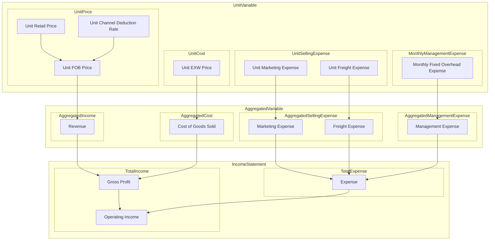

# Price Waterfall Model

---

## I. Parameter Glossary

| No. | Name | Meaning | Data Source | Relationship |
| :--- | :--- | :--- | :--- | :--- |
| 1 | `Units Sold` | Total units sold during the period | **Input** | Conversion basis for all unit/total parameters |
| 2 | `Unit Retail Price` | Final price paid by end customer | **Input** | Used to derive `Unit FOB Price` |
| 3 | `Unit Channel Deduction Rate` | Total deduction rate from retail price to FOB price | **Input** | Used to derive `Unit FOB Price` |
| 4 | `Unit FOB Price` | Net unit price received by Brand | Derived | Used to derive `Revenue` |
| 5 | `Revenue` | Brand's total sales revenue | Derived | `= Unit FOB Price × Units Sold` |
| 6 | `Unit EXW Price` | Direct cost to produce or purchase one unit | **Input** | Used to derive `Cost of Goods Sold` |
| 7 | `Cost of Goods Sold` | Total cost of goods sold | Derived | `= Unit EXW Price × Units Sold` |
| 8 | `Marketing Expense` | Total advertising and promotion expenses | **Input** | Used to derive `Unit Marketing Expense` |
| 9 | `Unit Marketing Expense` | Marketing expense allocated per unit | Derived | `= Marketing Expense / Units Sold` |
| 10 | `Unit Freight Expense` | Freight expense allocated per unit (Brand's share) | **Input** | Used to derive `Freight Expense` |
| 11 | `Freight Expense` | Brand's total freight expense | Derived | `= Unit Freight Expense × Units Sold` |
| 12 | `Management Expense` | Total fixed overhead (rent, admin salaries, etc.) | **Input** | Used to derive `Unit Fixed Overhead Expense` |
| 13 | `Unit Fixed Overhead Expense` | Fixed overhead allocated per unit | Derived | `= Management Expense / Units Sold` |
| 14 | `Operating Income` | Brand's total net profit | Derived | Used to derive `Unit Operating Income` |
| 15 | `Unit Operating Income` | Brand's net profit per unit | Derived | `= Operating Income / Units Sold` |

> **Notes**:
> - **Input** means data is obtained directly from books or business operations.
> - **Derived** means data is calculated using formulas.
> - `Unit Freight Expense` is an input in the Brand model (may be zero). In the Merchant model, it is calculated as `Unit Retail Price × Freight Rate`. The two calculations are independent.

---

## II. Parameter Relationships

### 2.1 Total → Unit (Deriving Unit Metrics from Book Data)

| Formula | Description |
| :--- | :--- |
| `Unit Marketing Expense = Marketing Expense / Units Sold` | Marketing expense per unit |
| `Unit Fixed Overhead Expense = Management Expense / Units Sold` | Fixed overhead per unit |
| `Unit Operating Income = Operating Income / Units Sold` | Operating income per unit |

### 2.2 Unit → Total (Deriving Total Metrics from Unit Costs)

| Formula | Description |
| :--- | :--- |
| `Cost of Goods Sold = Unit EXW Price × Units Sold` | Cost of Goods Sold |
| `Freight Expense = Unit Freight Expense × Units Sold` | Freight Expense |
| `Revenue = Unit FOB Price × Units Sold` | Revenue |

### 2.3 Core Income Statement Relationships

| Formula | Description |
| :--- | :--- |
| `Gross Profit = Revenue - Cost of Goods Sold` | Gross Profit |
| `Operating Income = Revenue - Cost of Goods Sold - Marketing Expense - Freight Expense - Management Expense` | Operating Income |
| `Unit FOB Price = Unit Retail Price × (1 - Unit Channel Deduction Rate)` | Unit FOB Price (derived from retail price) |
| `Unit EXW Price + Unit Gross Profit = Unit FOB Price` | Unit cost and gross profit relationship |

---

## III. Core Formula Summary

| Formula | Description |
| :--- | :--- |
| `Revenue = Unit FOB Price × Units Sold` | Revenue |
| `Gross Profit = Revenue - Cost of Goods Sold` | Gross Profit |
| `Operating Income = Revenue - Cost of Goods Sold - Marketing Expense - Freight Expense - Management Expense` | Operating Income |
| `Unit Marketing Expense = Marketing Expense / Units Sold` | Marketing expense per unit |
| `Unit Freight Expense = Freight Expense / Units Sold` | Freight expense per unit |
| `Unit Fixed Overhead Expense = Management Expense / Units Sold` | Fixed overhead per unit |
| `Unit Operating Income = Operating Income / Units Sold` | Operating income per unit |
| `Unit FOB Price = Unit Retail Price × (1 - Unit Channel Deduction Rate)` | Unit FOB Price (derived from retail price) |
| `Unit EXW Price + Unit Gross Profit = Unit FOB Price` | Unit cost and gross profit relationship |

---

## IV. Validation Formulas

| No. | Formula | Purpose |
| :--- | :--- | :--- |
| V1 | `Unit EXW Price + Unit Gross Profit = Unit FOB Price` | Validate unit cost and gross profit relationship |
| V2 | `Unit FOB Price = Unit EXW Price + Unit Marketing Expense + Unit Freight Expense + Unit Fixed Overhead Expense + Unit Operating Income` | Validate decomposition of FOB price |
| V3 | `Unit Retail Price = Unit EXW Price + Unit Marketing Expense + Unit Fixed Overhead Expense + Unit Operating Income + Unit Freight Expense + Unit Tariff Expense + Unit Channel Markup` | Validate retail price decomposition (see Section VI) |

> **V3 Note**: This formula corresponds exactly to the Profit Allocation Formula in Section VI. See Section VI for allocation of each item.

---

## V. Variable Relationship Diagram (Mermaid)




---


## VI. Profit Allocation (Complete Retail Price Decomposition)

### 6.1 Profit Allocation Formula

```
Unit Retail Price = Unit EXW Price 
                  + Unit Marketing Expense 
                  + Unit Fixed Overhead Expense 
                  + Unit Operating Income 
                  + Unit Freight Expense 
                  + Unit Tariff Expense 
                  + Unit Channel Markup
```

### 6.2 Allocation by Party

| Item | Recipient | Description |
| :--- | :--- | :--- |
| `Unit EXW Price` | Raw material suppliers / Manufacturers | Direct product cost |
| `Unit Marketing Expense` | Advertisers / Marketing platforms | Marketing fees paid by Brand |
| `Unit Fixed Overhead Expense` | Brand fixed costs | Rent, admin salaries, etc. |
| `Unit Operating Income` | Brand net profit | Brand's final profit |
| `Unit Freight Expense` | Logistics providers | Freight costs borne by Brand |
| `Unit Tariff Expense` | Government | Tariffs |
| `Unit Channel Markup` | Distributors / Merchants | Merchant's profit |

### 6.3 Profit Allocation Diagram (Mermaid)

```mermaid
flowchart TD
    START[Unit Retail Price: 100] --> S1[– Unit Freight Expense: 5<br>(Freight borne by Brand)]
    S1 --> S2[– Unit Tariff Expense: 5<br>(Government tariffs)]
    S2 --> S3[– Unit Channel Markup: 25<br>(Distributor/Merchant profit)]
    S3 --> S4[= Unit FOB Price: 65]
    
    S4 --> S5[– Unit EXW Price: 30<br>(Raw material/Manufacturer)]
    S5 --> S6[= Unit Gross Profit: 35]
    
    S6 --> S7[– Unit Marketing Expense: 10<br>(Advertiser/Marketing platform)]
    S7 --> S8[– Unit Fixed Overhead Expense: 10<br>(Brand fixed costs)]
    S8 --> END[Unit Operating Income: 15<br>(Brand net profit)]
```

---

## VII. Additional Notes

### 7.1 Treatment of Freight Expense

**Core Principle**: The same freight cost does not appear in two places. The Brand model and Merchant model are independent.

**Brand Model**:
- `Unit Freight Expense` is the actual freight cost borne by the Brand (may be zero depending on trade terms)
- Formula: `Freight Expense = Unit Freight Expense × Units Sold`

**Merchant Model**:
- Freight is calculated using `Freight Rate`: `Unit Freight Expense = Unit Retail Price × Freight Rate`
- This variable belongs to the Merchant model and is not included in the Brand model

**Treatment Under Different Trade Terms**:

| Trade Term | Freight Payer | Brand `Unit Freight Expense` | Merchant `Freight Rate` |
| :--- | :--- | :--- | :--- |
| EXW | Merchant | 0 | > 0 |
| FOB | Brand to destination port, then Merchant | > 0 (to destination port) | > 0 (after destination port) |
| CIF | Brand | > 0 | 0 |

> **Important Note**: `Unit Freight Expense` in the Brand model and `Unit Freight Expense` (calculated via `Freight Rate`) in the Merchant model are two independent variables, each reflecting the freight cost actually borne by the respective party.

---

### 7.2 Treatment of Marketing Expense

**Position in the Profit Allocation Chain**:

```
Unit Retail Price
    → Less Merchant deductions (freight, tariffs, channel markup)
    → Unit FOB Price (Brand's net revenue)
        → Less Unit EXW Price (product cost)
        → Unit Gross Profit
            → Less Unit Marketing Expense (paid to advertisers)
            → Less Unit Fixed Overhead Expense (Brand fixed costs)
            → Unit Operating Income (Brand net profit)
```

**Design Principles**:
- `Unit Marketing Expense` is the fee paid by the Brand to advertisers and is a Brand cost
- It does not affect the deduction relationship between retail price and FOB price
- It clearly separates "advertiser revenue" from "Brand profit"

**Extension**: To further refine marketing expense allocation, `Marketing Expense` can be broken down as:

| Sub-item | Recipient |
| :--- | :--- |
| `Media Spend` | Advertising platforms (e.g., TikTok, Google) |
| `Agency Fee` | Advertising agencies |
| `Creative Cost` | Creative agencies / in-house teams |

---

### 7.3 Model Feature Summary

| Feature | Description |
| :--- | :--- |
| **Bidirectional calculation** | Supports both Total→Unit (Marketing, Management, Operating Income) and Unit→Total (COGS, Freight, Revenue) directions |
| **Independent freight** | Brand and Merchant calculate their respective freight costs independently |
| **Clear marketing expense** | `Marketing Expense` flows to advertisers; `Operating Income` flows to Brand |
| **Verifiability** | 3 validation formulas ensure calculation consistency |
| **Scalability** | Can be extended to refine marketing expenses or handle different trade terms |

---
